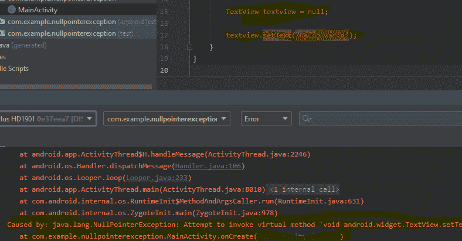
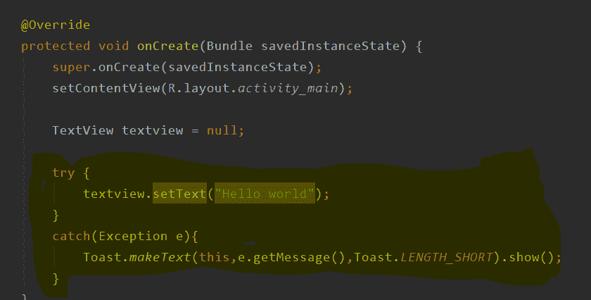
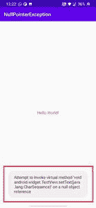
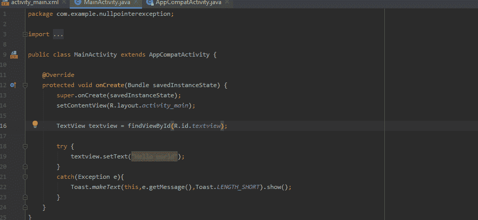
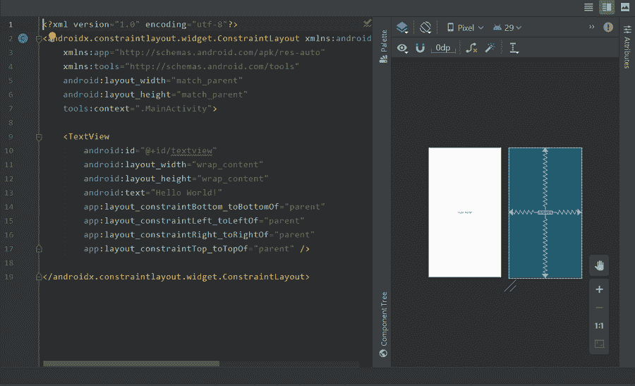

# 修复安卓工作室

中的“java.lang.NullPointerException”

> 原文:[https://www . geesforgeks . org/fix-Java-lang-nullpointerexception-in-Android-studio/](https://www.geeksforgeeks.org/fix-java-lang-nullpointerexception-in-android-studio/)

嘿，极客们，今天我们将看到 NullPointerException 是什么意思，以及我们如何在 Android Studio 中修复它。要理解 NullPointerException，**我们必须理解 Null 的含义。**

### 什么是 null？

**“null”**是所有程序员中非常熟悉的关键词。**它基本上是引用数据类型或变量的文字，如数组、类、接口和枚举。**每个基本数据类型都有一个默认值(例如:布尔值为真和假)。同样，如果在声明过程中没有初始化引用数据类型变量，则默认为空值。

## Java 语言(一种计算机语言，尤用于创建网站)

```java
import java.util.Scanner;
public class Main
{
    public static void main(String[] args) {
          // we can store null value in to scanner
          // object which has not yet been initialised
        Scanner sc = null;
        System.out.println(sc);
    }
}
```

**输出:**

```java
null
```

同样重要的是要注意，我们不能直接将空值存储在基元变量或对象中，如下所示。

## Java 语言(一种计算机语言，尤用于创建网站)

```java
import java.util.Scanner;
public class Main
{
    public static void main(String[] args) {
        int i = null;
        System.out.println(i);
    }
}
```

**输出:**

```java
Main.java:5: error: incompatible types:  cannot be converted to int
        int i = null;
                ^
1 error
```

### 什么是 NullPointerException？

当应用程序或程序试图访问存储有空值的对象引用(访问方法)时，会出现运行时异常**。当我们如下所示声明后不初始化它时，空值会自动存储在引用变量中。**

## **Java 语言(一种计算机语言，尤用于创建网站)**

```java
import java.util.Scanner;
public class Main
{
    public static void main(String[] args) {
          // sc is an object of Scanner class
          // which has not been initialised yet
        Scanner sc = null;
           // we are trying to access the reference
           // variable which is not yet initialised
         int input =sc.nextInt();
         System.out.println(input);
    }
}
```

****输出:****

```java
Exception in thread "main" java.lang.NullPointerException                                                                                      
        at Main.main(Main.java:6) 
```

### **安卓工作室空指针异常**

**安卓工作室中的 NullPointerException 在下面的截图中以黄色突出显示**

****

**如上图所示，它包含一个初始化为空的文本视图。**

```java
TextView textview = null;
```

**文本视图引用变量(即文本视图)被访问，这给出了一个空指针异常。**

```java
textview.setText("Hello world");
```

**

**App 一直急停**** 

****代码****

## **Java 语言(一种计算机语言，尤用于创建网站)**

```java
import androidx.appcompat.app.AppCompatActivity;

import android.os.Bundle;
import android.widget.TextView;
import android.widget.Toast;

public class MainActivity extends AppCompatActivity {

    @Override
    protected void onCreate(Bundle savedInstanceState) {
        super.onCreate(savedInstanceState);
        setContentView(R.layout.activity_main);

         // initialising textview to null
        TextView textview = null;

          // accessing the reference variable
        textview.setText("Hello World");
    }
}
```

### **在 android studio 中处理 nullpointexception**

**为了在不导致应用崩溃的情况下顺利处理空指针异常，我们在安卓系统中使用了“[Try–Catch Block](https://www.geeksforgeeks.org/try-catch-throw-and-throws-in-java/)”。**

*   ****Try:**Try 块执行一段可能会崩溃的代码或者异常发生的地方。**
*   ****Catch:**Catch 块将平滑地处理 Try 块中发生的异常(在屏幕上显示吐司消息)，而不会让应用突然崩溃。**

****试扣块结构如下图****

****

****代码****

## **Java 语言(一种计算机语言，尤用于创建网站)**

```java
import androidx.appcompat.app.AppCompatActivity;

import android.os.Bundle;
import android.widget.TextView;
import android.widget.Toast;

public class MainActivity extends AppCompatActivity {

    @Override
    protected void onCreate(Bundle savedInstanceState) {
        super.onCreate(savedInstanceState);
        setContentView(R.layout.activity_main);

        TextView textview = null;

        try {
            textview.setText("Hello world");
        }
        catch(Exception e){
            Toast.makeText(this,e.getMessage(),Toast.LENGTH_SHORT).show();
        }
    }
}
```

****输出:****

**使用“尝试捕获”，我们可以在屏幕上捕获异常**

****

### **如何修复 NullPointerException？**

**为了避免 NullPointerException，我们必须在 findviewbyid()方法的帮助下初始化 Textview 组件，如下所示。findViewbyId()将组件的“Id”值作为参数。此方法有助于定位应用程序中存在的组件。**

**

**解决空指针异常**** **

**带有 id 的文本视图**** 

****代码****

## **Java 语言(一种计算机语言，尤用于创建网站)**

```java
import androidx.appcompat.app.AppCompatActivity;

import android.os.Bundle;
import android.widget.TextView;
import android.widget.Toast;

public class MainActivity extends AppCompatActivity {

    @Override
    protected void onCreate(Bundle savedInstanceState) {
        super.onCreate(savedInstanceState);
        setContentView(R.layout.activity_main);

        // initialising the Textview using
          // findViewById(R.id.textview) method find
        TextView textview = findViewById(R.id.textview);

        try {
            textview.setText("Hello world");
        }
        catch(Exception e){
            Toast.makeText(this,e.getMessage(),Toast.LENGTH_SHORT).show();
        }
    }
}
```

****输出:****

**

解决 nullpointexception 后的输出** 

**正如您在初始化文本视图组件后看到的，我们已经解决了 NullPointerException。因此，通过这种方式，我们可以摆脱安卓工作室中的空指针异常。**