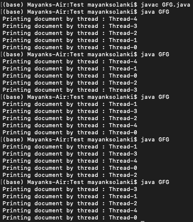
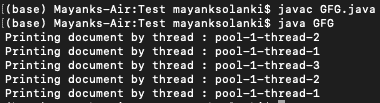

# Java Executor 框架中的 FixedSizeThreadPoolExecutor

> 原文:[https://www . geeksforgeeks . org/fixedsizethreadpoolexecutor-in-Java-executor-framework/](https://www.geeksforgeeks.org/fixedsizethreadpoolexecutor-in-java-executor-framework/)

在**固定线程池**中，池中线程的数量取决于任务的类型。对于 CPU 密集型任务，如加密、实现哈希算法，线程的数量取决于内核的数量。因此，每个线程都在它的核心上运行，一旦它完成了任务的执行，它就会从队列中取出下一个任务。此外，可能有多个应用程序正在运行，因此并非所有内核都可以访问。

对于涉及太多数据库调用或 HTTP 调用的 IO 密集型任务，如果线程较少，那么等待这些 IO 调用完成的线程可能会太多。因此，CPU 时间被浪费了，所以拥有更多线程是有意义的。这样，很少有线程能够利用 CPU 时间进行一些处理/计算，也很少有线程等待数据库/HTTP 调用完成。

**进近 1:** 标准进近

在 java 中，当您想要以异步方式运行任务时，您会生成线程并让线程执行任务。为此，我们有一个实现 Runnable 接口的类。然后，我们将 Runnable 的一个实例传递给执行任务的线程。

**例**

## Java 语言(一种计算机语言，尤用于创建网站)

```java
// Java Program to Test Threads

// Importing required packages
import java.io.*;
import java.util.*;

// Main class
// to test the threads
public class GFG {

    // Main driver method
    public static void main(String[] args)
    {

        // Creating 5 threads and passing an instance
        // of Runnable implementation
        for (int i = 0; i < 5; i++) {

            // Creating object of Thread class
            Thread thread = new Thread(() -> {
                // Printing and display the current thread
                // using curentThread() and getName() method
                System.out.println(
                    "Printing document by thread : "
                    + Thread.currentThread().getName());

                // Try block to check for exceptions
                try {

                    // Making current threads to sleep
                    // for 1 second
                    Thread.sleep(1000L);
                }

                // Catch block to handle th exceptions
                catch (InterruptedException e) {

                    // Print the line number where exception
                    // occurred
                    e.printStackTrace();
                }
            });

            // Starting the threads using start() method
            thread.start();
        }
    }
}
```

> **注意:**任务的执行顺序随着每次运行而变化。



输出解释:

在这里，主线程生成 5 个线程，每个线程都有一个 Runnable 实现的实例。当我们说 *thread.start()* 时，可运行实现的 run 方法被调用，任务被执行。

**方法 2:**

到目前为止，我们已经讨论了上述方法，并经历了每次运行的输出波动。有必要制定另一种方法，因为作为开发人员，我们需要处理线程的创建和管理，当应用程序中有许多线程时，这将变得乏味。为此，我们有 [ExecutorService 框架](https://www.geeksforgeeks.org/java-util-concurrent-executorservice-interface-with-examples/)，它有助于线程的管理。作为开发人员，我们选择执行器服务必须创建的线程池类型，并将线程管理的责任委托给执行器服务。在固定大小的线程池执行器中，我们在池中创建固定数量的线程，并将任务提交给执行器服务。提交的任务存储在阻塞队列中，每个线程从阻塞队列中挑选一个任务并执行它，然后继续执行下一个任务。阻塞队列以这样一种方式实现，即它可以处理并发操作，尤其是当多个线程试图从队列中提取相同的任务时。

**示例:**

## Java 语言(一种计算机语言，尤用于创建网站)

```java
// Java Program to demonstrate FixedThreadPoolExecutor

// Importing required libraries
import java.util.concurrent.ExecutorService;
import java.util.concurrent.Executors;

// Main class
public class GFG {

    // Main driver method
    public static void main(String[] args)
    {

        // Creating an object of ExecutorService for
        // asking the executor service to create a thread
        // pool with fixed number of threads
        ExecutorService service
            = Executors.newFixedThreadPool(3);

        // Creating 5 threads using loops
        for (int i = 0; i < 5; i++) {

            // Submitting task to service's execute method
            service.execute(() -> {
                // Printing and display the current thread
                // using curentThread() and getName() method
                System.out.println(
                    "Printing document by thread : "
                    + Thread.currentThread().getName());

                // Try block to check for exceptions
                try {

                    // Making threads to sleep for 1 second
                    // using the sleep() method
                    Thread.sleep(1000L);
                }

                // Catch block to handle the exceptions
                catch (InterruptedException e) {

                    // Print and display the line number
                    // where the exception occurred
                    e.printStackTrace();
                }
            });
        }

        // In order to avoid further coming execution of
        // tasks shutdown() method is used
        service.shutdown();
    }
}
```

**输出:**



输出解释:

在这里，我们创建了一个包含 3 个线程的线程池，在这里我们向执行器服务提交了 5 个任务。这个执行器服务负责执行线程池中的线程提交的任务。执行器服务负责创建线程池。所以这里线程名是池-X-线程-Y。