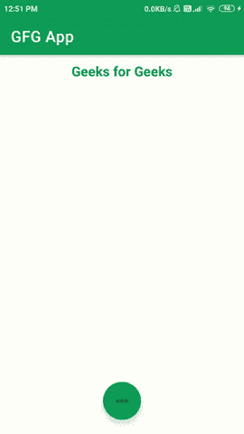

# 安卓

中使用 Fab 选项库的浮动动作按钮

> 原文:[https://www . geesforgeks . org/floating-action-button-using-fab-option-library-in-Android/](https://www.geeksforgeeks.org/floating-action-button-using-fab-option-library-in-android/)

[浮动动作按钮](https://www.geeksforgeeks.org/floating-action-button-fab-in-android-with-example/)使用 Fab 选项是显示各种选项的另一种独特方式。借助于此，我们可以轻松导航到不同的屏幕。这个浮动动作按钮显示各种菜单和动画。所以增加了用户体验。在本文中，我们将学习如何在安卓中使用**晶圆厂选项库实现浮动动作按钮。下面给出了一个 GIF 示例，以了解我们在本文中要做什么。注意，我们将使用 **Java** 语言来实现这个项目。**



### 使用 Fab 选项的浮动动作按钮的应用

*   使用 Fab 选项的浮动操作按钮提供了良好的用户体验。
*   浮动动作按钮使用 Fab 选项有助于提供动画形式的各种菜单。
*   浮动操作按钮使用 Fab 选项，可以轻松导航到不同的屏幕。

### 使用制造选项的浮动动作按钮的属性

<figure class="table">

| 

属性

 | 

描述

 |
| --- | --- |
| **布局 _ 宽度** | 用于给浮动动作赋予宽度。 |
| **布局 _ 高度** | 用于给浮动动作赋予宽度。 |
| **布局 _ 底部** | 用于将浮动操作按钮与底部对齐。 |

</figure>

### **分步实施**

**第一步:创建新项目**

要在安卓工作室创建新项目，请参考[如何在安卓工作室创建/启动新项目](https://www.geeksforgeeks.org/android-how-to-create-start-a-new-project-in-android-studio/)。注意选择 **Java** 作为编程语言。

**第二步:在 build.gradle 文件**中使用 Fab 选项库添加浮动动作按钮的依赖关系

然后导航到梯度脚本，然后导航到**构建.梯度(模块)**级别。在 dependencies 部分的 build.gradle 文件中添加以下行。

> 实现' com . github . joaquimley:fab options:1 . 2 . 0 '

现在点击**立即同步**它将同步你在 **build.gradle()** 中的所有文件。

**第三步:在你的 activity_main.xml 文件**中使用 Fab 选项创建一个新的浮动动作按钮

导航到 **app > res >布局> activity_main.xml** 并将下面的代码添加到该文件中。下面是**activity _ main . XML**文件的代码。

## 可扩展标记语言

```java
<?xml version="1.0" encoding="utf-8"?>
<RelativeLayout 
    xmlns:android="http://schemas.android.com/apk/res/android"
    xmlns:tools="http://schemas.android.com/tools"
    android:layout_width="match_parent"
    android:layout_height="match_parent"
    tools:context=".MainActivity">

    <!--Text View heading-->
    <TextView
        android:layout_width="wrap_content"
        android:layout_height="wrap_content"
        android:layout_centerHorizontal="true"
        android:layout_marginTop="10dp"
        android:text="Geeks for Geeks"
        android:textColor="@color/purple_200"
        android:textSize="20dp"
        android:textStyle="bold" />

    <!--Fab Options-->
    <com.joaquimley.faboptions.FabOptions
        android:id="@+id/fab_options"
        android:layout_width="wrap_content"
        android:layout_height="wrap_content"
        android:layout_alignParentBottom="true"
        android:layout_centerHorizontal="true"
        android:layout_gravity="bottom" />

</RelativeLayout>
```

**第四步:在你的资源文件夹**中创建新的菜单文件

进入 **app > res >右键>新建>安卓资源文件**选择资源类型为**菜单**，输入文件名为**菜单**，点击**确定**按钮。将以下代码输入**菜单. xml** 文件。

## 可扩展标记语言

```java
<?xml version="1.0" encoding="utf-8"?>
<menu 
    xmlns:android="http://schemas.android.com/apk/res/android">

    <!--Menu items-->
    <item
        android:id="@+id/balance"
        android:icon="@drawable/ic_baseline_account_balance_24"
        android:title="Bank" />

    <item
        android:id="@+id/download"
        android:icon="@drawable/ic_baseline_cloud_download_24"
        android:title="Download" />

    <item
        android:id="@+id/photo"
        android:icon="@drawable/ic_baseline_add_a_photo_24"
        android:title="Add Photo" />

    <item
        android:id="@+id/account"
        android:icon="@drawable/ic_baseline_account_circle_24"
        android:title="Account" />

</menu>
```

**第五步:使用****MainActivity.java 文件**

转到**MainActivity.java**文件，参考以下代码。以下是**MainActivity.java**文件的代码。代码中添加了注释，以更详细地理解代码。

## Java 语言(一种计算机语言，尤用于创建网站)

```java
import android.os.Bundle;
import android.view.View;
import android.widget.Toast;

import androidx.appcompat.app.AppCompatActivity;

import com.joaquimley.faboptions.FabOptions;

public class MainActivity extends AppCompatActivity implements View.OnClickListener {

    @Override
    protected void onCreate(Bundle savedInstanceState) {
        super.onCreate(savedInstanceState);
        setContentView(R.layout.activity_main);

        // Fab Options Code
        FabOptions fabOptions = (FabOptions) findViewById(R.id.fab_options);
        fabOptions.setButtonsMenu(this, R.menu.menu);
        fabOptions.setOnClickListener(this);
    }

    @Override
    public void onClick(View v) {
        // Menu given along with toast
        switch (v.getId()) {
            case R.id.balance:
                Toast.makeText(this, "Bank", Toast.LENGTH_SHORT).show();
                break;
            case R.id.download:
                Toast.makeText(this, "Download", Toast.LENGTH_SHORT).show();
                break;
            case R.id.photo:
                Toast.makeText(this, "Add Photo", Toast.LENGTH_SHORT).show();
                break;
            case R.id.account:
                Toast.makeText(this, "Account", Toast.LENGTH_SHORT).show();
                break;
        }
    }
}
```

现在点击**运行**选项，需要一些时间来建立 Gradle。之后，您将获得如下所示的设备输出。

### **输出:**

<video class="wp-video-shortcode" id="video-552243-1" width="640" height="360" preload="metadata" controls=""><source type="video/mp4" src="https://media.geeksforgeeks.org/wp-content/uploads/20210126135537/Screenrecorder-2021-01-26-12-51-51-525.mp4?_=1">[https://media.geeksforgeeks.org/wp-content/uploads/20210126135537/Screenrecorder-2021-01-26-12-51-51-525.mp4](https://media.geeksforgeeks.org/wp-content/uploads/20210126135537/Screenrecorder-2021-01-26-12-51-51-525.mp4)</video>