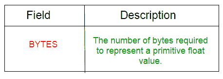
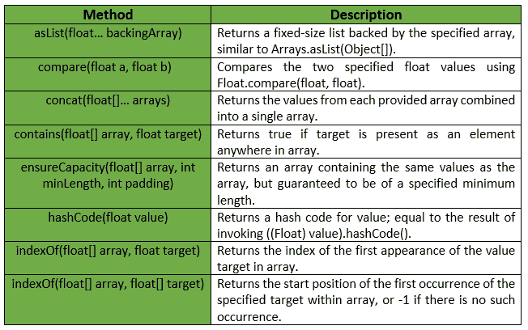
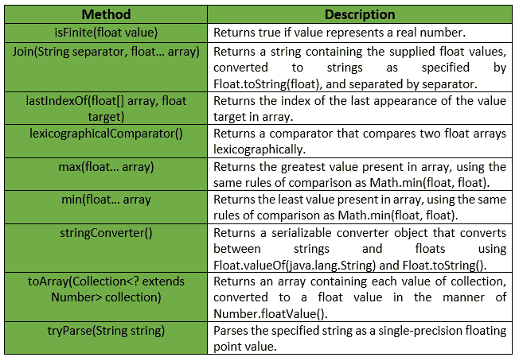

# 浮动类|番石榴|爪哇

> 原文:[https://www.geeksforgeeks.org/floats-class-guava-java/](https://www.geeksforgeeks.org/floats-class-guava-java/)

**Floats** 是一个用于原语类型 Floats 的实用程序类。它提供了 ***静态实用方法*** 来处理浮点原语，这些原语在浮点或数组中都找不到。

**申报:**

```
@GwtCompatible(emulated=true)
public final class Floats
extends Object

```

下表显示了番石榴浮动类的字段摘要:


番石榴花车类提供的一些方法有:

**例外:**

*   **min:***IllegalArgumentException*若阵为空。
*   **max:***IllegalArgumentException*如果数组为空。
*   **确保容量:** *如果最小长度或填充值为负，则显示“异常”。*
*   **to array:***NullPointerException*如果集合或其任何元素为空。

下表显示了番石榴浮动类提供的一些其他方法:

下面给出了一些示例，显示了番石榴浮动类的方法的实现:
**示例 1 :**

```
// Java code to show implementation
// of Guava Floats.asList() method

import com.google.common.primitives.Floats;
import java.util.*;

class GFG {
    // Driver method
    public static void main(String[] args)
    {
        float arr[] = { 2.6f, 4.6f, 1.2f, 2.4f, 1.5f };

        // Using Floats.asList() method which
        // converts array of primitives to array of objects
        List<Float> myList = Floats.asList(arr);

        // Displaying the elements
        System.out.println(myList);
    }
}
```

输出:

```
[2.6, 4.6, 1.2, 2.4, 1.5]

```

**例 2 :**

```
// Java code to show implementation
// of Guava Floats.toArray() method

import com.google.common.primitives.Floats;
import java.util.*;

class GFG {
    // Driver method
    public static void main(String[] args)
    {
        List<Float> myList = Arrays.asList(2.6f, 4.6f, 1.2f, 2.4f, 1.5f);

        // Using Floats.toArray() method which
        // converts a List of Floats to an
        // array of float
        float[] arr = Floats.toArray(myList);

        // Displaying the elements
        System.out.println(Arrays.toString(arr));
    }
}
```

输出:

```
[2.6, 4.6, 1.2, 2.4, 1.5]

```

**例 3 :**

```
// Java code to show implementation
// of Guava Floats.concat() method

import com.google.common.primitives.Floats;
import java.util.*;

class GFG {
    // Driver method
    public static void main(String[] args)
    {
        float[] arr1 = { 2.6f, 4.6f, 1.2f };
        float[] arr2 = { 2.4f, 1.5f };

        // Using Floats.concat() method which
        // combines arrays from specified
        // arrays into a single array
        float[] arr = Floats.concat(arr1, arr2);

        // Displaying the elements
        System.out.println(Arrays.toString(arr));
    }
}
```

输出:

```
[2.6, 4.6, 1.2, 2.4, 1.5]

```

**例 4 :**

```
// Java code to show implementation
// of Guava Floats.contains() method

import com.google.common.primitives.Floats;

class GFG {
    // Driver method
    public static void main(String[] args)
    {
        float[] arr = { 2.6f, 4.6f, 1.2f, 2.4f, 1.5f };

        // Using Floats.contains() method which
        // checks if element is present in array
        // or not
        System.out.println(Floats.contains(arr, 2.5f));
        System.out.println(Floats.contains(arr, 1.5f));
    }
}
```

输出:

```
false
true

```

**例 5 :**

```
// Java code to show implementation
// of Guava Floats.min() method

import com.google.common.primitives.Floats;

class GFG {
    // Driver method
    public static void main(String[] args)
    {
        float[] arr = { 2.6f, 4.6f, 1.2f, 2.4f, 1.5f };

        // Using Floats.min() method
        System.out.println(Floats.min(arr));
    }
}
```

输出:

```
1.2

```

**例 6 :**

```
// Java code to show implementation
// of Guava Floats.max() method

import com.google.common.primitives.Floats;

class GFG {
    // Driver method
    public static void main(String[] args)
    {
        float[] arr = { 2.6f, 4.6f, 1.2f, 2.4f, 1.5f };

        // Using Floats.max() method
        System.out.println(Floats.max(arr));
    }
}
```

输出:

```
4.6

```