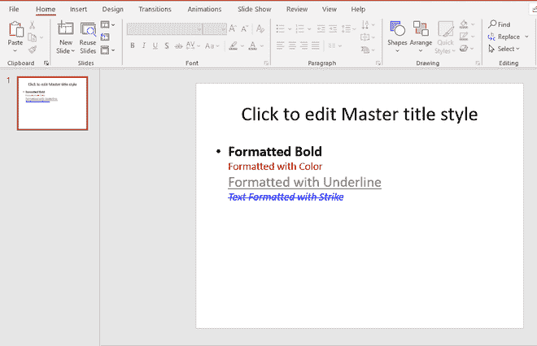

# 使用 Java 在 PPT 中格式化幻灯片上的文本

> 原文:[https://www . geesforgeks . org/formatting-text-in-a-PPT-using-Java/](https://www.geeksforgeeks.org/formatting-text-on-a-slide-in-a-ppt-using-java/)

要在 PowerPoint 演示文稿中使用 Java 格式化幻灯片上的文本，请使用名为 Apache POI 的 Java 库。Apache POI 是由 Apache 软件基金会运营的项目，之前是[雅加达项目](https://jakarta.apache.org/)的子项目，提供纯 Java 库，用于读写 Microsoft Office 格式的文件，如 Word、PowerPoint 和 Excel。使用[阿帕奇](https://www.geeksforgeeks.org/apache-poi-introduction/)指南为视窗/Linux 系统安装阿帕奇兴趣点库。

**进场:**

1.  使用阿帕奇**兴趣点**包中的 **XMLSlideShow** 创建一个空演示对象。
2.  创建幻灯片母版对象，并使用 **XSLFSlideMaster** 获取第一张幻灯片。
3.  使用 **XSLFSlideLayout** 对象设置幻灯片的布局。
4.  使用布局创建幻灯片。
5.  使用 **XSLFTextShape** 对象获取幻灯片的第二个标题，并使用**xslftextpages**对象为其添加段落。
6.  使用 **XSLFTextRun** 对象为段落添加行，并添加格式属性。

**实施:**

## Java 语言(一种计算机语言，尤用于创建网站)

```
// Formatting text on a slide in a PPT using java
import java.io.*;

// importing Apache POI environment packages
import org.apache.poi.xslf.usermodel.*;

public class FormatTextPPT {
    public static void main(String args[])
        throws IOException
    {

        // creating an empty presentation
        XMLSlideShow ppt = new XMLSlideShow();

        // creating the slide master object
        XSLFSlideMaster slideMaster
            = ppt.getSlideMasters().get(0);

        // select a layout from specified slideLayout list
        XSLFSlideLayout slidelayout = slideMaster.getLayout(
            SlideLayout.TITLE_AND_CONTENT);

        // creating a slide with title and content layout
        XSLFSlide slide = ppt.createSlide(slidelayout);

        // selection of title place holder
        XSLFTextShape title = slide.getPlaceholder(1);

        // clear the existing text in the slide
        title.clearText();

        // adding new paragraph
        XSLFTextParagraph paragraph
            = title.addNewTextParagraph();

        // formatting line 1
        XSLFTextRun line1 = paragraph.addNewTextRun();
        line1.setText("Formatted Bold");

        // making the text bold
        line1.setBold(true);

        // moving to the next line
        paragraph.addLineBreak();

        // formatting line 2
        XSLFTextRun line2 = paragraph.addNewTextRun();
        line2.setText("Formatted with Color");

        // setting color to the text
        line2.setFontColor(java.awt.Color.RED);

        // setting font size to the text
        line2.setFontSize(24.0);

        // moving to the next line
        paragraph.addLineBreak();

        // formatting line 3
        XSLFTextRun line3 = paragraph.addNewTextRun();
        line3.setText("Formatted with Underline");

        // underlining the text
        line3.setUnderlined(true);

        // setting color to the text
        line3.setFontColor(java.awt.Color.GRAY);

        // moving to the next line
        paragraph.addLineBreak();

        // formatting line 4
        XSLFTextRun line4 = paragraph.addNewTextRun();
        line4.setText("Text Formatted with Strike");
        line4.setFontSize(12.0);

        // making the text italic
        line4.setItalic(true);

        // setting color to the text
        line4.setFontColor(java.awt.Color.BLUE);

        // strike through the text
        line4.setStrikethrough(true);

        // setting font size to the text
        line4.setFontSize(24.0);

        // moving to the next line
        paragraph.addLineBreak();

        // getting path of current working directory
        // to create the pdf file in the same directory of
        // the running java program
        String path = System.getProperty("user.dir");
        path += "/FormattedText.pptx";

        // creating a file object with the path specified
        File file = new File(path);
        FileOutputStream out = new FileOutputStream(file);

        // saving the changes to a file
        ppt.write(out);
        out.close();
        ppt.close();
        System.out.println(
            "PPT with Formatted Text created successfully!");
    }
}
```

**程序执行后:**



输出:FormattedText.ppt