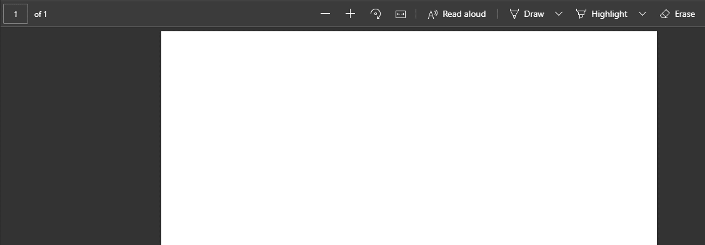
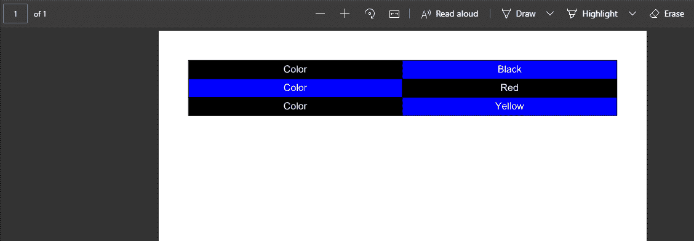

# 使用 Java 格式化 PDF 表格中单元格的内容

> 原文:[https://www . geesforgeks . org/formatting-使用-java 对 pdf 表格中的单元格内容进行格式化/](https://www.geeksforgeeks.org/formatting-the-content-of-a-cell-in-a-table-of-pdf-using-java/)

**iText** 是一个 Java 开发的库，用来访问和操作 PDF 文件，也就是提取和修改 PDF 内容。 iText 是一个 Java 库，最初由 Bruno Lowagie 创建，允许创建、读取和操作 PDF 文件。 Java 允许合并各种完全开发的包和模块，以便处理 PDF 文件。 iText 库启用在本地目录中创建一个 PDF 文档的离子，并将内容添加到使用 java 程序创建的 PDF 文件中。在这里，f 使用 java 格式化 PDF 中表格单元格的内容可以在本文下面提到的内容中实现。

所需的库:

*   [iText](https://www.geeksforgeeks.org/adding-paragraphs-as-text-to-a-pdf-using-java/)
*   日志库

**程序:**

1.  下载 [iText jar 文件](https://github.com/itext/itext7/releases/download/7.1.13/iText7-Core-7.1.13-only-jars.zip)。
2.  下载 [slf4j jar 文件](https://repo1.maven.org/maven2/org/slf4j/slf4j-jdk14/1.7.2/slf4j-jdk14-1.7.2.jar)。
3.  要使用这些库，请将上面下载的 jar 文件添加到系统的类路径中。
4.  获取正在运行的 java 程序的当前工作目录，在同一位置创建 PDF 文件。
5.  创建一个 PdfWriter 对象(来自 itextpdf 库)，将 pdf 文件写入给定的路径。
6.  创建一个空的 PDF 文档对象。
7.  使用表格对象创建表格并设置表格尺寸。
8.  创建单元格并向类似单元格的文本对齐、字体颜色、背景颜色和单元格内容添加属性。
9.  将单元格添加到表格中。

**样本输入图像:**这个 PDF 文件输入图像被下面的程序用来格式化单元格的内容。



**实现:**首先在上面输入的 PDF 文件中创建单元格，然后格式化单元格的内容

**例**

## Java 语言(一种计算机语言，尤用于创建网站)

```
// Java Progra to format the content
// of a cell in a table of PDF

// Importing generic java libraries
import java.io.*;

// Importing itext library packages
import com.itextpdf.kernel.colors.*;
import com.itextpdf.kernel.pdf.PdfDocument;
import com.itextpdf.kernel.pdf.PdfWriter;
import com.itextpdf.layout.Document;
import com.itextpdf.layout.element.Cell;
import com.itextpdf.layout.element.Paragraph;
import com.itextpdf.layout.element.Table;
import com.itextpdf.layout.property.TextAlignment;

public class FormatCellPdf {

    // Main driver method
    public static void main(String args[]) throws Exception
    {
        // Creating a PDF file
        // Getting path of current working directory
        // in the same directory of the running java program
        String path = System.getProperty("user.dir");
        path += "/cellPDF.pdf";

        // Creating a PdfWriter object using the path
        PdfWriter writer = new PdfWriter(path);

        // Creating a PdfDocument object
        PdfDocument pdfDoc = new PdfDocument(writer);

        // Creating a Document object
        Document doc = new Document(pdfDoc);

        // Creating a table
        float[] columnWidhts = { 300F, 300F };
        Table table = new Table(columnWidhts);

        // Filling Row1 and adding to table

        // For every cell perform 4 steps below:
        // Step 1: Creating a cell
        // Step 2: Adding name to a cell
        // Step 3: Setting background color
        // Step 4: Set text alignment

        // For Cell 1

        // Step 1: Creating cell 1
        Cell cell1 = new Cell();

        // Step 2: Adding name to cell 1
        cell1.add(new Paragraph("Color").setFontColor(
            ColorConstants.WHITE));

        // Step 3: Setting background color
        cell1.setBackgroundColor(ColorConstants.BLACK);

        // Step 4: Setting text alignment
        cell1.setTextAlignment(TextAlignment.CENTER);

        // For Cell 2
        Cell cell2 = new Cell();
        cell2.add(new Paragraph("Black").setFontColor(
            ColorConstants.WHITE));
        cell2.setBackgroundColor(ColorConstants.BLUE);
        cell2.setTextAlignment(TextAlignment.CENTER);

        // For Cell 3
        Cell cell3 = new Cell();
        cell3.add(new Paragraph("Color").setFontColor(
            ColorConstants.WHITE));
        cell3.setBackgroundColor(ColorConstants.BLUE);
        cell3.setTextAlignment(TextAlignment.CENTER);

        // For Cell 4
        Cell cell4 = new Cell();
        cell4.add(new Paragraph("Red").setFontColor(
            ColorConstants.WHITE));
        cell4.setBackgroundColor(ColorConstants.BLACK);
        cell4.setTextAlignment(TextAlignment.CENTER);

        // Filling Row 3 and adding to table
        // For Cell 5
        Cell cell5 = new Cell();
        cell5.add(new Paragraph("Color").setFontColor(
            ColorConstants.WHITE));
        cell5.setBackgroundColor(ColorConstants.BLACK);
        cell5.setTextAlignment(TextAlignment.CENTER);

        // For Cell 6
        Cell cell6 = new Cell();
        cell6.add(new Paragraph("Yellow").setFontColor(
            ColorConstants.WHITE));
        cell6.setBackgroundColor(ColorConstants.BLUE);
        cell6.setTextAlignment(TextAlignment.CENTER);

        // Now, adding cells to table
        table.addCell(cell1);
        table.addCell(cell2);
        table.addCell(cell3);
        table.addCell(cell4);
        table.addCell(cell5);
        table.addCell(cell6);

        // Now, adding Table to document
        doc.add(table);

        // Closing the document
        doc.close();

        // Display message for successful compilation and
        // execution of program
        System.out.println("Table created successfully!");
    }
}
```

**输出:**在控制台窗口中，打印消息“表格成功创建”，以显示程序的正确执行，并且在执行期间在输入文件中执行期间所做的更改如图所示。

