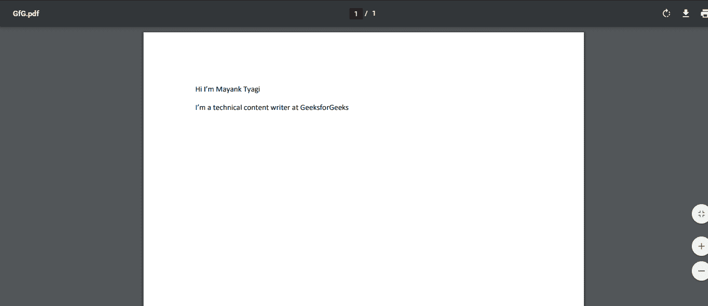

# 使用 Java 格式化 PDF 中的文本

> 原文:[https://www . geesforgeks . org/formatting-the-text-in-a-pdf-using-Java/](https://www.geeksforgeeks.org/formatting-the-text-in-a-pdf-using-java/)

我们可以通过安装文档类将嵌套表添加到 PDF 中。以下是使用 java 格式化 PDF 文本的步骤。

**1。** **创建一个 PDF 编写器对象**

这里的 PdfWriter 类代表了一个 PDF 的 DocWriter。这个班属于 com.itextpdf.kernel.pdf 包。此类的构造函数接受一个字符串，该字符串表示要创建 PDF 的文件的路径。

通过向构造函数传递一个字符串值(表示您想要生成 PDF 的路径)来创建 PdfWriter 类。

**2。创建一个 PdF 文档对象**

PDF 文档类是在 **iText** 中表示 PDF 文档的类。这个班属于 com.itextpdf.kernel.pdf 包。要创建这个类(在编写模式下)，您需要将一个类别为 PdfWriter 的对象传递给它的构造函数。

通过将上面创建的 PdfWriter 对象传递给其构造函数来创建 PdfDocument 类。

**3。在文档中添加文本**

将所需文本添加到您的 PDF 文档中

**4。** **设置文字颜色和字体**

使用 setFontColor()方法设置上一步添加的文本的文本颜色。

使用 setFont()方法设置上一步添加的文本的字体。

**5。** **新增文字**

添加您想要格式化的新文本或添加到步骤 3 中添加的文本中。

**6。将新文本添加到文档中**

将新创建的文本添加到原始文本中。我们可以通过使用 **doc.add()** 方法来实现，该方法将存储文本的变量作为参数。

## Java 语言(一种计算机语言，尤用于创建网站)

```java
// Java program to Format the Text in a PDF

import com.itextpdf.io.font.FontConstants;

import com.itextpdf.kernel.color.Color;
import com.itextpdf.kernel.font.PdfFontFactory;
import com.itextpdf.kernel.pdf.PdfDocument;
import com.itextpdf.kernel.pdf.PdfWriter;

import com.itextpdf.layout.Document;
import com.itextpdf.layout.element.Paragraph;
import com.itextpdf.layout.element.Text;

public class PdfTextFormat {
    public static void main(String args[]) throws Exception
    {
        String file
            = "C:/EXAMPLES/itextExamples/GfG.pdf";

        // Creating a PdfDocument object
        PdfDocument pdfDoc
            = new PdfDocument(new PdfWriter(file));

        // Creating a Document object
        Document doc = new Document(pdfDoc);

        // Adding text to the document
        Text text1 = new Text("Hi I'm Mayank Tyagi");

        // Setting color to the text
        text1.setFontColor(Color.BLACK);

        // Setting font to the text
        text1.setFont(PdfFontFactory.createFont(
            FontConstants.HELVETICA));

        // Creating a paragraph 1
        Paragraph para1 = new Paragraph(text1);

        Text text2 = new Text(
            "I'm a technical content writer at GeeksforGeeks");

        // Setting color to the text
        text2.setFontColor(Color.BLACK);

        // Setting font to the text
        text2.setFont(PdfFontFactory.createFont(
            FontConstants.HELVETICA));

        // Creating a paragraph 2
        Paragraph para2 = new Paragraph(text2);

        // Adding paragraphs to the document
        doc.add(para1);
        doc.add(para2);

        // Closing the document
        doc.close();
        System.out.println("Text added successfully..");
    }
}
```

**输出**

