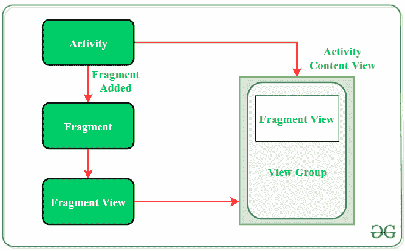
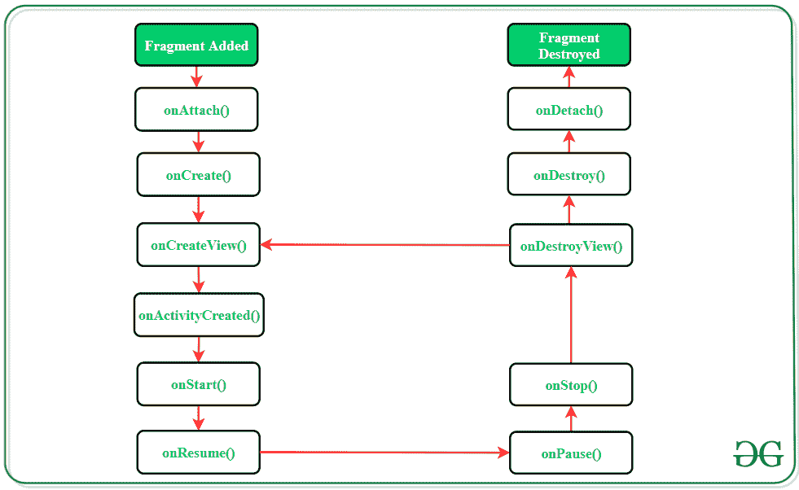

# 安卓中的碎片生命周期

> 原文:[https://www . geesforgeks . org/fragment-life-in-Android/](https://www.geeksforgeeks.org/fragment-lifecycle-in-android/)

在[安卓](https://www.geeksforgeeks.org/kotlin-android-tutorial/)中，片段是[活动](https://www.geeksforgeeks.org/introduction-to-activities-in-android/)的一部分，代表屏幕上用户界面的一部分。安卓活动的模块化部分非常有助于创建本质上灵活且可根据设备屏幕大小自动调整的用户界面设计。所有设备上的用户界面灵活性提高了用户体验和应用程序的适应性。片段只能存在于活动内部，因为它的生命周期依赖于宿主活动的生命周期。例如，如果主机活动暂停，则与该活动相关的片段的所有方法和操作都将停止运行，因此片段也被称为**子活动**。片段可以动态添加、移除或替换，即在活动运行时。

> **<片段>** 标签用于在安卓活动布局中插入片段。通过划分活动的布局，可以在其中添加多个片段。

以下是片段与活动互动的图示:



### 安卓碎片的类型

1.  **单个片段:**在设备屏幕上只显示一个视图。这类碎片多用于手机。
2.  **列表片段:**该片段用于显示列表视图，用户可以从中选择所需的子活动。Gmail 等应用程序的菜单抽屉就是这种碎片的最好例子。
3.  **片段事务:**这类片段支持在运行时从一个片段过渡到另一个片段。用户可以像切换标签一样在多个片段之间切换。

### 片段生命周期



> 每个片段都有自己的生命周期，但是由于与它所属的活动的联系，片段生命周期受到活动生命周期的影响。

### 安卓碎片的方法

<figure class="table">

| 方法 | 

描述

 |
| --- | --- |
| onattach() | 当片段与活动关联时调用的第一个方法。此方法在片段的生存期内只执行一次。 |
| onCreate() | 此方法通过添加所有必需的属性和组件来初始化片段。 |
| onCreateView() | 系统调用此方法来创建片段的用户界面。该方法将片段布局的根作为视图组件返回，以绘制用户界面。 |
| onActivityCreated() | 它表示已经创建了片段所在的活动。片段的视图层次结构也在此函数调用之前实例化。 |
| onStart（） | 系统调用此方法，使片段在用户设备上可见。 |
| onResume（） | 调用此方法是为了使可见片段具有交互性。 |
| onpause() | 它表示用户正在离开片段。系统调用此方法来提交对片段所做的更改。 |
| onStop() | 方法终止用户屏幕上片段的功能和可见性。 |
| onDestroyView() | 系统调用此方法来清理各种资源以及与片段相关联的视图层次结构。 |
| onDestroy() | 它被调用来执行片段状态及其生命周期的最终清理。 |
| 底部() | 系统执行此方法来解除片段与其主机活动的关联。 |

</figure>

### 安卓碎片示例

片段总是嵌入到活动中，也就是说，它们被添加到它们所在的活动的布局中。一个活动可以添加多个片段。这项任务可以通过两种方式完成:

1.  静态地:在活动的 XML 文件中明确提到片段。这种类型的片段在运行时不能被替换。
2.  动态地:**片段管理器**用于在片段中嵌入能够在运行时添加、删除或替换片段的活动。

几乎所有安卓应用都使用动态添加片段，因为它改善了用户体验。下面是在一个活动中添加 2 个片段的分步实现。当活动出现在屏幕上时，默认片段将可见，用户可以在运行时在两个片段之间切换。

> **注意:**在 Android Studio 版本上执行以下步骤

**第一步:创建新项目**

1.  单击文件，然后单击新建= >新建项目。
2.  选择空活动
3.  选择语言作为 Java
4.  根据您的需要选择最小的软件开发工具包。

**第二步:修改 strings.xml 文件**

活动中使用的所有字符串都列在该文件中

## 可扩展标记语言

```
<resources>
    <string name="app_name">GfG | Fragment in Android</string>
    <string name="heading">Two Fragments in One Activity</string>
    <string name="fragment1_button">Display First Fragment</string>
    <string name="fragment2_button">Display Second Fragment</string>
    <string name="fragment1_text1">Displaying contents of the First Fragment</string>
    <string name="fragment2_text1">Displaying contents of the Second Fragment</string>
</resources>
```

**步骤 3:使用 activity_main.xml 文件**

打开 **activity_main.xml** 文件，添加 2 个按钮，用于在 2 个片段之间切换。此外，在活动布局中添加片段元素。这是片段将被显示的区域。

## 可扩展标记语言

```
<?xml version="1.0" encoding="utf-8"?>
<LinearLayout
    xmlns:android="http://schemas.android.com/apk/res/android"
    xmlns:tools="http://schemas.android.com/tools"
    android:layout_width="match_parent"
    android:layout_height="match_parent"
    android:background="#168BC34A"
    android:orientation="vertical"
    tools:context=".MainActivity">

    <!-- Heading of the activity -->
    <TextView
        android:id="@+id/textView"
        android:layout_width="match_parent"
        android:layout_height="wrap_content"
        android:layout_marginTop="20dp"
        android:layout_marginBottom="20dp"
        android:fontFamily="@font/roboto"
        android:text="@string/heading"
        android:textAlignment="center"
        android:textColor="@android:color/holo_green_light"
        android:textSize="24sp"
        android:textStyle="bold" />

    <!-- Button to display first fragment -->
    <Button
        android:id="@+id/button1"
        android:layout_width="fill_parent"
        android:layout_height="wrap_content"
        android:layout_marginStart="20dp"
        android:layout_marginEnd="20dp"
        android:background="#4CAF50"
        android:fontFamily="@font/roboto"
        android:onClick="selectFragment"
        android:text="@string/fragment1_button"
        android:textColor="@android:color/background_light"
        android:textSize="18sp"
        android:textStyle="bold" />

    <!-- Button to display second fragment -->
    <Button
        android:id="@+id/button2"
        android:layout_width="fill_parent"
        android:layout_height="wrap_content"
        android:layout_marginStart="20dp"
        android:layout_marginTop="20dp"
        android:layout_marginEnd="20dp"
        android:layout_marginBottom="20dp"
        android:background="#4CAF50"
        android:fontFamily="@font/roboto"
        android:onClick="selectFragment"
        android:text="@string/fragment2_button"
        android:textColor="@android:color/background_light"
        android:textSize="18sp"
        android:textStyle="bold" />

    <!-- Adding Fragment element in the activity -->
    <fragment
        android:id="@+id/fragment_section"
        android:name="com.example.fragments_backup.FragmentOne"
        android:layout_width="match_parent"
        android:layout_height="match_parent"
        android:layout_marginStart="10dp"
        android:layout_marginEnd="10dp"
        android:layout_marginBottom="10dp"
        tools:layout="@layout/fragment_one" />

</LinearLayout>
```

> <片段>元素下的**安卓:name** 标签包含活动打开时显示的默认片段的文件名。

**第四步:创建两个片段类**

这些文件只包含 **onCreateView()** 方法来膨胀片段的 UI 并返回片段布局的根。如果片段没有任何用户界面，它将返回空值。

**1。第一个片段类:**

## Java 语言(一种计算机语言，尤用于创建网站)

```
import android.app.Fragment;
import android.os.Bundle;
import android.view.LayoutInflater;
import android.view.View;
import android.view.ViewGroup;

public class FragmentOne extends Fragment {
    @Override
    public View onCreateView(LayoutInflater inflater, ViewGroup container, Bundle savedInstanceState) {

        // inflating the layout of the fragment
        // and returning the view component
        return inflater.inflate(R.layout.fragment_one, container, false);
    }
}
```