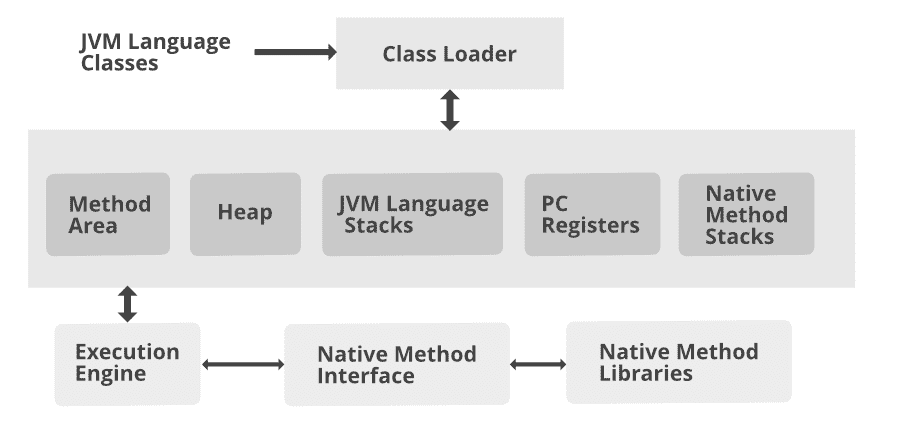

# 常用 JVM 参数

> 原文:[https://www . geesforgeks . org/常用-jvm-parameters/](https://www.geeksforgeeks.org/frequently-used-jvm-parameters/)

JVM 或 Java 虚拟机是物理机器的软件实现，或者我们可以说它是一个抽象机器。Java 是用在虚拟机上运行的 WORA(写一次运行在任何地方)的概念设计的。它是一个规范，提供了一个运行时环境，在这个环境中，java 字节码经常被执行。编译器将 Java 文件编译成 Java。类文件，然后是。类文件被输入到 JVM 中，JVM 加载并执行类文件。

**JVM 由三个基本子单元**构成

1.  类加载器子系统
2.  运行时数据区
3.  执行引擎



现在让我们讨论最常用的 JVM 参数，即 3 个如下:

1.  Java 堆大小
2.  [垃圾收集器](https://www.geeksforgeeks.org/garbage-collection-java/)
3.  打印气相色谱

**参数 1:** Java 堆大小

以下三个 JVM 选项指定运行 Java 程序时的初始和最大堆大小以及线程堆栈大小:

```
 -Xms - set initial Java heap size
 -Xmx - set maximum Java heap size
 -Xss - set java thread stack size
```

**参数 2:** 垃圾收集器

垃圾收集算法用于获得更好的应用程序稳定性。垃圾收集跟踪 JVM 堆空间中可用的每个对象，并移除未使用的对象。

Java 为我们提供了 4 种实现垃圾收集的方法，即:

> *   -xx：+useeriaalgc*   -xx:+使用并行气相色谱*   -xx:+useparnewgc*   -xx:+usg 1 GC

**示例:**

## Java 语言(一种计算机语言，尤用于创建网站)

```
// Class
// To test garbage collection
public class GFG { 

  // Method 1 - finalize()
  // finalize() method is invoked each time
  // before the "Test example garbage collection"
  public void finalize(){System.out.println("Test example garbage collection");} 

  // Method 2
  // Main driver method
  public static void main(String args[]){

  // Creating anonymous objects of
  // GFG class in amin() method 
  GFG object1 = new GFG(); 
  GFG object2 = new GFG();

  // Assigning objects NULL references
  object1 = null; 
  object2 = null;

  // CAlling(invoking) garbage collection
  // using gc() method
  System.gc(); 
 } 
}
```

**输出:**

```
 Test example garbage collection
 Test example garbage collection
```

**参数 3:** 打印 GC

这些 JVM 选项支持垃圾收集日志记录，这对于延迟敏感的操作非常有效。

使用以下参数，我们可以记录垃圾收集活动:

```
-XX:+UseGCLogFileRotation 
-XX:NumberOfGCLogFiles=< number of log files > 
-XX:GCLogFileSize=< file size >[ unit ]
-Xloggc:/path/to/gc.log
```

**示例:**

## Java 语言(一种计算机语言，尤用于创建网站)

```
// Java Program to illustrate Print GC
public class Application {

    private static Map<String, String> stringContainer = new HashMap<>();

    public static void main(String[] args) {
        System.out.println("Start!");
        String stringWithPrefix = "Prefix";

        // Load Java Heap with 3 M java.lang.String instances
        for (int i = 0; i < 3000000; i++) {
            String newString = stringWithPrefix + i;
            stringContainer.put(newString, newString);
        }
        System.out.println("MAP size: " + stringContainer.size());

        // Explicit GC!
        System.gc();

        // Remove 2 M out of 3 M
        for (int i = 0; i < 2000000; i++) {
            String newString = stringWithPrefix + i;
            stringContainer.remove(newString);
        }

        System.out.println("MAP size: " + stringContainer.size());
        System.out.println("End");
    }
}
```