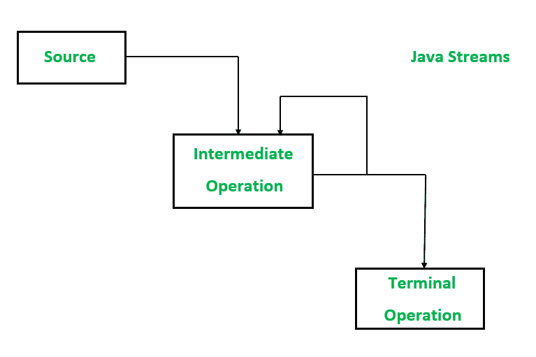

# Java 8+中使用流 API 的函数式编程，示例

> 原文:[https://www . geesforgeks . org/functional-programming-in-Java-8-使用流-api-with-example/](https://www.geeksforgeeks.org/functional-programming-in-java-8-using-the-stream-api-with-example/)

应用编程接口是应用编程接口的缩写，它是软件，java 流在数据源上工作。想象一条小溪，就像一条小运河里的水流。让我们举一个现实生活中的例子。每次用户使用像 WhatsApp 这样时下流行的应用程序，通过向其他用户发送短信或打电话来进行通信时。两个用户都在使用一个应用编程接口。



Java 流处理三个操作，如下所述

1.  数据源
2.  中间操作
3.  终端操作

**方法:**可以通过三种方式创建流

1.  使用集合框架中任何类的对象
2.  使用引用数据类型的数组
3.  使用“java.util.stream”包中定义的接口

**方法 1:** 数据源

数据源可以有很多种，如数组、列表等

**语法:**

```
ArrayList<Integer> numbers = new ArrayList<>();
Integer[] numbers = {1,2,3};
```

**示例 1:** 使用对象作为数据源

## Java 语言(一种计算机语言，尤用于创建网站)

```
// Java Program showcasing data source
// using an object as a data source

// Importing input output classes
import java.io.*;

// Class
class GFG {

    // Main driver method
    public static void main(String[] args)
    {
        // Data Source

        // Creating an arrayList object
        // Declaring object of String type
        ArrayList<String> gfgNames = new ArrayList<>();

        // Custom input elements to above object
        gfgNames.add("Dean");
        gfgNames.add("castee");
        gfgNames.add("robert");

        // Creating object of Stream where Stream is created
        // using arrayList and object as data source
        Stream<String> streamOfNames = gfgNames.stream();

        // Print and display element
        System.out.print(streamOfNames);
    }
}
```

**示例 2:** 使用数组作为数据源

```
// Data Source
Integer[] numbers = {1,2,3,4,5};
```

```
// Stream using an array
Stream<Integer> streamOfNumbers = Arrays.stream(numbers);
```

```
// using predefined Instream interface
integerStream = IntStream.range(1,100); // a stream from 1 to 99;
```

## Java 语言(一种计算机语言，尤用于创建网站)

```
// Java Program showcasing data source
// using an array as a data source

// Importing java input output class
import java.io.*;

// Importing all classes from
// java.util package
import java.util.*;

// Importing class for additional operations,
// additionls and pipelines
import java.util.stream.IntStream;

// Class
class GFG {

    // Main driver method
    public static void main(String[] args)
    {
        // Creating a predefined stream using range method
        // Custom inputs for range as parameters
        var stream = IntStream.range(1, 100);

        // Stream is created
        var max = stream.filter(number -> number % 4 == 0)
                      .count();

        // Print and display the maximum number
        // from the stream
        System.out.println(max);
    }
}
```

```
24
```

**方法 2:** 中间操作

中间操作是可以应用于流的一些方法。

> **注:**可以是任意数

```
filter()
```

**示例:**

## Java 语言(一种计算机语言，尤用于创建网站)

```
import java.io.*;

class GFG {
    public static void main(String[] args)
    {
        // Data Source
        Integer[] numbers = { 1, 2, 3, 4, 5, 6, 7, 8, 9, 0 }

        // Stream
        Stream<Integer> streamOfNumbers
            = Arrays.stream(numbers);

        // filter all the even numbers
        Stream<Integer> evenNumbersStream
            = streamOfNumbers.filter(
                number -> number % 2 == 0)
    }
}
```

**方法三:**终端操作

我们可以在流上应用的终端操作方法会导致流被“关闭”。

**概念:**

一些终端操作可以用来迭代流的元素。

```
min(),max(),count()
```

```
forEach(),noneMatch()
```

**示例 1:** 解释流 API

## Java 语言(一种计算机语言，尤用于创建网站)

```
// Importing input output classes
import java.io.*;
// Importing all classes from
// java.util package
import java.util.*;

// Class
class GFG {

    // Main driver method
    public static void main(String[] args)
    {
        // Data source
        // Custom integer inputs
        Integer[] numbers
            = { 1, 2, 3, 4, 5, 6, 7, 8, 9, 0 };

        // Stream
        var streamOfNumbers = Arrays.stream(numbers);

        // Using filter method
        var evenNumbersStream
            = streamOfNumbers
                  .filter(number -> number % 3 == 0)
                  .count();

        // Print and display
        System.out.println(evenNumbersStream);
    }
}
```

**Output**

```
4
```

**例 2:**

## Java 语言(一种计算机语言，尤用于创建网站)

```
// Importing all classes from java.util package
import java.io.*;
import java.util.*;

// Class
class GFG {

  // Main driver method
    public static void main(String[] args)
    {
      // Creating an ArrayList of Integer type
        ArrayList<Integer> list = new ArrayList<>();

      // Adding elements to above object of Arraylist
      // Custom inputs
        list.add(20);
        list.add(4);
        list.add(76);
        list.add(21);
        list.add(3);
        list.add(80);

        var stream = list.stream();

        var numbers
            = stream.filter(number -> number % 2 == 0)
                  .filter(number -> number > 20);

      // Print all the elements of the stream on the console
        numbers.forEach(System.out::println);
    }
}
```

**Output**

```
76
80
```

> **注:**一个人可以通过λ还数 *- >系统. out.println(数+ " ")*