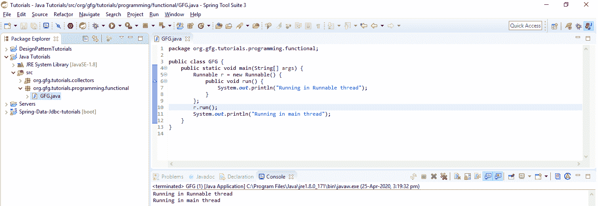

# Java 中的函数式编程示例

> 原文:[https://www . geesforgeks . org/functional-programming-in-Java-with-examples/](https://www.geeksforgeeks.org/functional-programming-in-java-with-examples/)

到目前为止，Java 支持命令式编程和面向对象编程。java 加入的下一件大事是，随着 Java 8 的发布，Java 已经开始支持函数式编程风格。在本文中，我们将讨论 Java 8 中的函数式编程。
**<u>什么是函数式编程？</u>**
它是一种声明式的编程风格，而不是命令式的。与传统的编码风格相比，这种编程风格的基本目标是使代码更简洁、更简单、更可预测、更容易测试。函数式编程处理某些关键概念，如[纯函数](https://www.geeksforgeeks.org/pure-functions/)、[不可变状态](https://www.geeksforgeeks.org/mutable-vs-immutable-objects-in-python/)、无赋值编程等。
**<u>函数式编程 vs 纯函数式编程:</u>**
纯函数式编程语言本质上不允许任何可变性，而函数式风格语言提供更高阶的功能，但往往允许可变性，风险是我们无法做正确的事情，这给我们带来了负担，而不是保护我们。因此，一般来说，我们可以说，如果一种语言提供了高阶函数，它就是函数式语言，如果一种语言除了高阶函数之外，还限制了可变性，那么它就变成了纯函数式语言。Java 是一种函数式语言，像 **Haskell** 这样的语言是一种纯粹的函数式编程语言。
我们来了解一下**功能编程**中的几个概念:

*   **高阶函数:**在函数编程中，函数被认为是一等公民。也就是说，到目前为止，在遗留的编码风格中，我们可以用对象做下面的事情。
    1.  我们可以将**对象**传递给一个函数。
    2.  我们可以在函数内创建**对象**。
    3.  我们可以从函数中返回**对象**。
    4.  我们可以将**函数**传递给函数。
    5.  我们可以在函数内创建一个**函数**。
    6.  我们可以从一个函数返回一个**函数**。
*   [**【纯函数】**](https://www.geeksforgeeks.org/pure-functions/) **:** 如果一个函数总是为相同的参数值返回相同的结果，并且它没有像修改参数(或全局变量)或输出某些东西那样的副作用，那么它被称为纯函数。
*   **Lambda 表达式:**Lambda 表达式是一个匿名方法，它的可变性非常小，只有一个参数列表和一个主体。返回类型总是根据上下文来推断。另外，请注意，Lambda 表达式与函数接口并行工作。λ表达式的语法是:

```java
(parameter) -> body

```

*   在其简单形式中，λ可以表示为逗号分隔的参数列表、**–>**符号和主体。

**<u>如何用 Java 实现函数式编程？</u>**

## Java 语言（一种计算机语言，尤用于创建网站）

```java
// Java program to demonstrate
// anonymous method
import java.util.Arrays;
import java.util.List;
public class GFG {
    public static void main(String[] args)
    {

        // Defining an anonymous method
        Runnable r = new Runnable() {
            public void run()
            {
                System.out.println(
                    "Running in Runnable thread");
            }
        };

        r.run();
        System.out.println(
            "Running in main thread");
    }
}
```

**Output:** 

```java
Running in Runnable thread
Running in main thread

```

[](https://media.geeksforgeeks.org/wp-content/uploads/20200425151713/Java-8-output.png)

如果我们看一下 **run()** 方法，我们用 Runnable 包装它。直到 Java 7 之前，我们都是这样初始化这个方法的。同样的程序可以用 Java 8 重写为:

## Java 语言（一种计算机语言，尤用于创建网站）

```java
// Java 8 program to demonstrate
// a lambda expression
import java.util.Arrays;
import java.util.List;
public class GFG {
    public static void main(String[] args)
    {
        Runnable r
            = ()
            -> System.out.println(
                "Running in Runnable thread");

        r.run();

        System.out.println(
            "Running in main thread");
    }
}
```

**Output:** 

```java
Running in Runnable thread
Running in main thread

```

现在，上面的代码已经被转换成 **Lambda 表达式**而不是匿名方法。这里我们计算了一个没有名字的函数，这个函数是一个 lambda 表达式。因此，在这种情况下，我们可以看到一个函数已经被评估并分配给一个可运行的接口，在这里这个函数被视为一级公民。
**<u>将一些函数从 Java 7 重构到 Java 8:</u>**
到目前为止，我们已经多次使用循环和迭代器来处理 Java 7，如下所示:

## Java 语言（一种计算机语言，尤用于创建网站）

```java
// Java program to demonstrate an
// external iterator
import java.util.Arrays;
import java.util.List;
public class GFG {
    public static void main(String[] args)
    {
        List<Integer> numbers
            = Arrays.asList(11, 22, 33, 44,
                            55, 66, 77, 88,
                            99, 100);

        // External iterator, for Each loop
        for (Integer n : numbers) {
            System.out.print(n + " ");
        }
    }
}
```

**Output:** 

```java
11 22 33 44 55 66 77 88 99 100

```

上面是 Java 中 [forEach 循环的一个例子](https://www.geeksforgeeks.org/for-each-loop-in-java/)外部迭代器的一个类别，下面是一个例子和另一种形式的外部迭代器。

## Java 语言（一种计算机语言，尤用于创建网站）

```java
// Java program to demonstrate an
// external iterator
import java.util.Arrays;
import java.util.List;
public class GFG {
    public static void main(String[] args)
    {
        List<Integer> numbers
            = Arrays.asList(11, 22, 33, 44,
                            55, 66, 77, 88,
                            99, 100);

        // External iterator
        for (int i = 0; i < numbers.size(); i++) {
            System.out.print(numbers.get(i) + " ");
        }
    }
}
```

**Output:** 

```java
11 22 33 44 55 66 77 88 99 100

```

我们可以用 Java 8 中引入的内部迭代器来转换上面的外部迭代器示例，如下所示:

## Java 语言（一种计算机语言，尤用于创建网站）

```java
// Java 8 program to demonstrate
// an internal iterator

import java.util.Arrays;
import java.util.List;

public class GFG {
    public static void main(String[] args)
    {
        List<Integer> numbers
            = Arrays.asList(11, 22, 33, 44,
                            55, 66, 77, 88,
                            99, 100);

        // Internal iterator
        numbers.forEach(number
                        -> System.out.print(
                            number + " "));
    }
}
```

**Output:** 

```java
11 22 33 44 55 66 77 88 99 100

```