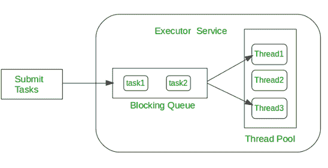

# Java 中的未来和未来任务

> 原文:[https://www . geesforgeks . org/future-and-future etask-in-Java/](https://www.geeksforgeeks.org/future-and-futuretask-in-java/)

**先决条件:** [**未来可调用**](https://www.geeksforgeeks.org/callable-future-java/)

### 未来:

一个**未来**界面提供了方法**来检查计算是否完成，等待其完成并检索计算结果**。当计算完成时，使用 Future 的 get()方法检索结果，并一直阻塞到计算完成。
Future 和 FutureTask 都有 Java 1.5 的 **java.util.concurrent 包**提供。

### 未来任务：

1.  FutureTask 实现 Future 接口和 RunnableFuture 接口，意味着可以使用 FutureTask 作为 Runnable，并可以提交给 ExecutorService 执行。
2.  当一个人调用 Future.submit() Callable 或 Runnable 对象时，大多数时候 ExecutorService 会创建 FutureTask，也可以手动创建它。
3.  未来任务就像一个门闩。
4.  未来任务表示的计算是用可调用接口实现的。
5.  它实现了未来或可调用接口。
6.  get()方法的行为取决于任务的状态。如果任务没有完成，get()方法会等待或阻塞直到任务完成。任务完成后，它会返回结果或引发 ExecutionException。

使用 Future 的一个例子是使用**线程池**。当一个人向执行服务提交一个运行时间很长任务时，它会立即返回一个未来对象。这个 Future 对象可以用于任务完成和获得计算结果。



**示例:**创建两个任务。一个任务完全执行后，等待 2000 毫秒后，第二个任务正在执行

**注意:** Online IDE 在 sleep()方法上无法正常工作。

## Java 语言(一种计算机语言，尤用于创建网站)

```
// Java program do two FutureTask
// using Runnable Interface

import java.util.concurrent.*;
import java.util.logging.Level;
import java.util.logging.Logger;

class MyRunnable implements Runnable {

    private final long waitTime;

    public MyRunnable(int timeInMillis)
    {
        this.waitTime = timeInMillis;
    }

    @Override
    public void run()
    {
        try {
            // sleep for user given millisecond
            // before checking again
            Thread.sleep(waitTime);

            // return current thread name
            System.out.println(Thread
                                   .currentThread()
                                   .getName());
        }

        catch (InterruptedException ex) {
            Logger
                .getLogger(MyRunnable.class.getName())
                .log(Level.SEVERE, null, ex);
        }
    }
}

// Class FutureTaskExample execute two future task
class FutureTaskExample {

    public static void main(String[] args)
    {
        // create two object of MyRunnable class
        // for FutureTask and sleep 1000, 2000
        // millisecond before checking again
        MyRunnable myrunnableobject1 = new MyRunnable(1000);
        MyRunnable myrunnableobject2 = new MyRunnable(2000);

        FutureTask<String>
            futureTask1 = new FutureTask<>(myrunnableobject1,
                                           "FutureTask1 is complete");
        FutureTask<String>
            futureTask2 = new FutureTask<>(myrunnableobject2,
                                           "FutureTask2 is complete");

        // create thread pool of 2 size for ExecutorService
        ExecutorService executor = Executors.newFixedThreadPool(2);

        // submit futureTask1 to ExecutorService
        executor.submit(futureTask1);

        // submit futureTask2 to ExecutorService
        executor.submit(futureTask2);

        while (true) {
            try {

                // if both future task complete
                if (futureTask1.isDone() && futureTask2.isDone()) {

                    System.out.println("Both FutureTask Complete");

                    // shut down executor service
                    executor.shutdown();
                    return;
                }

                if (!futureTask1.isDone()) {

                    // wait indefinitely for future
                    // task to complete
                    System.out.println("FutureTask1 output = "
                                       + futureTask1.get());
                }

                System.out.println("Waiting for FutureTask2 to complete");

                // Wait if necessary for the computation to complete,
                // and then retrieves its result
                String s = futureTask2.get(250, TimeUnit.MILLISECONDS);

                if (s != null) {
                    System.out.println("FutureTask2 output=" + s);
                }
            }

            catch (Exception e) {
                Sysmtem.out.println("Exception: " + e);
            }
        }
    }
}
```

**输出:**

```
FutureTask1 output=FutureTask1 is complete
Waiting for FutureTask2 to complete
Waiting for FutureTask2 to complete
Waiting for FutureTask2 to complete
Waiting for FutureTask2 to complete
FutureTask2 output=FutureTask2 is complete
Both FutureTask Complete
```

**参考**:

*   [https://docs . Oracle . com/javase/7/docs/API/Java/util/concurrent/future . html](https://docs.oracle.com/javase/7/docs/api/java/util/concurrent/Future.html)
*   [https://docs . Oracle . com/javase/7/docs/API/Java/util/concurrent/futuretask . html](https://docs.oracle.com/javase/7/docs/api/java/util/concurrent/FutureTask.html)