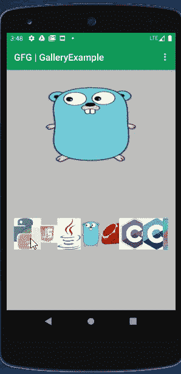

# 安卓中的 GalleryView，示例

> 原文:[https://www . geeksforgeeks . org/gallery view-in-Android-with-example/](https://www.geeksforgeeks.org/galleryview-in-android-with-example/)

在安卓系统中，**图库**是一个可以在中心锁定的水平滚动列表中显示项目的视图，因此用户可以选择一个视图，然后用户选择的视图将显示在水平列表的中心。使用适配器可以添加“N”个项目。适配器是 UI 组件和数据源之间的桥接组件(它可以是在 java 代码中定义的项目数组，也可以来自数据库)。适配器中给出的项目将显示在示例的图库中。

> **重要提示:**图库类在 API 等级 16 中被弃用。相反，支持库中的其他水平滚动小部件是水平滚动视图和视图页面。

### **定义图库标签的方式**

## 可扩展标记语言

```java
<!-- By using android:spacing we can give spacing between images
     android:animationDuration="3000" -> for animation running -->
<Gallery
  android:id="@+id/languagesGallery"
  android:layout_width="match_parent"
  android:layout_height="wrap_content"
  android:layout_marginTop="100dp"
  android:unselectedAlpha="50"
  android:spacing="5dp"
  android:animationDuration="2000"
  android:padding="10dp" />
```

### **安卓**中 G **alleryView 的重要方法**

<figure class="table">

| 

方法

 | 

描述

 |
| --- | --- |
| setanitionduration(int) | 要设置过渡动画应该运行多长时间的持续时间每当布局发生变化时(毫秒)。这也可以通过 Android:animationDuration = " 3000 "在 xml 中设置 |
| setSpacing（int） | 设置图库中项目之间的间距。这可以用 xml 设置同样通过 android:spacing="5dp " |
| setUnselectedAlpha(浮动) | 为未选择的项目设置 alpha。这可以用 xml 设置

也可以通过安卓系统:unselect edalpha =“0.25” |

</figure>

**让我们看看重要方法的实现:**

## Java 语言(一种计算机语言，尤用于创建网站)

```java
// get the reference of Gallery first
Gallery simpleGallery = (Gallery) findViewById(R.id.languagesGallery);

// set 3000 milliseconds for animation duration between each items of Gallery
// xml equivalent -> android:animationDuration="2000"
simpleGallery.setAnimationDuration(2000);

// set space between the items of Gallery
// xml equivalent -> android:spacing="15dp"
simpleGallery.setSpacing(15);

// set 0.25 value for the alpha of unselected items of Gallery
// xml equivalent -> android:unselectedAlpha="0.25"
simpleGallery.setUnselectedAlpha(0.25f);
```

### **画廊视图的属性**

<figure class="table">

| 

属性

 | 

描述

 |
| --- | --- |
| 身份证明（identification） | 要唯一标识图库 |
| 填料 | 从图库的左侧、右侧、顶部或底部设置填充。 |
| 向右划水 | 从图库的右侧设置填充。 |
| 划水 | 从图库的左侧设置填充。 |
| 填充顶部 | 从图库的顶部设置填充。 |
| 划水底部 | 从图库的底部设置填充。 |
| 填料 | 从画廊的所有侧面设置填充。 |
| 背景 | 设置画廊的背景。作为背景，我们可以设置颜色(使用 colors.xml)或保存在可绘制文件夹下的图像通过 java 代码，我们可以用下面的方式设置背景颜色

简单画廊。设置背景颜色(颜色。gfggreecolor)；//设置所需的颜色 |
| 动画持续时间 | 设置过渡动画运行的持续时间(以毫秒为单位)通过 java，simplegallery . setanimationduration(<no of="" milliseconds="">)；</no> |
| 间隔 | 设置图库中项目之间的间距。通过 java，simplegallery . setspacing(10)；//我们可以根据需要设置项目之间的间距 |
| 取消选择 lpha | 为未选择的项目设置 alpha。通过 java，simplegallery . setunselectedalpha(0.25 f) |

</figure>

### 例子

下面给出了一个 GIF 示例，来了解一下在这篇文章中要做什么。注意，我们将使用 **Java** 语言来实现这个项目。



### **分步实施**

**第一步:创建新项目**

要在安卓工作室创建新项目，请参考[如何在安卓工作室创建/启动新项目](https://www.geeksforgeeks.org/android-how-to-create-start-a-new-project-in-android-studio/)。注意选择 **Java** 作为编程语言。

**步骤 2:使用 activity_main.xml 文件**

转到 **activity_main.xml** 文件，参考以下代码。下面是 **activity_main.xml** 文件的代码。

## 可扩展标记语言

```java
<LinearLayout
    xmlns:android="http://schemas.android.com/apk/res/android"
    xmlns:tools="http://schemas.android.com/tools"
    android:layout_width="match_parent"
    android:layout_height="match_parent"
    android:background="#fff"
    android:orientation="vertical"
    tools:context=".MainActivity">

    <!-- create a ImageView and Gallery -->
    <ImageView
        android:id="@+id/imageView"
        android:layout_width="fill_parent"
        android:layout_height="200dp"
        android:scaleType="fitXY" />

    <!-- By using android:spacing we can give spacing between images
         android:animationDuration="3000" -> for animation running -->
    <Gallery
        android:id="@+id/languagesGallery"
        android:layout_width="match_parent"
        android:layout_height="wrap_content"
        android:layout_marginTop="100dp"
        android:animationDuration="2000"
        android:padding="10dp"
        android:spacing="5dp"
        android:unselectedAlpha="50" />

</LinearLayout>
```

**步骤 3:使用 MainActivity.java 文件**

转到**MainActivity.java**文件，参考以下代码。以下是**MainActivity.java**文件的代码。代码中添加了注释，以更详细地理解代码。

## Java 语言(一种计算机语言，尤用于创建网站)

```java
import android.os.Bundle;
import android.view.View;
import android.widget.AdapterView;
import android.widget.Gallery;
import android.widget.ImageView;
import androidx.appcompat.app.AppCompatActivity;

public class MainActivity extends AppCompatActivity {

    Gallery simpleGallery;

    // CustomizedGalleryAdapter is a java class which extends BaseAdapter
    // and implement the override methods.
    CustomizedGalleryAdapter customGalleryAdapter;
    ImageView selectedImageView;

    // To show the selected language, we need this
    // array of images, here taken 10 different kind of most popular programming languages
    int[] images = {R.drawable.python, R.drawable.javascript, R.drawable.java, R.drawable.python, R.drawable.r,
            R.drawable.python, R.drawable.javascript, R.drawable.python, R.drawable.r, R.drawable.javascript};

    @Override
    protected void onCreate(Bundle savedInstanceState) {
        super.onCreate(savedInstanceState);
        setContentView(R.layout.activity_main);

        // Our layout is activity_main
        // get the reference of Gallery. As we are showing languages it is named as languagesGallery
        // meaningful names will be good for easier understanding
        simpleGallery = (Gallery) findViewById(R.id.languagesGallery);

        // get the reference of ImageView
        selectedImageView = (ImageView) findViewById(R.id.imageView);

        // initialize the adapter
        customGalleryAdapter = new CustomizedGalleryAdapter(getApplicationContext(), images);

        // set the adapter for gallery
        simpleGallery.setAdapter(customGalleryAdapter);

        // Let us do item click of gallery and image can be identified by its position
        simpleGallery.setOnItemClickListener(new AdapterView.OnItemClickListener() {
            @Override
            public void onItemClick(AdapterView<?> parent, View view, int position, long id) {
                // Whichever image is clicked, that is set in the  selectedImageView
                // position will indicate the location of image
                selectedImageView.setImageResource(images[position]);
            }
        });
    }
}
```

**第四步:新建一个 CustomizedGalleryAdapter.java 类**

这可以放在与 MainActivity.java 相同的位置，以便于参考。在这一步中，我们创建了一个 **CustomizedGalleryAdapter** ，它是从 BaseAdapter 扩展而来的，实现了被覆盖的方法。在代码中，运行时在 getView 方法中创建了一个 [ImageView](https://www.geeksforgeeks.org/imageview-in-kotlin/) ，最后在 ImageView 中设置图像。

## Java 语言(一种计算机语言，尤用于创建网站)

```java
import android.content.Context;
import android.view.View;
import android.view.ViewGroup;
import android.widget.BaseAdapter;
import android.widget.Gallery;
import android.widget.ImageView;

public class CustomizedGalleryAdapter extends BaseAdapter {

    private Context context;
    private int[] images;

    public CustomizedGalleryAdapter(Context c, int[] images) {
        context = c;
        this.images = images;
    }

    // returns the number of images, in our example it is 10
    public int getCount() {
        return images.length;
    }

    // returns the Item  of an item, i.e. for our example we can get the image
    public Object getItem(int position) {
        return position;
    }

    // returns the ID of an item
    public long getItemId(int position) {
        return position;
    }

    // returns an ImageView view
    public View getView(int position, View convertView, ViewGroup parent) {
        // position argument will indicate the location of image
        // create a ImageView programmatically
        ImageView imageView = new ImageView(context);

        // set image in ImageView
        imageView.setImageResource(images[position]);

        // set ImageView param
        imageView.setLayoutParams(new Gallery.LayoutParams(200, 200));
        return imageView;
    }
}
```

### **输出**

在 android studio 中运行 android 代码时，我们可以获得如所附视频所示的输出。这是一个有用的功能，在许多安卓应用中使用。我们需要考虑前面提到的要点。也就是说，水平滚动的小部件是来自支持库的 [**【水平滚动滚动视图】**](https://www.geeksforgeeks.org/horizontalscrollview-in-kotlin/) 和 [**视图寻呼机**](https://www.geeksforgeeks.org/image-slider-in-android-using-viewpager/) 是可用的，因此对于最新的设备来说更喜欢它们。

<video class="wp-video-shortcode" id="video-507267-1" width="640" height="360" preload="metadata" controls=""><source type="video/mp4" src="https://media.geeksforgeeks.org/wp-content/uploads/20201029115934/GalleryExample1.mp4?_=1">[https://media.geeksforgeeks.org/wp-content/uploads/20201029115934/GalleryExample1.mp4](https://media.geeksforgeeks.org/wp-content/uploads/20201029115934/GalleryExample1.mp4)</video>