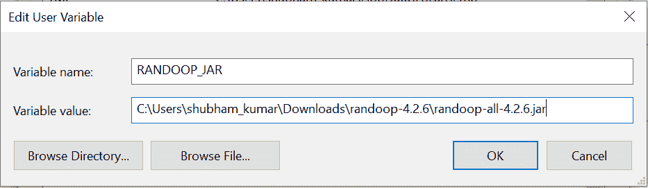
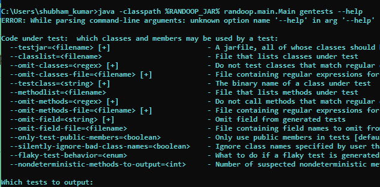
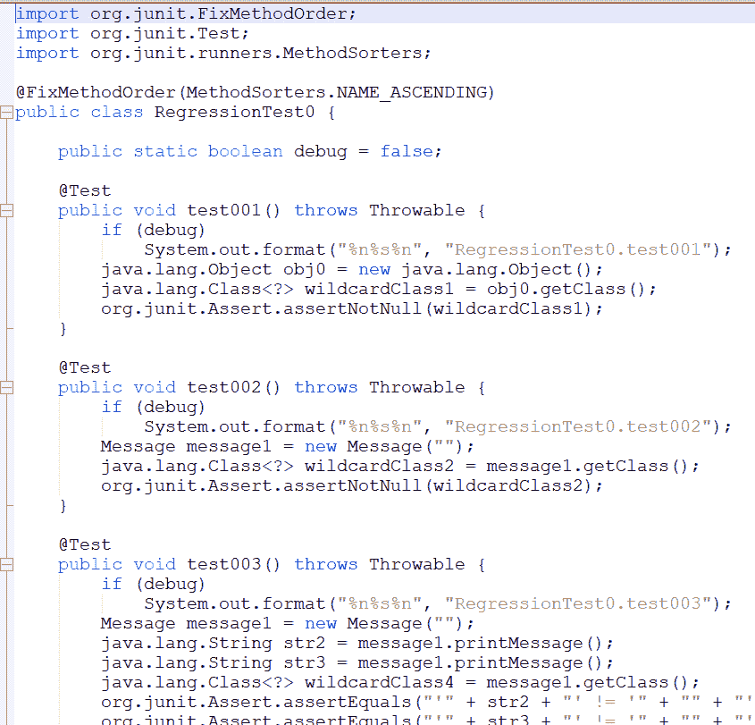
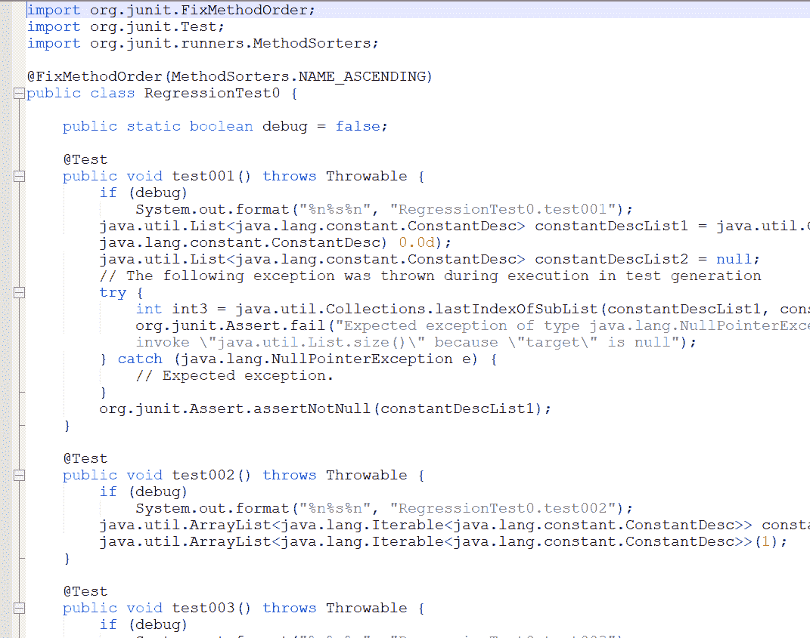

# 使用 Java 中的 Randoop API 生成 Junit 测试用例

> 原文:[https://www . geesforgeks . org/generate-JUnit-test-cases-use-randoop-API-in-Java/](https://www.geeksforgeeks.org/generate-junit-test-cases-using-randoop-api-in-java/)

这里我们将讨论如何使用 Randoop 生成[](https://www.geeksforgeeks.org/unit-testing-software-testing/)**测试用例，以及当前实例的示例图和快照。所以基本上在开发中如果我们谈论测试用例，那么每个开发人员都必须手动编写测试用例。这被计算在开发工作中，也增加了项目的时间和成本估算。所以我们可以在一些 API 的帮助下减少编写测试用例的时间。其中之一就是 **Randoop** 。Java 和 Randoop 是我们前进之前的先决条件。使用 randoop 生成测试用例需要基础知识您需要了解 Junit 的基础知识来验证结果。**

****Randoop 的工作方式:** Randoop 会自动为你的类创建 Junit 测试。它是一个 Java 的单元测试生成器。Randoop 使用反馈导向的随机测试生成来生成单元测试。这种技术是伪随机的，但是很聪明，为测试中的类生成方法/构造函数调用序列。**

****Randoop 通常会生成两种类型的测试用例:****

*   **检测当前代码中的错误的错误揭示测试。**
*   **可用于检测未来错误的回归测试。**

****运行 Randoop:** 现在你的机器里有下载的 jar 了。要运行它，你必须调用 Randoop 的主方法，比如 **randoop.main.Main****

****第一步:**首先要设置 **randoop-all-4.2.6.jar** 和**的环境变量。****

****

****步骤 2:** 设置可变开路端子后，输入下面给出的线路，如果一切配置正确，则输出如下。**

```
java -classpath %RANDOOP_JAR% randoop.main.Main gentests --help
```

****

****步骤 3:** 现在，为 java 文件(**–Test class)**生成测试用例**

*   **创建一个示例 java 文件来生成测试用例。**
*   **在这个例子中，我们使用**–test class**选项来测试单个类文件。**

****例****

## **Java 语言(一种计算机语言，尤用于创建网站)**

```
public class Message {
   private String message;

   public Message(String message){
      this.message = message;
   }   
   public String printMessage(){
      System.out.println(message);
      return message;
   }   
}
```

****第四步:**使用***javac Message.java***编译，它将生成 ***Message.class*** 文件，randoop 将使用该文件生成测试用例。**

****步骤 5:** 现在打开终端/cmd，输入如下命令:**

****语法:****

> **Java-类路径<location of="" the="" class="" file="">；<location where="" jar="" file="" located="">randoop-all-4.2 . x randoop . main . main gentests–test class =<class file="" name=""></class></location></location>**

******示例:******

```
**java -classpath C:\Users\public\Downloads\testbin;%RANDOOP_JAR% randoop.main.Main gentests --testclass=Message**
```

> ****运行此命令后，Message.class 文件的所有可能的测试用例都将在新的 Java 文件中列出，这些文件是由名为 retractiontest0，retractiontest0 的 Randoop 生成的。****

********

```
**Generate Test cases for java files (**--classlist)****
```

****实现:在这个例子中，我们将为用简单文本文件编写的类文件列表生成测试用例，并将该文本文件作为输入提供给 randoop。****

******语法**:****

> ****java 类路径<location where="" jar="" file="" located="">randoop-all-4.2 . x randoop . main . main gentests–class list =<location of="" the="" file=""></location></location>****

******示例:******

```
**java -classpath %RANDOOP_JAR% randoop.main.Main gentests --classlist=C:\User\test1.txt**
```

******输出:******

********

****到目前为止，我们已经完成了使用 Randoop API 生成 Junit 测试用例的工作，这也是我们的目标。下面以表格的形式列出了一些有用的操作，以获得对 Randoop API 的支持。它们如下:****

<figure class="table">

| 操作 | 已执行的操作 |
| --- | --- |
| –测试= <filename>[+]</filename> | 一个 jar 文件，它的所有类都应该被测试 |
| –T0 | 列出测试中的类的文件 |
| –省略类= <regex>[+]</regex> | 不要测试匹配正则表达式的类 |
| –省略-类-文件= <filename>[+]</filename> | 包含要省略的方法的正则表达式的文件 |
| –测试类= <string>[+]</string> | 被测类的二进制名称 |
| –方法列表=<filename></filename> | 列出测试中的方法的文件 |
| –省略-methods= <regex>[+]</regex> | 不要调用匹配正则表达式的方法 |
| –省略-方法-文件= <filename>[+]</filename> | 包含要忽略的方法的正则表达式的文件 |
| –省略-字段= <string>[+]</string> | 从生成的测试中省略字段 |
| –省略-字段-文件=<filename></filename> | 包含要从生成的测试中忽略的字段名的文件 |
| –仅测试-公共-成员=<boolean></boolean> | 仅在测试中使用公共成员[默认为 false] |
| –默默忽略坏类名=<boolean></boolean> | 忽略用户指定的找不到的类名[默认为 false] |
| –片状测试行为= | 如果产生不稳定的测试怎么办[默认输出] |
| –不确定的方法到输出= | 疑似不确定的打印方法数量[默认为 10] |

</figure>