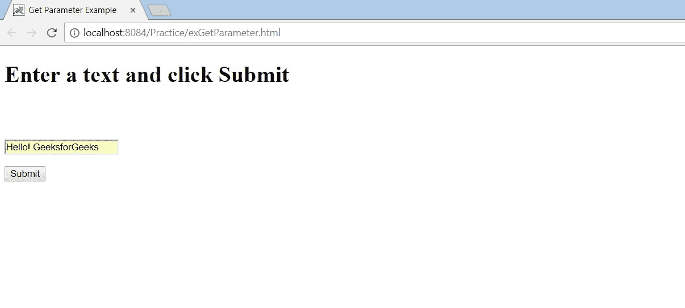
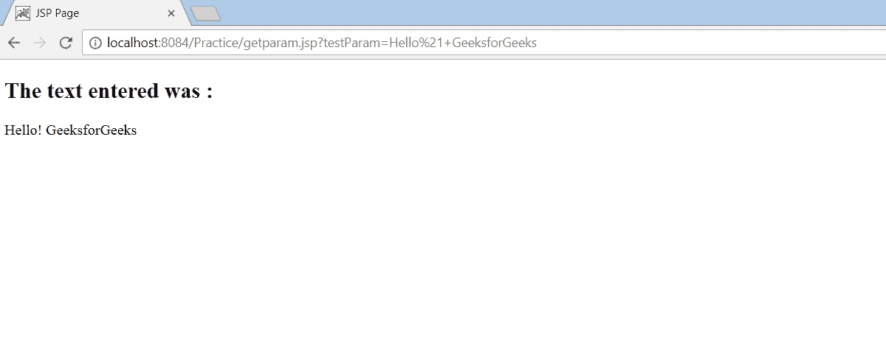

# getParameter()–将数据从客户端传递到 JSP

> 原文:[https://www . geesforgeks . org/getparameter-passing-data-from-client-to-JSP/](https://www.geeksforgeeks.org/getparameter-passing-data-from-client-to-jsp/)

这里介绍一下 getParameter()方法在从客户端 HTML 页面到 JSP 页面获取数据(尤其是表单数据)方面的熟悉程度。request.getParameter()在这里用于从客户端检索表单数据。

**需要遵循的步骤**
**1)** 首先，一个 html 页面 exGetParameter.html 接受来自客户端的数据。客户在提供的空白处输入文本，然后点击“提交”。
**2)**getparam.jsp 页面立即被调用，它在动作标签中被提及。
**3)** 这个 JSP 页面使用 getParameter()方法获取数据并显示给用户。

注意:整个应用程序已经在 NetBeans IDE 8.1 上进行了开发和测试。

**接受客户端数据页面:exGetParameter.html 页面**

```
<html>
    <head>
        <title>Get Parameter Example</title>
        <meta charset="UTF-8">
        <meta name="viewport" content="width=device-width,
                                       initial-scale=1.0">
    </head>
    <body>
        <!-- Here we specify that the from data will be sent to 
             getparam.jsp page using the action attribute  
        -->
        <form name="testForm" action="getparam.jsp">
           <label><h1>Enter a text and click Submit<h1/></label><br/>
           <input type="text" name="testParam"><br/>
           <input type="submit">
        </form>
    </body>
</html>
```

**获取客户端数据页面:getparam.jsp**

```
<%@page contentType="text/html" pageEncoding="UTF-8"%>
<!DOCTYPE html>
<html>
    <head>
        <meta http-equiv="Content-Type" content="text/html;
                                            charset=UTF-8">
        <title>JSP Page</title>
    </head>
    <body>
        <%-- Here we fetch the data using the name attribute 
             of the text from the previous page
        --%>
        <% String val = request.getParameter("testParam"); %>
    </body>
    <%-- Here we use the JSP expression tag to display value 
         stored in a variable
    --%>
    <h2>The text entered was : </h2><%=val%>
</html>
```

**输出**
**客户端数据:exGetParameter.html**


点击“提交”后，出现以下屏幕。
**从客户端获取的数据:getparam.jsp**
