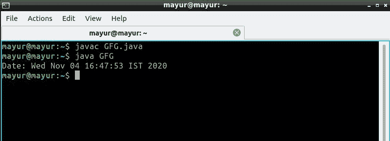

# 获取 Java 中 URL 连接的日期

> 原文:[https://www . geesforgeks . org/get-date-of-URL-in-Java-connection/](https://www.geeksforgeeks.org/getting-the-date-of-url-connection-in-java/)

[HttpURLConnection 类](https://www.geeksforgeeks.org/java-net-httpurlconnection-class-java/)是 java 中处理所有与 URL 连接相关的操作的类。 **getDate()** 方法的 HttpURLConnection 类是用来获取 URL 连接的日期和时间的方法。

**语法:**

```
Obj.getDate()  // Obj is object of HttpUrlConnection class
```

**参数:**该方法不取任何参数。它只是与一个 HttpUrlConnection 对象一起使用，我们希望从该对象中获取连接的日期和时间。

**返回值:**返回连接的日期、日期和时间。

下面是获取网址连接日期的代码实现。

## Java 语言(一种计算机语言，尤用于创建网站)

```
// Java Program to get the date of the URL connection

import java.io.IOException;
import java.net.HttpURLConnection;
import java.net.URL;
import java.util.Date;
import java.util.concurrent.TimeUnit;

class Main {
    public static void main(String args[])
        throws IOException, InterruptedException
    {
        // getting the URL class object
        URL url = new URL("http://www.yahoo.com");

        // opening the connection
        HttpURLConnection httpCon
            = (HttpURLConnection)url.openConnection();

        // getting the date of URL connection
        long date = httpCon.getDate();

        /*
          Other working of program
        */

        // if date is 0,it means there is no 
        // information regarding date
        if (date == 0)
            System.out.println("No date information.");
        else {
            // print the date using object of Date class
            System.out.println("Date: " + new Date(date));
        }
    }
}
```

**输出:-**

