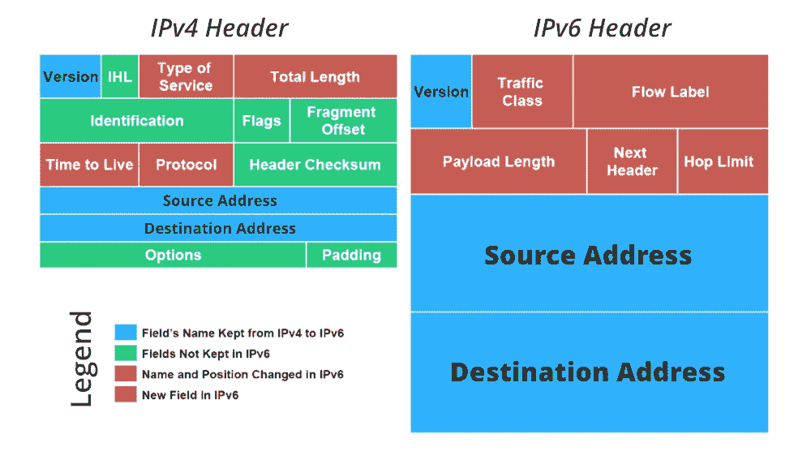

# 使用 Java 获取自己的设备 IP 地址

> 原文:[https://www . geesforgeks . org/get-your-your-your-device-IP-address-using-Java/](https://www.geeksforgeeks.org/getting-your-own-device-ip-address-using-java/)

互联网协议地址(IP 地址)是分配给参与使用互联网协议进行通信的计算机网络的每个设备(例如，计算机、打印机)的数字标签。IP 地址有两个主要功能:主机或网络接口识别和位置寻址。互联网协议地址有两个版本，命名如下:

*   IPv4
*   IPv6



IPv4 地址由 32 位组成，将地址空间限制为 4294967296 (232)个可能的唯一地址。IPv4 保留一些地址用于特殊用途，例如专用网络(约 1800 万个地址)或多播地址(约 2.7 亿个地址)。IPv4 地址空间的快速耗尽促使互联网工程任务组探索新技术来扩展互联网上的寻址能力。这种新一代互联网协议最终在 1995 年被命名为互联网协议版本 6 (IPv6)。地址大小从 32 位增加到 128 位(16 个八位字节)，从而提供了多达 2128 个(约 3.403×1038)地址。

**实施:**

> 伪代码如下:
> 
> ```java
> InetAddress myIP = InetAddress.getLocalHost();
> System.out.println(myIP.getHostAddress());
> ```

**例**

## Java 语言(一种计算机语言，尤用于创建网站)

```java
// Java Program to Find IP address of Own Device

// Importing input output class
import java.io.*;
// Importing InetAddress class from java.net package
import java.net.InetAddress;

// Main class
public class GFG {

    // Main driver method
    public static void main(String[] args)
    {

        // Try block to check for exceptions
        try {

            // Creating an object of InetAddress class to
            // get the Ip address
            InetAddress myIP = InetAddress.getLocalHost();

            // Display message only
            System.out.println("My IP Address is : ");

            // Print and display the IP address
            System.out.println(myIP.getHostAddress());
        }

        // Catch block to handle the exceptions
        catch (Exception e) {

            // Display message to be printed on console
            // as the exception occurs
            System.out.println("Some Error Occured");
        }
    }
}
```

**Output**

```java
My IP Address is:
127.0.0.1
```