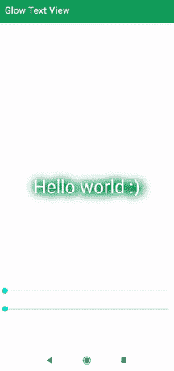

# Android 中的 Glow 文本视图

> 原文:[https://www.geeksforgeeks.org/glow-textview-in-android/](https://www.geeksforgeeks.org/glow-textview-in-android/)

默认情况下，安卓没有提供简单的方法将发光添加到文本视图或任何其他视图中，因此为了使我们的应用程序更加吸引人和美观，我们可以将发光效果添加到我们的[文本视图](https://www.geeksforgeeks.org/working-with-the-textview-in-android/)中。为此，我们可以使用许多不同的外部库。下面给出一个 GIF 示例，了解一下我们在本文中要做什么。注意，我们将使用 **Java** 语言来实现这个项目。



### **接近**

**第一步:创建新项目**

要在安卓工作室创建新项目，请参考[如何在安卓工作室创建/启动新项目](https://www.geeksforgeeks.org/android-how-to-create-start-a-new-project-in-android-studio/)。注意选择 **Java** 作为编程语言。

**第二步:去编码区之前先做一些前置任务**

转到**应用程序->RES->values->colors . XML**文件，为应用程序设置颜色。

## 可扩展标记语言

```java
<?xml version="1.0" encoding="utf-8"?>
<resources>

    <color name="colorPrimary">#0F9D58</color>
    <color name="colorPrimaryDark">#0F9D58</color>
    <color name="colorAccent">#05af9b</color>
    <color name="white">#ffffff</color>

</resources>
```

转到 Gradle **脚本>构建. gradle** (模块:app)部分，导入以下依赖项，然后单击上面弹出窗口中的“**立即同步**”。

> //添加 glowtextview
> 
> 实现' com . riningan . widget:glwtextview:1.0 '

**第三步:设计 UI**

在 **activity_main.xml** 中，删除默认的文本视图，将布局更改为相对布局，并添加**辉光文本视图**，我们还添加了 2 [SeekBar](https://www.geeksforgeeks.org/android-creating-a-seekbar/) 来更改辉光文本视图的颜色和半径，如下所示。下面是**activity _ main . XML**文件的代码。

## 可扩展标记语言

```java
<?xml version="1.0" encoding="utf-8"?>
<RelativeLayout
    xmlns:android="http://schemas.android.com/apk/res/android"
    xmlns:app="http://schemas.android.com/apk/res-auto"
    xmlns:tools="http://schemas.android.com/tools"
    android:layout_width="match_parent"
    android:layout_height="match_parent"
    tools:context=".MainActivity">

    <!-- Glow Text View -->
    <com.riningan.widget.GlowTextView
        android:id="@+id/glowTextView"
        android:layout_width="wrap_content"
        android:layout_height="wrap_content"
        android:layout_centerInParent="true"
        android:padding="40dp"
        android:text="Hello world :)"
        android:textColor="@android:color/white"
        android:textSize="40dp"
        app:glowColor="@color/Green"
        app:glowRadius="16dp" />

    <!-- simple seek bar to change the glow of the GlowTextView -->
    <SeekBar
        android:id="@+id/seekBarGlow"
        android:layout_width="match_parent"
        android:layout_height="wrap_content"
        android:layout_alignParentBottom="true"
        android:layout_marginBottom="80dp"
        android:max="100" />

    <!-- simple seek bar to change the color of the GlowTextView -->
    <SeekBar
        android:id="@+id/seekBarColor"
        android:layout_width="match_parent"
        android:layout_height="wrap_content"
        android:layout_alignParentBottom="true"
        android:layout_marginBottom="120dp" />

</RelativeLayout>
```

**属性:**

1.  **app:glowRadius** :用于设置发光半径【默认值 60f】
2.  **app:glowColor** :用于设置发光颜色【默认颜色值白色】

**第四步:编码部分**

打开**MainActivity.java**文件，在类内部，我们创建一个整数数组来存储不同的颜色(我们稍后使用它来改变**glwtextview**的颜色)，如下所示

## Java 语言(一种计算机语言，尤用于创建网站)

```java
// array of different colors
int[] colors={Color.RED,Color.GREEN,Color.BLACK,Color.CYAN,Color.DKGRAY,Color.GRAY,Color.LTGRAY,Color.BLUE,Color.WHITE,Color.YELLOW,Color.MAGENTA};
```

现在在 **onCreate()** 中获取 GlowTextView 和 2 SeekBar 的参考，并将 SeekBar 的最大颜色设置为**colors . length–1**，如下所示。

## Java 语言(一种计算机语言，尤用于创建网站)

```java
// getting Glow seekBar reference
SeekBar seekBarGlow =(SeekBar)findViewById(R.id.seekBarGlow);

// getting Color seekBar reference
SeekBar seekBarColor =(SeekBar)findViewById(R.id.seekBarColor);

// setting the max of seekBar to color length -1
seekBarColor.setMax(colors.length-1);

// getting glowTextView reference
GlowTextView  glowTextView =(GlowTextView)findViewById(R.id.glowTextView);
```

现在创建一个 SeekBar 的**SeekBar angelistener**和**onprogress changed(SeekBar SeekBar，int progress，boolean fromUser)** 将 **GlowColor** 和**glow dius**值设置为如下所示的过程

## Java 语言(一种计算机语言，尤用于创建网站)

```java
// seekBar change listener for changing the glow radius
seekBarGlow.setOnSeekBarChangeListener(new SeekBar.OnSeekBarChangeListener() {
           @Override
           public void onProgressChanged(SeekBar seekBar, int progress, boolean fromUser) {
               // change the glow radius of the glow text view
               glowTextView.setGlowRadius(progress);
           }

           @Override
           public void onStartTrackingTouch(SeekBar seekBar) {

           }

           @Override
           public void onStopTrackingTouch(SeekBar seekBar) {

           }
       });

        // seekBar change listener for changing color
        seekBarColor.setOnSeekBarChangeListener(new SeekBar.OnSeekBarChangeListener() {
            @Override
            public void onProgressChanged(SeekBar seekBar, int progress, boolean fromUser) {
                // change the glow color  of the glow text view
                glowTextView.setGlowColor(colors[progress]);
            }

            @Override
            public void onStartTrackingTouch(SeekBar seekBar) {

            }

            @Override
            public void onStopTrackingTouch(SeekBar seekBar) {

            }
});
```

以下是**MainActvity.java**文件的完整代码。

## Java 语言(一种计算机语言，尤用于创建网站)

```java
import android.graphics.Color;
import android.os.Bundle;
import android.widget.SeekBar;

import androidx.appcompat.app.AppCompatActivity;

import com.riningan.widget.GlowTextView;

public class MainActivity extends AppCompatActivity {

    // array of different colors
    int[] colors = {Color.RED, Color.GREEN, Color.BLACK, Color.CYAN, Color.DKGRAY, Color.GRAY, Color.LTGRAY, Color.BLUE, Color.WHITE, Color.YELLOW, Color.MAGENTA};

    @Override
    protected void onCreate(Bundle savedInstanceState) {
        super.onCreate(savedInstanceState);
        setContentView(R.layout.activity_main);

        // getting Glow seekBar reference
        SeekBar seekBarGlow = (SeekBar) findViewById(R.id.seekBarGlow);

        // getting Color seekBar reference
        SeekBar seekBarColor = (SeekBar) findViewById(R.id.seekBarColor);

        // setting the max of seekBar to color length -1
        seekBarColor.setMax(colors.length - 1);

        // getting glowTextView reference
        GlowTextView glowTextView = (GlowTextView) findViewById(R.id.glowTextView);

        // seekBar change listener for changing the glow radius
        seekBarGlow.setOnSeekBarChangeListener(new SeekBar.OnSeekBarChangeListener() {
            @Override
            public void onProgressChanged(SeekBar seekBar, int progress, boolean fromUser) {
                // change the glow radius of the glow text view
                glowTextView.setGlowRadius(progress);
            }

            @Override
            public void onStartTrackingTouch(SeekBar seekBar) {

            }

            @Override
            public void onStopTrackingTouch(SeekBar seekBar) {

            }
        });

        // seekBar change listener for changing color
        seekBarColor.setOnSeekBarChangeListener(new SeekBar.OnSeekBarChangeListener() {
            @Override
            public void onProgressChanged(SeekBar seekBar, int progress, boolean fromUser) {
                // change the glow color  of the glow text view
                glowTextView.setGlowColor(colors[progress]);
            }

            @Override
            public void onStartTrackingTouch(SeekBar seekBar) {

            }

            @Override
            public void onStopTrackingTouch(SeekBar seekBar) {

            }
        });
    }

}
```

**输出:**

<video class="wp-video-shortcode" id="video-585297-1" width="640" height="360" preload="metadata" controls=""><source type="video/mp4" src="https://media.geeksforgeeks.org/wp-content/uploads/20210407015437/glow-text-view-2.0.mp4?_=1">[https://media.geeksforgeeks.org/wp-content/uploads/20210407015437/glow-text-view-2.0.mp4](https://media.geeksforgeeks.org/wp-content/uploads/20210407015437/glow-text-view-2.0.mp4)</video>