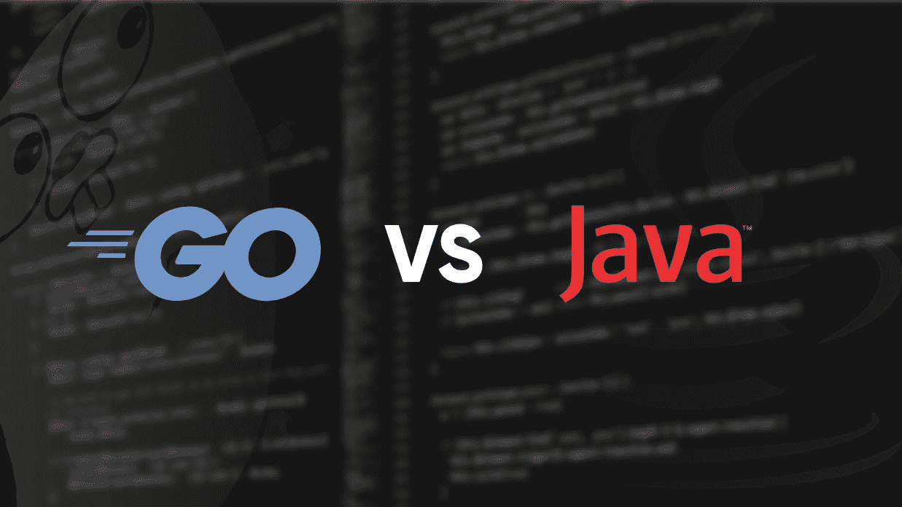

# 围棋 vs Java

> 原文:[https://www.geeksforgeeks.org/go-vs-java/](https://www.geeksforgeeks.org/go-vs-java/)

[Go](https://www.geeksforgeeks.org/go-programming-language-introduction/) 是一种过程编程语言。它于 2007 年由罗伯特·格里森、罗布·派克和肯·汤普森在谷歌开发，但于 2009 年作为开源编程语言推出。程序通过使用包来组装，以便有效地管理依赖关系。这种语言也支持环境采用与动态语言相似的模式。

[Java](https://www.geeksforgeeks.org/java/) 是目前最流行、应用最广泛的编程语言和平台之一。平台是一种有助于开发和运行用任何编程语言编写的程序的环境。Java 快速、可靠、安全。从桌面到网络应用，从科学超级计算机到游戏机，从手机到互联网，Java 被应用到每一个角落。

***以下是 Go 语言和 Java 语言的一些区别:***

| 去 | Java 语言(一种计算机语言，尤用于创建网站) |
| Go 是一种过程和并发编程语言。 | Java 是一种面向对象的编程语言。 |
| 它不支持带有构造函数和解构函数的类。 | 它支持带有构造函数和解构函数的类。 |
| 它不包含异常处理的概念，而是异常处理 Go 有错误。 | 它包含异常处理的概念。 |
| 它不支持隐式类型转换。 | 它支持隐式类型转换。 |
| 它不支持继承。 | 它支持继承。 |
| 它支持 Goroutine。 | 它不支持 Goroutines。 |
| 它不支持函数重载。 | 它支持函数重载。 |
| 它不支持泛型。 | 它支持泛型。 |
| 它支持频道。 | 它不支持通道。 |
| 它不包含 do-while 和 while 语句。 | 它包含 do-while 和 while 语句。 |
| Go 语言程序比 Java 程序更紧凑。 | Java 程序没有 Go 程序紧凑。 |
| 围棋中的线很便宜。 | 与 Go 相比，Java 中的线程非常昂贵。 |
| Go 以不同于 Java 的方式支持公共和私有功能。虽然 Go 不支持私有和公共关键字，但函数名的第一个字母决定了它是公共的(大写)还是私有的(小写)。 | 在 Java 中，方法可以是公共的，也可以是私有的。 |