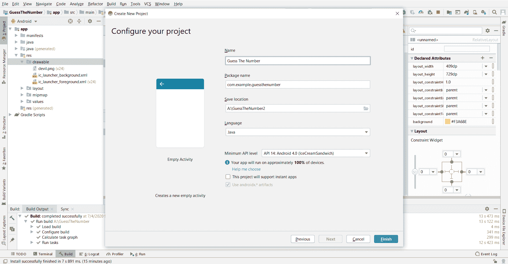
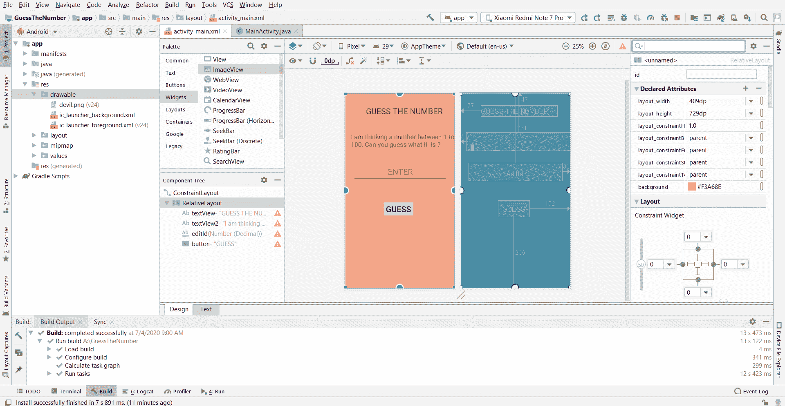
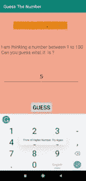
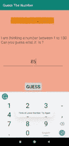
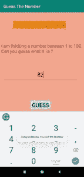

# 使用安卓工作室猜数字游戏

> 原文:[https://www . geesforgeks . org/猜数字游戏-使用安卓-studio/](https://www.geeksforgeeks.org/guessing-the-number-game-using-android-studio/)

一个简单的**猜测数字**应用程序，其中应用程序生成 1 到 100 之间的随机数，用户必须猜测该数字。这是一个简单而基本的应用程序，使用基本的小部件和库。
**进场:**

**步骤 1:创建新项目**

*   点击左上角的**文件**选项。
*   然后点击**新建**打开一个新项目并命名(这里命名为猜数字)。
*   Now select the Empty Activity with language as Java. Don’t change any other option.

    

     *注意:默认会有两个文件 **activity_main.xml** 和**MainActivity.java**。*

**第二步:设计用户界面**

*   Add the below code in **activity_main.xml** file. Here two TextViews , one EditText and a Button is added. TextViews are used to display the message and edittext widget is used by the user to enter the guessed number and the button is required to submit the entered value.

    ## activity_main.xml

    ```
    <?xml version="1.0" encoding="utf-8"?>
    <androidx.constraintlayout.widget.ConstraintLayout xmlns:android="http://schemas.android.com/apk/res/android"
        xmlns:app="http://schemas.android.com/apk/res-auto"
        xmlns:tools="http://schemas.android.com/tools"
        android:layout_width="match_parent"
        android:layout_height="match_parent"
        tools:context=".MainActivity">

        <RelativeLayout
            android:layout_width="409dp"
            android:layout_height="729dp"
            android:background="#F3A68E"
            app:layout_constraintBottom_toBottomOf="parent"
            app:layout_constraintEnd_toEndOf="parent"
            app:layout_constraintHorizontal_bias="1.0"
            app:layout_constraintStart_toStartOf="parent"
            app:layout_constraintTop_toTopOf="parent">

            <TextView
                android:id="@+id/textView"
                android:layout_width="wrap_content"
                android:layout_height="wrap_content"
                android:layout_alignParentStart="true"
                android:layout_alignParentLeft="true"
                android:layout_alignParentTop="true"
                android:layout_marginStart="77dp"
                android:layout_marginLeft="77dp"
                android:layout_marginTop="47dp"
                android:background="#FF9100"
                android:text="GUESS THE NUMBER"
                android:textSize="30sp" />

            <TextView
                android:id="@+id/textView2"
                android:layout_width="391dp"
                android:layout_height="68dp"
                android:layout_alignParentStart="true"
                android:layout_alignParentLeft="true"
                android:layout_alignParentTop="true"
                android:layout_marginStart="21dp"
                android:layout_marginLeft="21dp"
                android:layout_marginTop="147dp"
                android:text="I am thinking a number between 1 to 100\. Can you guess what it  is ?"
                android:textSize="24sp"
                app:layout_constraintEnd_toEndOf="parent"
                app:layout_constraintStart_toStartOf="parent" />

            <EditText
                android:id="@+id/editId"
                android:layout_width="348dp"
                android:layout_height="67dp"
                android:layout_alignParentTop="true"
                android:layout_alignParentEnd="true"
                android:layout_alignParentRight="true"
                android:layout_marginTop="271dp"
                android:layout_marginEnd="30dp"
                android:layout_marginRight="30dp"
                android:ems="10"
                android:gravity="center"
                android:hint="ENTER"
                android:inputType="numberDecimal" />

            <Button
                android:id="@+id/button"
                android:layout_width="wrap_content"
                android:layout_height="wrap_content"
                android:layout_alignParentEnd="true"
                android:layout_alignParentRight="true"
                android:layout_alignParentBottom="true"
                android:layout_marginEnd="152dp"
                android:layout_marginRight="152dp"
                android:layout_marginBottom="266dp"
                android:onClick="clickFunction"
                android:text="GUESS"
                android:textSize="30sp"
                app:layout_constraintEnd_toEndOf="parent"
                app:layout_constraintStart_toStartOf="parent" />

        </RelativeLayout>
    </androidx.constraintlayout.widget.ConstraintLayout>
    ```

    在 activity_main 中添加上述代码后。Xml 文件，用户界面会是这样的:

    

**步骤 3:使用 Java 文件**

*   打开**MainActivity.java**，在类内添加一个方法 **getRandomNumber()** ，返回 1 到 100 之间的随机数。
*   **启动应用时调用 OnCreate()** 方法，因此从内部调用 getRandomNumber()函数，从而生成随机数。
*   The value from EditText is taken by using below code:

    > EditText 变量 = （EditText）findViewById（R.id.editId）;

    这里的编辑标识是编辑文本的标识，变量是变量名。

*   在**变量**中，存储的数据是字符串形式的，因此使用下面的代码将其转换为整数:

    > 用户弹出=整数。parseint(变量。getText().toString())；

*   **当用户点击按钮时，调用 OnClick** 功能。这里取用户输入的值，用 if-else 条件来判断用户是否猜对了数字，如果猜错了，请用户再试一次。
*   最后，展示 Toast，提示用户猜对号码。

**MainActivity.java 的 Java 代码是:**

## MainActivity.java

```
package com.example.guessthenumber;

import androidx.appcompat.app.AppCompatActivity;

import android.os.Bundle;
import android.view.View;
import android.widget.EditText;
import android.widget.Toast;

public class MainActivity extends AppCompatActivity {

    int result;
    static int getRandomNumber(int max, int min)
    {
        return (int)((Math.random()
 * (max - min)) + min);
    }

    public void makeToast(String str)
    {
        Toast.makeText(
MainActivity.this, 
str,
 Toast.LENGTH_SHORT)
.show();
    }
    public void clickFunction(View view)
    {
        int userGuessing;
        EditText variable
 = (EditText)findViewById(
R.id.editId);
        userGuessing
 = Integer.parseInt(
variable
.getText()
.toString());
        if (userGuessing < result) {

            makeToast("Think of Higher Number, 
Try Again");
        }
        else if (userGuessing > result) {
            makeToast("Think of Lower Number, 
Try Again");
        }
        else {
            makeToast(
"Congratulations,"
+" You Got the Number");
        }
    }

    @Override
    protected void onCreate(
Bundle savedInstanceState)
    {
        super.onCreate(savedInstanceState);
        setContentView(R.layout.activity_main);

        int min = 1;
        int max = 100;
        result = getRandomNumber(min, max);
    }
}
```

**输出:**

*   **如果猜测的数字小于随机数**
    
*   **如果猜测的数字大于随机数**
    
*   **如果猜到的数字等于随机数**
    