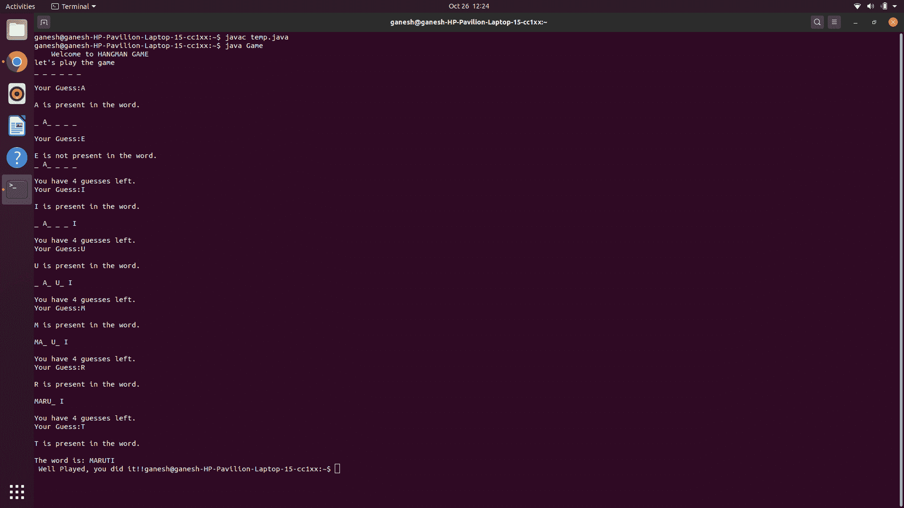

# Java 中的刽子手游戏

> 原文:[https://www.geeksforgeeks.org/hangman-game-in-java/](https://www.geeksforgeeks.org/hangman-game-in-java/)

**刽子手**是一款流行的**猜字游戏**，玩家通过一次猜测一个字母来构建一个丢失的单词。在一定数量的非基本猜测之后，游戏结束，玩家输了。当玩家准确分辨出丢失单词的所有字母时，游戏也就结束了。下面给出了这个游戏在 Java 中的实现。

**示例:**

> **输出** :
> 欢迎来到 HANGMAN GAME
> 我们来玩游戏
> _ _ _ _ _ _
> 你的猜测:
> **输入** : s
> **输出** :
> S 在单词中不存在。
> _ _ _ _ _ _
> 你还剩 4 次猜测。
> 你的猜测:
> **输入** : m
> **输出** :
> M 不在字里行间。
> _ _ _ _ _ _
> 你还剩 3 次猜测。
> 你的猜测:
> **输入:** d
> **输出** :
> D 在单词中不存在。
> _ _ _ _ _ _
> 你还剩 2 次猜测。
> 你的猜测:
> **输入** : t
> **输出** :
> T 出现在单词中。
> T _ _
> 你还剩 2 次猜测。
> 你的猜测:
> **输入** : o
> **输出** :
> O 存在于单词中。
> TO_ OT_
> 你还剩 2 次猜测。
> 你的猜测:
> **输入** : y
> **输出** :
> Y 存在于单词中。
> TOYOT_
> 你还剩 2 次猜测。
> 你的猜测:
> **输入** : a
> **输出** :
> A 出现在单词中。
> 这个词就是:丰田
> 打得好，你做到了！！

[Java](https://www.geeksforgeeks.org/java/) 是一种通用的计算机编程方言，它是并发的、基于类的、面向对象的，并且特别设计成具有尽可能少的依赖性。 **Java** 已经为[随机](https://www.geeksforgeeks.org/java-util-random-class-java/) **数字**奉献了整个库，看到了它在日常编程中的重要性。[nextInt()](https://www.geeksforgeeks.org/java-util-random-nextint-java/) 一个函数，用在了本文的代码中。这个游戏是为学习用 Java 编写代码的初学者准备的，并向他们简要介绍如何使用字符串、循环和条件语句。

### 了解游戏

一个词必须由玩家猜。因此，输出屏幕将显示代表有待猜测的字母的破折号。然后玩家会猜一个字母。如果单词中有这个字母，那么程序会在每个出现的地方用这个字母代替破折号。如果单词中没有字母，那么生命线的数量就会减少(包括有限数量的机会)。一旦单词的所有字母都猜对了，玩家就赢了。

**游戏计划:**

用户应该从猜测单词中出现最多的字母开始，这些字母是元音( **a** 、 **e** 、 **i** 、 **o** 、 **u** )。除了元音之外，其他最常用的字母还有 **t** 、 **n** 、 **s** 、 **h** 、 **r** 、 **d** 和 **l** 。

#### 游戏的实现

在程序中，已经创建了类**游戏**，其中创建了由单词组成的字符串列表。在单词列表中，将使用随机模块( [java.util.Random](https://www.geeksforgeeks.org/java-util-random-class-java/) )随机选择一个单词，供用户猜测其字母。选择单词后，使用[to ppercase()](https://www.geeksforgeeks.org/java-touppercase-examples/)功能将所有字母大写，然后用破折号替换这些字母。游戏中允许的**不正确猜测**的最大数量为 **5** ，如果用户超出该数量，则用户将输掉游戏。在 while 循环中，当用户开始猜测字母时，正确的猜测会用正确的字母代替破折号，而不正确的猜测会通过 **1** 增加计算不正确猜测次数的变量。

*   第一个条件用于在用户猜错字母时通知用户剩余的生命线。
*   第二个条件用于告诉用户输入的字母已经被猜到。
*   第三个条件是检查猜出来的新字母是否出现在单词中，如果它们是正确的，那么破折号将被那些正确的字母替换
*   如果单词中没有字母，则生命线减少 1。

**满足以下任一条件，游戏结束:**

*   用户已经猜对了整个单词。
*   用户的生命线已经结束。

## Java 语言(一种计算机语言，尤用于创建网站)

```
// Java program to implement
// Hangman game

import java.util.Scanner;
import java.util.Random;

class Game {

    static Scanner input;
    public static void hangman()
    {
        input = new Scanner(System.in);

        // array of strings containing words
        String[] company = { "Maruti", "Tata", "Suzuki",
                             "Ducati", "Toyota" };
        System.out.println(
            "    Welcome to HANGMAN GAME    ");

        Random obj = new Random();
        int Ran_num = obj.nextInt(5);

        // takes input of the word
        String word = (company[Ran_num]);
        word = word.toUpperCase();

        // To show the word in underscores
        String word1 = word.replaceAll("[A-Z]", "_ ");

        // play the game
        System.out.println("let's play the game");
        startGame(word, word1);
    }
    public static void startGame(String word, String word1)
    {
        // total guesses
        int guess_ = 0;

        // number of wrong guesses
        int wrong = 0;

        // for each guess
        String guess;

        // stores the guessed letter
        char letter;

        // stores if the letter was
        // already guessed
        boolean guessescontainsguess;
        String guesses = "";
        boolean guessinword;

        // while loop starts here
        while (wrong < 5 && word1.contains("_")) {

            System.out.println(word1 + "\n");
            int temp = 5 - wrong;
            if (wrong != 0) {

                // for picture 1
                System.out.println("You have " + temp
                                   + " guesses left.");
            }

            System.out.print("Your Guess:");

            // takes guess input
            guess = input.nextLine();

            // converts to uppercase
            // for comparison
            guess = guess.toUpperCase();

            // gets the first letter
            // as guessed letter
            letter = guess.charAt(0);

            guessescontainsguess
                = (guesses.indexOf(letter)) != -1;

            // stores every letter
            // guessed in guesses
            guesses += letter;

            // converts to uppercase for
            // comparison
            letter = Character.toUpperCase(letter);
            System.out.println();

            // if letter already guessed
            if (guessescontainsguess == true) {

                // already guessed letter
                System.out.println("You ALREADY guessed "
                                   + letter + ". \n");
            }

            // guessed letter is in the word
            guessinword = (word.indexOf(letter)) != -1;

            // if statement begins
            if (guessinword == true) {

                // print the letter
                System.out.println(
                    letter + " is present in the word.");
                System.out.print("\n");

                // find the letter positions
                // replace dashes with those
                // letter at valid positions
                for (int position = 0;
                     position < word.length(); position++) {

                    // guessed letter is equal to
                    // letter at position in word
                    // and word1 has previously does not
                    // have that letter
                    if (word.charAt(position) == letter
                        && word1.charAt(position)
                               != letter) {

                        word1 = word1.replaceAll("_ ", "_");
                        String word2;
                        word2 = word1.substring(0, position)
                                + letter
                                + word1.substring(position
                                                  + 1);
                        word2 = word2.replaceAll("_", "_ ");
                        word1 = word2;
                    }
                }
            }

            // if statement ends, else if begins
            else {

                // prints
                // wrong = wrong + 1, after every
                // wrong answer
                System.out.println(
                    letter
                    + " is not present in the word.");
                wrong++;
            }

            // guess_ = guess_ + 1, after every
            // attempt
            guess_++;

        } // while loop ends

        // if the lifelines finishes
        if (wrong == 5) {
            System.out.println(
                "YOU LOST!, maximum limit of incorrect guesses reached.");
        }
        else {

            // when solved
            System.out.print(
                "The word is: " + word1
                + "\n Well Played, you did it!!");
        }
    }
    public static void main(String[] args)
    {
        // play hangman game
        hangman();
    }
}
```

**输出:**



**注意:**这是一款互动游戏，在控制台玩吧。