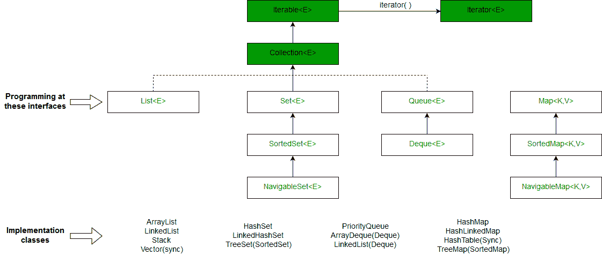

# Java 中的 HashMap 和 TreeMap

> 原文:[https://www.geeksforgeeks.org/hashmap-treemap-java/](https://www.geeksforgeeks.org/hashmap-treemap-java/)

HashMap 和 TreeMap 是[集合框架](https://docs.oracle.com/javase/tutorial/collections/intro/)的一部分。

<center>**HashMap**</center>

java.util.HashMap class is a Hashing based implementation. In HashMap, we have a key and a value pair<Key, Value>.

```
 HashMap<K, V> hmap = new HashMap<K, V>();
```

让我们考虑下面的例子，其中我们必须计算给定整数数组中每个整数的出现次数。

```
Input: arr[] = {10, 3, 5, 10, 3, 5, 10};
Output: Frequency of 10 is 3
        Frequency of 3 is 2
        Frequency of 5 is 2

```

```
/* Java program to print frequencies of all elements using 
   HashMap */
import java.util.*;

class Main
{
    // This function prints frequencies of all elements
    static void printFreq(int arr[])
    {
        // Creates an empty HashMap
        HashMap<Integer, Integer> hmap = 
                     new HashMap<Integer, Integer>();

        // Traverse through the given array
        for (int i = 0; i < arr.length; i++)
        {
            Integer c = hmap.get(arr[i]);

            // If this is first occurrence of element 
            if (hmap.get(arr[i]) == null)
               hmap.put(arr[i], 1);

            // If elements already exists in hash map
            else 
              hmap.put(arr[i], ++c);
        }

        // Print result
        for (Map.Entry m:hmap.entrySet())
          System.out.println("Frequency of " + m.getKey() + 
                             " is " + m.getValue());
    }

    // Driver method to test above method
    public static void main (String[] args)
    {
        int arr[] = {10, 34, 5, 10, 3, 5, 10};
        printFreq(arr);
    }
}
```

输出:

```
Frequency of 34 is 1
Frequency of 3 is 1
Frequency of 5 is 2
Frequency of 10 is 3
```

**要点**

*   HashMap 既不基于键也不基于值来维护任何顺序，如果我们希望键以排序的顺序来维护，我们需要使用 TreeMap。
*   **复杂度** : get/put/containsKey()操作在一般情况下是 O(1)，但是我们不能保证，因为这都取决于计算哈希需要多少时间。

**应用:**
HashMap 基本上是[哈希](http://geeksquiz.com/hashing-set-1-introduction/)的实现。因此，无论我们在哪里需要键值对散列，我们都可以使用 HashMap。例如，在网络应用程序中，用户名作为密钥存储，用户数据作为值存储在哈希表中，以便更快地检索对应于用户名的用户数据。

<center>**TreeMap**</center>

TreeMap can be a bit handy when we only need to store unique elements in a sorted order. Java.util.TreeMap uses a [red-black tree](https://www.geeksforgeeks.org/red-black-tree-set-1-introduction-2/) in the background which makes sure that there are no duplicates; additionally it also maintains the elements in a sorted order.

```
 TreeMap<K, V> hmap = new TreeMap<K, V>();
```

下面是同样问题的基于 TreeMap 的实现。与以前的 O(n)解决方案相比，该解决方案具有更高的时间复杂度 O(n)。这种方法的优点是，我们按照排序的顺序获取元素。

```
/* Java program to print frequencies of all elements using 
   TreeMap */
import java.util.*;

class Main
{
    // This function prints frequencies of all elements
    static void printFreq(int arr[])
    {
        // Creates an empty TreeMap
        TreeMap<Integer, Integer> tmap =
                     new TreeMap<Integer, Integer>();

        // Traverse through the given array
        for (int i = 0; i < arr.length; i++)
        {
            Integer c = tmap.get(arr[i]);

            // If this is first occurrence of element   
            if (tmap.get(arr[i]) == null)
               tmap.put(arr[i], 1);

            // If elements already exists in hash map
            else
              tmap.put(arr[i], ++c);
        }

        // Print result
        for (Map.Entry m:tmap.entrySet())
          System.out.println("Frequency of " + m.getKey() + 
                             " is " + m.getValue());
    }

    // Driver method to test above method
    public static void main (String[] args)
    {
        int arr[] = {10, 34, 5, 10, 3, 5, 10};
        printFreq(arr);
    }
}
```

输出:

```
Frequency of 3 is 1
Frequency of 5 is 2
Frequency of 10 is 3
Frequency of 34 is 1
```

**要点**

*   对于像添加、删除、containsKey 这样的操作，时间复杂度为 0(log n，其中 n 是 TreeMap 中存在的元素数量。
*   TreeMap 总是保持元素的排序(递增)顺序，而 HashMap 中的元素没有顺序。TreeMap 还提供了一些很酷的方法，比如第一个、最后一个、地板和天花板的按键。

<center>**Overview:**</center>

1.  HashMap 实现 Map 接口，而 TreeMap 实现 SortedMap 接口。排序地图界面是地图的子界面。
2.  哈希映射实现哈希，而树映射实现红黑树(一个自平衡二叉查找树)。因此，哈希和平衡二叉查找树之间的所有差异都适用于此。
3.  HashMap 和 TreeMap 都有它们的对应物 HashSet 和 TreeSet。HashSet 和 TreeSet 实现[设置界面](http://geeksquiz.com/set-in-java/)。在 HashSet 和 TreeSet 中，我们只有键，没有值，这些主要用来查看一个集合中的有无。对于上述问题，我们不能使用 HashSet(或 TreeSet)，因为我们不能存储计数。我们更喜欢 HashSet(或 TreeSet)而不是 HashMap(或 TreeMap)的一个问题是打印数组中所有不同的元素。



**相关文章**

*   [Java 中的 linked hashmap](https://www.geeksforgeeks.org/linkedhashmap-class-java-examples/)
*   [Java 中 TreeMap、HashMap 和 LinkedHashMap 的区别](https://www.geeksforgeeks.org/differences-treemap-hashmap-linkedhashmap-java/)
*   [Java 中 HashMap 和 HashTable 的区别](https://www.geeksforgeeks.org/differences-between-hashmap-and-hashtable-in-java/)

**参考文献:**
[https://docs . Oracle . com/javase/7/docs/API/Java/util/collection . html](https://docs.oracle.com/javase/7/docs/api/java/util/Collection.html)

本文由 **Chirag Agrawal** 供稿。如果你喜欢极客博客并想投稿，你也可以写一篇文章并把你的文章邮寄到 contribute@geeksforgeeks.org。看到你的文章出现在极客博客主页上，帮助其他极客。

如果您发现任何不正确的地方，或者您想分享更多关于上面讨论的主题的信息，请写评论