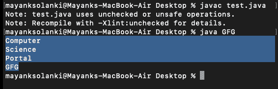
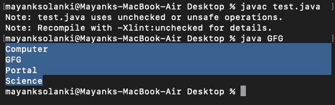

# Java 中的 HashSet vs TreeSet

> 原文:[https://www.geeksforgeeks.org/hashset-vs-treeset-in-java/](https://www.geeksforgeeks.org/hashset-vs-treeset-in-java/)

当讨论 Set 之间的差异时，首先要考虑的是插入顺序和如何处理元素。java 中的 [HashSet 是一个实现](https://www.geeksforgeeks.org/hashset-in-java/) [Set 接口](https://www.geeksforgeeks.org/set-in-java/) 的类，由一个哈希表支持，该哈希表实际上是一个 [HashMap](https://www.geeksforgeeks.org/java-util-hashmap-in-java/) 实例。 这个类允许空元素。该类还为基本操作(如添加、移除、包含和大小)提供了恒定的时间性能，假设哈希函数将元素适当地分散在桶中，而 TreeSet 是 SortedSet 接口的实现，顾名思义，该接口使用树进行存储，其中元素的顺序由一个集合使用它们的自然顺序来维护，无论是否提供了显式的 [比较器](https://www.geeksforgeeks.org/comparator-interface-java/) 。


**1。速度和内部实施**

对于像搜索、插入和删除这样的操作，哈希集平均需要恒定的时间。HashSet 比 TreeSet 快。HashSet 是使用[哈希表](https://www.geeksforgeeks.org/hashing-set-1-introduction/)实现的。TreeSet 取 O(Log n)进行搜索、插入和删除，比 HashSet 高。但是 TreeSet 会保留已排序的数据。此外，它还支持更高的()(返回最少更高的元素)、地板()、天花板()等操作。这些操作在 TreeSet 中也是 O(Log n)，在 HashSet 中不支持。使用自平衡二叉查找树([红黑树](https://www.geeksforgeeks.org/red-black-tree-set-1-introduction-2/))实现树集。TreeSet 由 Java 中的 TreeMap 支持。

**2。订购**

HashSet 中的元素没有排序。TreeSet 按照 Java 中的 Comparable 或 Comparator 方法定义的排序顺序维护对象。默认情况下，TreeSet 元素按升序排序。它提供了几种处理有序集的方法，如 first()、last()、headSet()、tailSet()等。

**3.空对象**

HashSet 允许空对象。TreeSet 不允许 null Object 并抛出 NullPointerException，为什么，因为 TreeSet 使用 compareTo()方法来比较键，而 compareTo()将抛出 java.lang.NullPointerException。

**4。对比**

HashSet 使用 [equals()](https://www.geeksforgeeks.org/overriding-equals-method-in-java/) 方法来比较集合中的两个对象并检测重复项。TreeSet 出于同样的目的使用了 compareTo()方法。
如果 equals()和 compareTo()不一致，也就是说，对于两个相等的对象，equals 应该返回 true，而 compareTo()应该返回零，那么它将打破 Set 接口的约定，并允许像 TreeSet 这样的 Set 实现中出现重复

> **注意:**如果你想要一个排序的集合，那么最好将元素添加到 HashSet 中，然后将其转换为 TreeSet，而不是创建一个 TreeSet 并向其中添加元素。

**极客在经历了他们的不同之后，你一定想知道什么时候更喜欢 TreeSet 而不是 HashSet？**

*   需要排序的唯一元素，而不是唯一元素。TreeSet 给出的排序列表总是以升序排列。
*   TreeSet 比 HashSet 具有更大的局部性。如果两个条目在顺序上是相邻的，那么 TreeSet 会将它们放在数据结构中，从而放在内存中，而 HashSet 会将条目分散在内存中，而不管它们与哪个键相关联。
*   TreeSet 使用下面的红黑树算法来排序元素。当需要频繁执行读/写操作时，TreeSet 是一个不错的选择。
*   [LinkedHashSet](https://www.geeksforgeeks.org/linkedhashset-class-in-java-with-examples/) 是介于这两者之间的另一种数据结构。它提供了像 HashSet 这样的时间复杂性，并保持了插入的顺序(注意，这不是排序顺序，而是元素插入的顺序)。

**实施:**

在这里，我们将用两个例子来讨论它们。让我们从 HashSet 开始，稍后再详细讨论 TreeSet。

*   HashSet 示例
*   TreeSet 示例

**例 1:**

## Java 语言(一种计算机语言，尤用于创建网站)

```
// Java Program to Demonstrate Working of HashSet

// Importing HashSet class from java.util package
import java.util.HashSet;

// Main class
class GFG {

    // Main driver method
    public static void main(String[] args)
    {
        // Creating a HashSet object of string type
        HashSet<String> hset = new HashSet<String>();

        // Adding elements to HashSet
        // using add() method
        hset.add("geeks");
        hset.add("for");
        hset.add("practice");
        hset.add("contribute");

        // Duplicate removed
        hset.add("geeks");

        // Printing HashSet elements using for each loop

        // Display command only
        System.out.println("HashSet contains: ");

        for (String temp : hset) {
            System.out.println(temp);
        }
    }
}
```

**Output:** 

```
HashSet contains: 
practice
geeks
for
contribute
```

**例 2:**

## Java 语言(一种计算机语言，尤用于创建网站)

```
// Java Program to Illustrate Working of HashSet
// From another Collection

// Importing utility classes
import java.util.*;

class GFG {

    // Main driver method
    public static void main(String[] args)
    {

        ArrayList<String> ll = new ArrayList<String>();

        // Adding elements to ArrayList
        ll.add("Computer");
        ll.add("Science");

        // Creating HashSet object of string type
        HashSet<String> hs = new HashSet(ll);
        hs.add("Portal");
        hs.add("GFG");

        // Iterating via iterators
        Iterator<String> iter = hs.iterator();

        // Condition holds true till there is single element
        // in th List
        while (iter.hasNext()) {

            // Printing all elements inside objects
            System.out.println(iter.next());
        }
    }
}
```

**输出:**



现在是时候**实现 TreeSet** 了，通过实现它可以更好的理解。

**例 1:**

## Java 语言(一种计算机语言，尤用于创建网站)

```
// Java program to demonstrate working of
// TreeSet.
import java.util.TreeSet;
class TreeSetDemo {

    public static void main(String[] args)
    {
        // Create a TreeSet
        TreeSet<String> tset = new TreeSet<String>();

        // add elements to HashSet
        tset.add("geeks");
        tset.add("for");
        tset.add("practice");
        tset.add("contribute");

        // Duplicate removed
        tset.add("geeks");

        // Displaying TreeSet elements
        System.out.println("TreeSet contains: ");
        for (String temp : tset) {
            System.out.println(temp);
        }
    }
}
```

**Output:** 

```
TreeSet contains: 
contribute
for
geeks
practice
```

**例 2:**

## Java 语言(一种计算机语言，尤用于创建网站)

```
// Java Program to Illustrate Working of TreeSet
// From another Collection

// Importing utility classes
import java.util.*;

// Main class
class GFG {

    // Main driver method
    public static void main(String[] args) {

        ArrayList<String> ll = new ArrayList<String>();

        // Adding elements to ArrayList
        ll.add("Computer");
        ll.add("Science");

        // Creating TreeSet object of string type
        TreeSet<String> ts = new TreeSet(ll);
        ts.add("Portal");
        ts.add("GFG");

        // Iterating via iterators
        Iterator<String> iter = ts.iterator();

        // Condition holds true till there is single element in th List
        while (iter.hasNext()) {

            // Printing all elements inside objects 
            System.out.println(iter.next());
        }

    }
}
```

**输出:**

