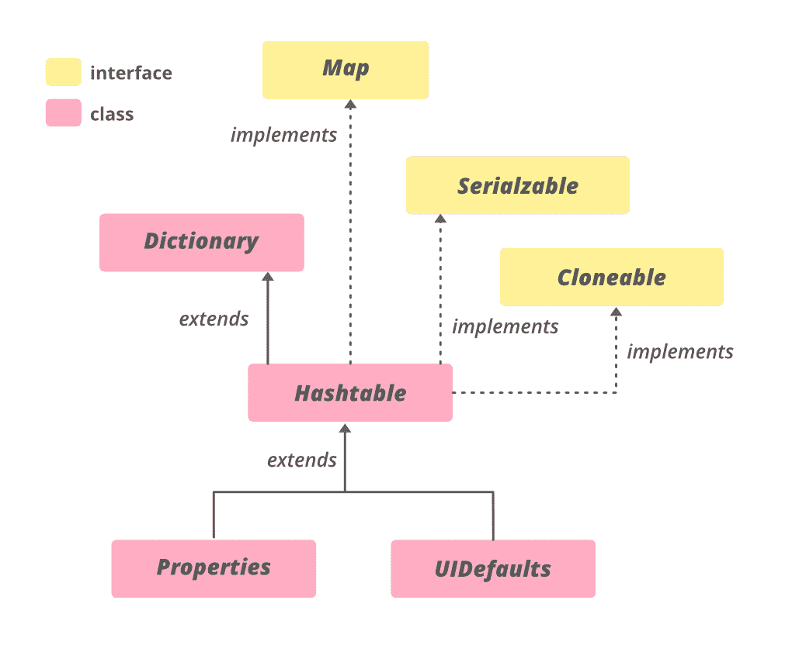

# Java 中的哈希表

> 原文:[https://www.geeksforgeeks.org/hashtable-in-java/](https://www.geeksforgeeks.org/hashtable-in-java/)

**哈希表**类实现了一个哈希表，它将键映射到值。任何非空对象都可以用作键或值。为了成功地从哈希表中存储和检索对象，用作键的对象必须实现 hashCode 方法和 equals 方法。

**哈希表**的特性

*   它类似于 HashMap，但是是同步的。
*   哈希表将键/值对存储在哈希表中。
*   在哈希表中，我们指定一个用作键的对象，以及我们想要与该键关联的值。然后对该键进行哈希运算，得到的哈希代码用作该值在表中存储的索引。
*   哈希表类的初始默认容量是 11，而加载因子是 0.75。
*   哈希表不提供任何枚举，而哈希表不提供快速枚举。

**申报:**

```java
public class Hashtable<K,V> extends Dictionary<K,V> implements Map<K,V>, Cloneable, Serializable
```

**类型参数:**

*   **K**–该地图维护的按键类型
*   **V**–映射值的类型

### 哈希表的层次结构



哈希表实现**可序列化**、**可克隆**、[映射< K、V>T5】接口，扩展](https://www.geeksforgeeks.org/map-interface-java-examples/)[字典< K、V>T7】。直接子类是](https://www.geeksforgeeks.org/java-util-dictionary-class-java/)[属性](https://www.geeksforgeeks.org/java-util-properties-class-java/)、**指导结果**。

### 构造函数:

为了创建一个 Hashtable，我们需要从 **java.util.Hashtable** 导入。有多种方法可以创建哈希表。

**1。哈希表():**这将创建一个空哈希表，默认加载因子为 0.75，初始容量为 11。

> 哈希表 <k v="">ht =新哈希表<k v="">()；</k></k>

## Java 语言(一种计算机语言，尤用于创建网站)

```java
// Java program to demonstrate
// adding elements to Hashtable

import java.io.*;
import java.util.*;

class AddElementsToHashtable {
    public static void main(String args[])
    {
        // No need to mention the
        // Generic type twice
        Hashtable<Integer, String> ht1 = new Hashtable<>();

        // Initialization of a Hashtable
        // using Generics
        Hashtable<Integer, String> ht2
            = new Hashtable<Integer, String>();

        // Inserting the Elements
        // using put() method
        ht1.put(1, "one");
        ht1.put(2, "two");
        ht1.put(3, "three");

        ht2.put(4, "four");
        ht2.put(5, "five");
        ht2.put(6, "six");

        // Print mappings to the console
        System.out.println("Mappings of ht1 : " + ht1);
        System.out.println("Mappings of ht2 : " + ht2);
    }
}
```

**Output**

```java
Mappings of ht1 : {3=three, 2=two, 1=one}
Mappings of ht2 : {6=six, 5=five, 4=four}
```

**2。哈希表(int initialCapacity):** 这将创建一个哈希表，其初始大小由 initialCapacity 指定，默认加载因子为 0.75。

> 哈希表 <k v="">ht =新哈希表<k v="">(int initial capacity)；</k></k>

## Java 语言(一种计算机语言，尤用于创建网站)

```java
// Java program to demonstrate
// adding elements to Hashtable

import java.io.*;
import java.util.*;

class AddElementsToHashtable {
    public static void main(String args[])
    {
        // No need to mention the
        // Generic type twice
        Hashtable<Integer, String> ht1 = new Hashtable<>(4);

        // Initialization of a Hashtable
        // using Generics
        Hashtable<Integer, String> ht2
            = new Hashtable<Integer, String>(2);

        // Inserting the Elements
        // using put() method
        ht1.put(1, "one");
        ht1.put(2, "two");
        ht1.put(3, "three");

        ht2.put(4, "four");
        ht2.put(5, "five");
        ht2.put(6, "six");

        // Print mappings to the console
        System.out.println("Mappings of ht1 : " + ht1);
        System.out.println("Mappings of ht2 : " + ht2);
    }
}
```

**Output**

```java
Mappings of ht1 : {3=three, 2=two, 1=one}
Mappings of ht2 : {4=four, 6=six, 5=five}
```

**3。哈希表(int size，float fillRatio):** 这个版本创建了一个哈希表，其初始大小由 size 指定，填充比率由 fillRatio 指定。填充率:基本上，它决定了哈希表在向上调整大小之前的填充程度，其值介于 0.0 到 1.0 之间。

> 哈希表 <k v="">ht =新哈希表 <k v="">(int size，float fill ratio)；</k></k>

## Java 语言(一种计算机语言，尤用于创建网站)

```java
// Java program to demonstrate
// adding elements to Hashtable

import java.io.*;
import java.util.*;

class AddElementsToHashtable {
    public static void main(String args[])
    {
        // No need to mention the
        // Generic type twice
        Hashtable<Integer, String> ht1
            = new Hashtable<>(4, 0.75f);

        // Initialization of a Hashtable
        // using Generics
        Hashtable<Integer, String> ht2
            = new Hashtable<Integer, String>(3, 0.5f);

        // Inserting the Elements
        // using put() method
        ht1.put(1, "one");
        ht1.put(2, "two");
        ht1.put(3, "three");

        ht2.put(4, "four");
        ht2.put(5, "five");
        ht2.put(6, "six");

        // Print mappings to the console
        System.out.println("Mappings of ht1 : " + ht1);
        System.out.println("Mappings of ht2 : " + ht2);
    }
}
```

**Output**

```java
Mappings of ht1 : {3=three, 2=two, 1=one}
Mappings of ht2 : {6=six, 5=five, 4=four}
```

**4。哈希表(地图<？延伸 K，？扩展 V>m:**这将创建一个哈希表，并使用 m 中的元素进行初始化。

> 哈希表 <k v="">ht =新哈希表<k v="">(地图 m)；</k></k>

## Java 语言(一种计算机语言，尤用于创建网站)

```java
// Java program to demonstrate
// adding elements to Hashtable

import java.io.*;
import java.util.*;

class AddElementsToHashtable {
    public static void main(String args[])
    {
        // No need to mention the
        // Generic type twice
        Map<Integer, String> hm = new HashMap<>();

        // Inserting the Elements
        // using put() method
        hm.put(1, "one");
        hm.put(2, "two");
        hm.put(3, "three");

        // Initialization of a Hashtable
        // using Generics
        Hashtable<Integer, String> ht2
            = new Hashtable<Integer, String>(hm);

        // Print mappings to the console

        System.out.println("Mappings of ht2 : " + ht2);
    }
}
```

**Output**

```java
Mappings of ht2 : {3=three, 2=two, 1=one}
```

**示例:**

## Java 语言(一种计算机语言，尤用于创建网站)

```java
// Java program to illustrate
// Java.util.Hashtable

import java.util.*;

public class GFG {
    public static void main(String[] args)
    {
        // Create an empty Hashtable
        Hashtable<String, Integer> ht = new Hashtable<>();

        // Add elements to the hashtable
        ht.put("vishal", 10);
        ht.put("sachin", 30);
        ht.put("vaibhav", 20);

        // Print size and content
        System.out.println("Size of map is:- " + ht.size());
        System.out.println(ht);

        // Check if a key is present and if
        // present, print value
        if (ht.containsKey("vishal")) {
            Integer a = ht.get("vishal");
            System.out.println("value for key"
                               + " \"vishal\" is:- " + a);
        }
    }
}
```

**Output**

```java
Size of map is:- 3
{vaibhav=20, vishal=10, sachin=30}
value for key "vishal" is:- 10
```