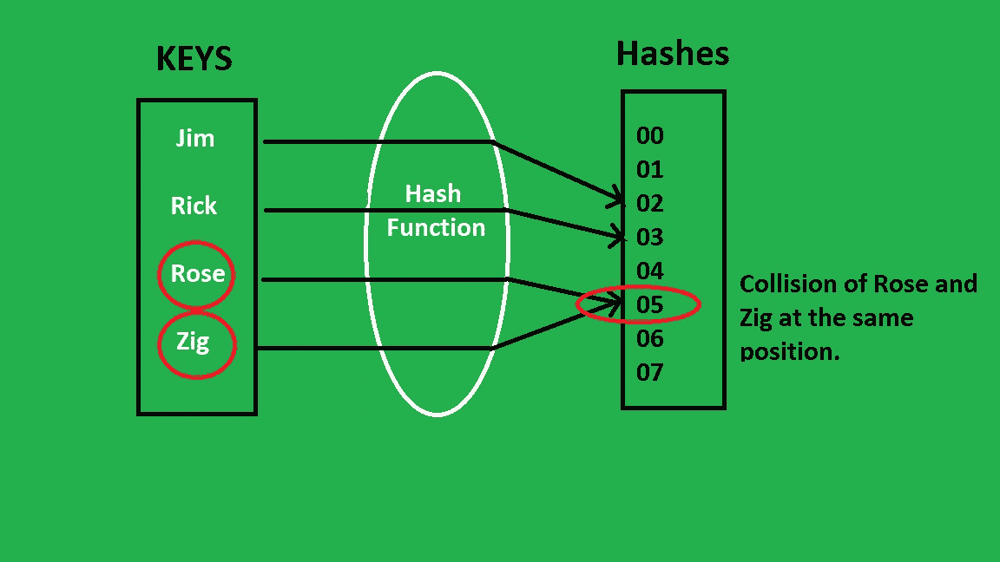

# Java 中的哈希表键()方法

> 原文:[https://www . geesforgeks . org/hashtable-key-method-in-Java/](https://www.geeksforgeeks.org/hashtable-keys-method-in-java/)

众所周知，枚举定义 java 类类型，因此枚举可以有构造函数、方法和实例变量。java 中 Hashtable 类的 java.util.Hashtable.keys()方法用于获取 Hashtable 中存在的键的枚举。

插图:



**语法:**

```
public Enumeration<K> keys()
Enumeration enu = Hash_table.keys();
```

**返回值:**哈希表键的枚举。

**例 1:**

## Java 语言(一种计算机语言，尤用于创建网站)

```
// Java Program to Illustrate keys() method
// of Hashtable class

// Importing utility classes
import java.util.*;

// Main class
public class GFG {

    // Main driver method
    public static void main(String[] args)
    {
        // Creating an empty Hashtable
        // Declaring object of integer and string type
        Hashtable<Integer, String> hash_table
            = new Hashtable<Integer, String>();

        // Inserting elements into the table
        // using put() method

        // Custom input elements
        hash_table.put(10, "Geeks");
        hash_table.put(15, "4");
        hash_table.put(20, "Geeks");
        hash_table.put(25, "Welcomes");
        hash_table.put(30, "You");

        // Print and display all entered elements in object
        System.out.println("The Table is: " + hash_table);

        // Creating an empty enumeration to store
        Enumeration enu = hash_table.keys();

        // Display message
        System.out.println("The enumeration of keys are:");

        // Condition holds true till there is single element
        // remaining using hasMoreElements() method
        while (enu.hasMoreElements()) {

            // Displaying the Enumeration
            System.out.println(enu.nextElement());
        }
    }
}
```

**Output:** 

```
The Table is: {10=Geeks, 20=Geeks, 30=You, 15=4, 25=Welcomes}
The enumeration of keys are:
10
20
30
15
25
```

**例 2:**

## Java 语言(一种计算机语言，尤用于创建网站)

```
// Java Program to illustrate  keys() method
// of Hashtable class

// Importing utility classes
import java.util.*;

// Main class
public class GFG {

    // Main driver method
    public static void main(String[] args)
    {
        // Creating an empty Hashtable
        // Declaring object of string and integer type
        Hashtable<String, Integer> hash_table
            = new Hashtable<String, Integer>();

        // Inserting elements into the table
        // using put() method
        hash_table.put("Geeks", 10);
        hash_table.put("4", 15);
        hash_table.put("Geeks", 20);
        hash_table.put("Welcomes", 25);
        hash_table.put("You", 30);

        // Displaying the Hashtable
        System.out.println("The Table is: " + hash_table);

        // Creating an empty enumeration to store
        Enumeration enu = hash_table.keys();

        // Display message
        System.out.println("The enumeration of keys are:");

        // Condition holds true till there is single element
        // remaining via hasMoreElements() method
        while (enu.hasMoreElements()) {

            // Displaying the enumeration
            System.out.println(enu.nextElement());
        }
    }
}
```

**Output:** 

```
The Table is: {You=30, Welcomes=25, 4=15, Geeks=20}
The enumeration of keys are:
You
Welcomes
4
Geeks
```