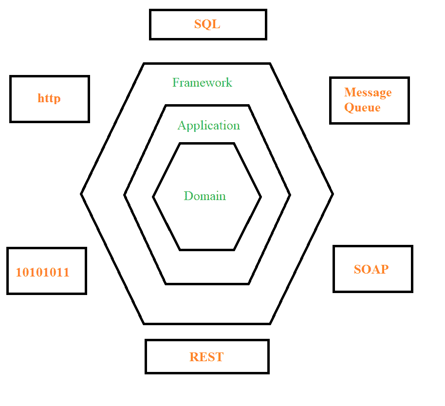
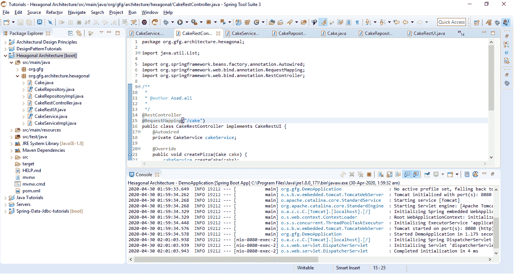

# Java 中的六边形架构

> 原文:[https://www . geesforgeks . org/hexagon-architecture-in-Java/](https://www.geeksforgeeks.org/hexagonal-architecture-in-java/)

根据软件开发设计原则，需要最小维护工作量的软件被认为是好的设计。也就是说，维护应该是架构师必须考虑的关键点。本文讨论了一种这样的架构，称为**六边形架构**，它使软件易于维护、管理、测试和扩展。
**六边形建筑**是阿利斯泰尔·考克伯恩在 2006 年创造的一个术语。六角形架构的另一个名称是*端口和适配器*架构。该架构将应用程序分为两部分，即*内部部分*和*外部部分*。应用程序的核心逻辑被视为内部部分。[数据库](https://www.geeksforgeeks.org/introduction-of-dbms-database-management-system-set-1/)、用户界面和消息队列可能是外部部分。这样做，核心应用程序逻辑已经与外部世界完全隔离。现在，这两个部分之间的通信可以通过端口和适配器进行。现在，让我们来理解这些是什么意思。

*   **端口:**端口作为网关，通过它作为入站或出站端口进行通信。入站端口类似于一个服务接口，向外界公开核心逻辑。出站端口类似于存储库接口，便于应用程序与持久性系统之间的通信。
*   **适配器:**适配器充当端口的实现，该端口处理用户输入并将其转换为特定于语言的调用。它基本上封装了与消息队列、数据库等外部系统交互的逻辑。它还转换了外部对象和核心之间的通信。适配器也有两种类型。
    1.  **主适配器:**它使用应用程序的入站端口驱动应用程序，也称为*驱动适配器*。主适配器的例子可以是网络视图或静止控制器。
    2.  **辅助适配器:**这是一个由应用程序驱动的出站端口的实现，也称为*驱动适配器*。与消息队列、数据库和外部应用编程接口调用的连接是辅助适配器的一些例子。

因此，六边形体系结构谈论为了通信目的在应用程序中公开多个端点。如果我们的端口有合适的适配器，我们的请求将被接受。该体系结构是一个分层的体系结构，主要由框架、应用程序和域三层组成。



1.  **域:**是一个核心业务逻辑层，外层的实现细节都用这个隐藏起来。
2.  **应用:**它充当域层和框架层之间的中介。
3.  **框架:**这个层有一个领域层将如何与外部世界交互的所有实现细节。

**说明性示例:**让我们用一个实时示例来理解这个架构。我们将使用 Spring Boot 设计一个*蛋糕服务*应用程序。您也可以创建一个普通的基于 Spring 或 Maven 的项目，这取决于您的方便程度。以下是示例中的不同部分:

*   **域:**应用的核心。创建一个带有属性的蛋糕类，为了简单起见，我们将在这里添加名称。

## Java 语言(一种计算机语言，尤用于创建网站)

```
// Consider this as a value object
// around which the domain logic revolves.
public class Cake implements Serializable {

    private static final long serialVersionUID
        = 100000000L;
    private String name;

    // Getters and setters for the name
    public String getName()
    {
        return name;
    }

    public void setName(String name)
    {
        this.name = name;
    }

    @Override
    public String toString()
    {
        return "Cake [name=" + name + "]";
    }
}
```

*   **入站端口:**定义一个接口，通过这个接口，我们的核心应用程序将启用它的通信。它向外界公开核心应用程序。

## Java 语言(一种计算机语言，尤用于创建网站)

```
import java.util.List;

// Interface through which the core
// application communicates. For
// all the classes implementing the
// interface, we need to implement
// the methods in this interface
public interface CakeService {

    public void createCake(Cake cake);

    public Cake getCake(String cakeName);

    public List<Cake> listCake();
}
```

*   **出站端口:**多创建一个接口，创建或访问外部世界，即 Cake。

## Java 语言(一种计算机语言，尤用于创建网站)

```
import java.util.List;

// Interface to access the cake
public interface CakeRepository {

    public void createCake(Cake cake);

    public Cake getCake(String cakeName);

    public List<Cake> getAllCake();
}
```

*   **主适配器:**控制器可以是我们的主适配器，它将为创建和获取资源提供端点。

## Java 语言(一种计算机语言，尤用于创建网站)

```
import java.util.List;

import org.springframework.beans.factory.annotation.Autowired;
import org.springframework.web.bind.annotation.RequestMapping;
import org.springframework.web.bind.annotation.RestController;

// This is the REST endpoint
@RestController
@RequestMapping("/cake")
public class CakeRestController implements CakeRestUI {
    @Autowired
    private CakeService cakeService;

    @Override
    public void createCake(Cake cake)
    {
        cakeService.createCake(cake);
    }

    @Override
    public Cake getCake(String cakeName)
    {
        return cakeService.getCake(cakeName);
    }

    @Override
    public List<Cake> listCake()
    {
        return cakeService.listCake();
    }
}
```

*   我们可以为 *CakeRestUI* 再创建一个界面，如下所示:

## Java 语言(一种计算机语言，尤用于创建网站)

```
import java.util.List;

import org.springframework.web.bind.annotation.GetMapping;
import org.springframework.web.bind.annotation.PathVariable;
import org.springframework.web.bind.annotation.PostMapping;
import org.springframework.web.bind.annotation.RequestBody;

public interface CakeRestUI {
    @PostMapping
    void createCake(@RequestBody Cake cake);

    @GetMapping("/{name}")
    public Cake getCake(@PathVariable String name);

    @GetMapping
    public List<Cake> listCake();
}
```

*   **辅助适配器:**这将是出站端口的实现。因为 CakeRepository 是我们的出站端口，所以让我们实现它。

## Java 语言(一种计算机语言，尤用于创建网站)

```
import java.util.HashMap;
import java.util.List;
import java.util.Map;
import java.util.stream.Collectors;

import org.springframework.stereotype.Repository;

// Implementing the interface and
// all the methods which have been
// defined in the interface
@Repository
public class CakeRepositoryImpl
    implements CakeRepository {
    private Map<String, Cake> cakeStore
        = new HashMap<String, Cake>();

    @Override
    public void createCake(Cake cake)
    {
        cakeStore.put(cake.getName(), cake);
    }

    @Override
    public Cake getCake(String cakeName)
    {
        return cakeStore.get(cakeName);
    }

    @Override
    public List<Cake> getAllCake()
    {
        return cakeStore.values().stream().collect(Collectors.toList());
    }
}
```

*   **核心与数据源之间的通信:**最后，让我们创建一个实现类，它将使用出站端口负责核心应用程序与数据源之间的通信。

## Java 语言(一种计算机语言，尤用于创建网站)

```
import java.util.List;

import org.springframework.beans.factory.annotation.Autowired;
import org.springframework.stereotype.Service;

// This is the implementation class
// for the CakeService
@Service
public class CakeServiceImpl
    implements CakeService {

    // Overriding the methods defined
    // in the interface
    @Autowired
    private CakeRepository cakeRepository;

    @Override
    public void createCake(Cake cake)
    {
        cakeRepository.createCake(cake);
    }

    @Override
    public Cake getCake(String cakeName)
    {
        return cakeRepository.getCake(cakeName);
    }

    @Override
    public List<Cake> listCake()
    {
        return cakeRepository.getAllCake();
    }
}
```

我们最终实现了给定示例中所需的所有方法。以下是运行上述代码的输出:



现在，让我们使用 REST API 为上面的例子创建一些蛋糕。下面的应用编程接口用于将蛋糕推送到存储库中。因为我们正在创建和添加数据，所以我们使用 POST 请求。例如:

*   **API:**【*POST*】:http://localhost:8080/cake
    T5】输入体

```
{
    "name" : "Black Forest"
}
```

*   **API:**【*POST*】:http://localhost:8080/cake
    T5】输入体

```
{
    "name" : "Red Velvet"
}
```

*   **API:**【*GET*】:http://localhost:8080/cake
    T5】输出

```
[
    {
        "name": "Black Forest"
    },
    {
        "name": "Red Velvet"
    }
]
```

**六边形建筑的优势:**

*   **易于维护:**由于核心应用逻辑(类和对象)与外界隔离，且松散耦合，因此更易于维护。在不接触另一层的情况下，在任一层中添加一些新功能更容易。
*   **易于适应新的变化:**由于所有的层都是独立的，如果我们想添加或替换一个新的数据库，我们只需要替换或添加数据库适配器，而不需要改变应用程序的域逻辑。
*   **容易测试:**测试变得容易。我们可以通过使用模拟适配器模拟端口来为每一层编写测试用例。