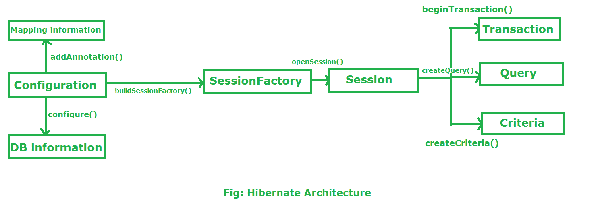
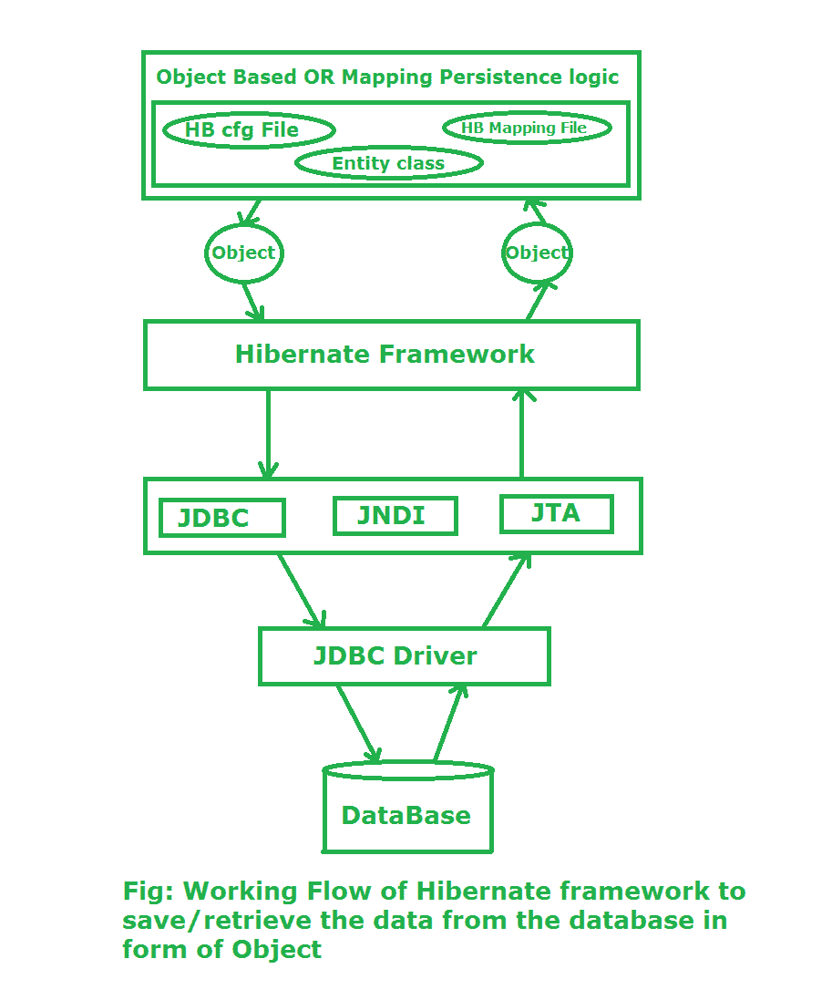

# 休眠架构

> 原文:[https://www.geeksforgeeks.org/hibernate-architecture/](https://www.geeksforgeeks.org/hibernate-architecture/)

**先决条件:** [冬眠介绍](https://www.geeksforgeeks.org/introduction-to-hibernate-framework/)

**Hibernate:** Hibernate 是一个用于开发独立于数据库软件的持久化逻辑的框架。在 JDBC，为了开发持久性逻辑，我们处理原始类型。而 Hibernate 框架使用对象来开发独立于数据库软件的持久性逻辑。

**休眠架构:**



**配置:**

*   Configuration 是 org.hibernate.cfg 包中的一个类。它激活了 Hibernate 框架。它读取配置文件和映射文件。

    ```java
    It activate Hibernate Framework
    Configuration cfg=new Configuration();
    It read both cfg file and mapping files
    cfg.configure();

    ```

*   它检查配置文件在语法上是否正确。
*   如果配置文件无效，那么它将抛出一个异常。如果它有效，那么它会在内存中创建一个元数据，并将该元数据返回给对象来表示配置文件。

会话工厂:

*   会话工厂是一个存在于组织休眠包中的接口，用于创建会话对象。
*   它本质上是不可变的和线程安全的。

    ```java
    buildSessionFactory() method gathers the meta-data which is in the cfg Object. 
    From cfg object it takes the JDBC information and create a JDBC Connection.
    SessionFactory factory=cfg.buildSessionFactory();

    ```

**会话:**

*   Session 是 org.hibernate 包中的一个接口。会话对象是基于会话工厂对象(即工厂)创建的。
*   它通过 Hibernate 框架打开与数据库软件的连接/会话。
*   这是一个重量轻的物体，它不是线程安全的。
*   会话对象用于执行 CRUD 操作。

    ```java
    Session session=factory.buildSession();

    ```

**交易:**

*   每当我们执行任何操作时都会使用事务对象，并且基于该操作，数据库中会有一些变化。
*   事务对象用于向数据库发出指令，通过使用 commit()方法，使由于操作而发生的更改永久化。

    ```java
    Transaction tx=session.beginTransaction();
    tx.commit();

    ```

**查询:**

*   查询是 org.hibernate 包中的一个接口。
*   查询实例通过调用 Session.createQuery()获得。
*   除了 Session.iterate()和 Session.find()提供的功能之外，这个接口还公开了一些额外的功能:

    ```java
    Query query=session.createQuery();

    ```

    1.  可以通过调用 setMaxResults()、setFirstResult()来选择结果集的特定页面。
    2.  可以使用命名查询参数。

**标准:**

*   标准是一个简化的应用编程接口，用于通过组合标准对象来检索实体。
*   进程是标准工厂。标准实例通常通过工厂限制方法获得。

    ```java
    Criteria criteria=session.createCriteria();

    ```

**Hibernate 框架中运行时的工作流程:**

假设我们想向数据库中插入一个对象。这里的对象只不过是我们在 java 程序上编写并创建该程序的对象的持久性逻辑。如果我们想在数据库中插入该对象，或者我们想从数据库中检索该对象。现在的问题是 hibernate 如何将对象保存到数据库或者从数据库中检索对象。Hibernate 框架通过几个层次来完成上述任务。让我们了解一下 Hibernate 框架在执行操作时的层次/流程:



**第一阶段:**第一阶段，我们将编写持久化逻辑，借助 Hibernate Configuration 文件和 Hibernate 映射文件对数据库进行一些具体的操作。之后，我们创建一个特定类的对象，并在其上编写持久性逻辑。

**第二阶段:**在第二阶段，我们包含持久性逻辑的类将与 hibernate 框架进行交互，hibernate 框架给出一些抽象来执行一些任务。现在 java 类的图片结束了。现在 Hibernate 负责借助 Hibernate 框架下面的层来执行持久化逻辑，或者我们可以说这些层是 Hibernate 的内部实现。

**第三阶段:**在第三阶段，我们的 hibernate 框架交互 JDBC、JNDI、JTA 等去数据库执行持久化逻辑。

**第四阶段&第五阶段:**第四&第五阶段，hibernate 在 JDBC 驱动的帮助下与 Database 进行交互。现在，hibernate 执行持久化逻辑，这不过是 **CRUD** 操作。如果我们的持久性逻辑是检索一条记录，那么它将以相反的顺序显示在 java 程序的控制台上。