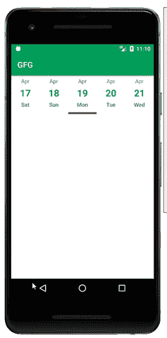

# 安卓中的水平日历视图

> 原文:[https://www . geesforgeks . org/horizontal-calendar view-in-Android/](https://www.geeksforgeeks.org/horizontal-calendarview-in-android/)

如果我们正在制作一个应用程序，提供诸如预订航班、电影票或其他服务，我们通常必须在我们的应用程序中实现一个日历。我们必须以这样的方式对齐日历，这样它看起来会更好，并且在移动应用程序中占用的空间也会更少。大多数应用程序更喜欢在其内部使用水平日历视图，这看起来比普通日历更好。在本文中，我们将研究如何在我们的应用程序中实现类似的日历。

### 我们将在本文中构建什么？

我们将建立一个简单的应用程序，我们将简单地创建一个水平日历，我们将在其中显示一个月的全部日期。我们将在水平日历视图中显示这些日期。下面给出了一个示例 GIF，以了解我们将在本文中做什么。注意，我们将使用 **Java** 语言来实现这个项目。



### **分步实施**

**第一步:创建新项目**

要在安卓工作室创建新项目，请参考[如何在安卓工作室创建/启动新项目](https://www.geeksforgeeks.org/android-how-to-create-start-a-new-project-in-android-studio/)。注意选择 **Java** 作为编程语言。

**第二步:添加依赖关系**

导航到**渐变脚本>构建.渐变(模块:应用)**，并在依赖项部分添加以下依赖项。

> 实现' devs . mulham . horizontalcalendar:horizontalcalendar:1 . 3 . 4 '

**步骤 3:使用 activity_main.xml 文件**

导航到**应用程序> res >布局> activity_main.xml** 并将下面的代码添加到该文件中。下面是 **activity_main.xml** 文件的代码。

## 可扩展标记语言

```
<?xml version="1.0" encoding="utf-8"?>
<RelativeLayout 
    xmlns:android="http://schemas.android.com/apk/res/android"
    xmlns:app="http://schemas.android.com/apk/res-auto"
    xmlns:tools="http://schemas.android.com/tools"
    android:layout_width="match_parent"
    android:layout_height="match_parent"
    tools:context=".MainActivity">

    <!--on below line we are creating our calendar view
        selector color is use as a indicator for selected date
        text color normal is use to give text color to unselected date
        text color selected is use to give text color to selected date-->
    <devs.mulham.horizontalcalendar.HorizontalCalendarView
        android:id="@+id/calendarView"
        android:layout_width="match_parent"
        android:layout_height="wrap_content"
        app:selectorColor="@android:color/holo_red_dark"
        app:textColorNormal="@color/purple_200"
        app:textColorSelected="@color/purple_200" />

</RelativeLayout>
```

**第四步:使用****MainActivity.java 文件**

转到**MainActivity.java**文件，参考以下代码。以下是**MainActivity.java**文件的代码。代码中添加了注释，以更详细地理解代码。

## Java 语言(一种计算机语言，尤用于创建网站)

```
import android.os.Bundle;
import android.util.Log;

import androidx.appcompat.app.AppCompatActivity;

import java.util.Calendar;

import devs.mulham.horizontalcalendar.HorizontalCalendar;
import devs.mulham.horizontalcalendar.utils.HorizontalCalendarListener;

public class MainActivity extends AppCompatActivity {

    @Override
    protected void onCreate(Bundle savedInstanceState) {
        super.onCreate(savedInstanceState);
        setContentView(R.layout.activity_main);

        /* starts before 1 month from now */
        Calendar startDate = Calendar.getInstance();
        startDate.add(Calendar.MONTH, -1);

        /* ends after 1 month from now */
        Calendar endDate = Calendar.getInstance();
        endDate.add(Calendar.MONTH, 1);

        // on below line we are setting up our horizontal calendar view and passing id our calendar view to it.
        HorizontalCalendar horizontalCalendar = new HorizontalCalendar.Builder(this, R.id.calendarView)
                // on below line we are adding a range 
                // as start date and end date to our calendar.
                .range(startDate, endDate)
                // on below line we are providing a number of dates
                // which will be visible on the screen at a time.
                .datesNumberOnScreen(5)
                // at last we are calling a build method 
                // to build our horizontal recycler view.
                .build();
        // on below line we are setting calendar listener to our calendar view.
        horizontalCalendar.setCalendarListener(new HorizontalCalendarListener() {
            @Override
            public void onDateSelected(Calendar date, int position) {
                // on below line we are printing date 
                // in the logcat which is selected.
                Log.e("TAG", "CURRENT DATE IS " + date);
            }
        });
    }
}
```

现在运行您的应用程序，并查看应用程序的输出。

**输出:**

<video class="wp-video-shortcode" id="video-594988-1" width="640" height="360" preload="metadata" controls=""><source type="video/mp4" src="https://media.geeksforgeeks.org/wp-content/uploads/20210419231047/20210419_231004.mp4?_=1">[https://media.geeksforgeeks.org/wp-content/uploads/20210419231047/20210419_231004.mp4](https://media.geeksforgeeks.org/wp-content/uploads/20210419231047/20210419_231004.mp4)</video>