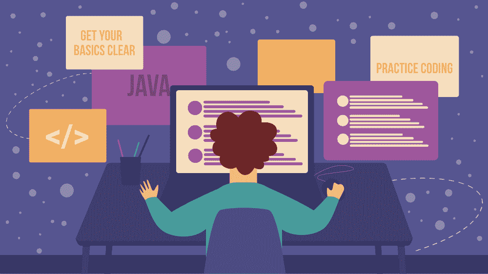

# 如何成为一名优秀的 Java 程序员？

> 原文:[https://www . geeksforgeeks . org/如何成为一名优秀的 java 程序员/](https://www.geeksforgeeks.org/how-do-i-become-a-good-java-programmer/)

[Java](https://www.geeksforgeeks.org/java/) 是一种非常成功和流行的编程语言。它非常可靠，广泛应用于我们的日常生活中，尤其是在网络或移动应用中。如今对 Java 的需求很大，Java 程序员主要是在信息技术领域招聘的。关于为什么要学习 Java 的更多细节，可以访问[学习 Java 的十大理由](https://www.geeksforgeeks.org/top-10-reasons-to-learn-java/)。

作为一名优秀的 Java 程序员，您必须专注于这里提到的某些事情:

### 1.理清你的基本问题

找到一个好的知识来源，无论是导师还是在线视频或学习材料，并加强你的基础知识。理解基础知识是进一步构建编程技能的必要条件。与其抢劫你得不到的东西，不如寻求帮助，了解背后的逻辑。慢慢来，不要有一蹴而就的目标，在起步的时候慢慢来，然后逐渐加快速度。你应该学会:

*   Java 8
*   春季框架(Spring Boot)
*   单元测试
*   应用编程接口和库
*   [JVM 的内部构件](https://www.geeksforgeeks.org/jvm-works-jvm-architecture/)
*   设计模式
*   开发工具
*   [锅炉](https://www.geeksforgeeks.org/kotlin-programming-language/)
*   微服务
*   更好地学习您的集成开发环境

### 2.阅读文档和开源框架源代码

加入一些好的论坛，订阅时事通讯，让自己了解最新的 Java 技术。永远不要停止阅读。继续从某个地方或其他地方阅读它，并尝试将你的知识传播给其他人。这也有助于保持你对这个领域的兴趣。养成阅读大量文档的习惯。可能是规范、JSR、API 文档、教程等。阅读文档有助于你建立必要的基础，并以此为基础以最好的方式进行编程。

### 3.[练习编码](https://practice.geeksforgeeks.org/tracks/Java/)

实现你正在学习的东西。在线或离线练习编程，这会增强你的信心。要有规律，制定目标，并努力在规定的时间内完成。只有当你实际执行你所理解的东西时，知识的深度才会到来。加入 Java 编程实践与竞赛，如:[代码厨师](https://www.codechef.com/)、 [spoj](https://www.spoj.com/) 、 [projecteuler](https://projecteuler.net/about) 。

### 4.小组讨论和阅读书籍

分组讨论。加入互联网上的枢纽。小组讨论有助于你获得关于这个话题的不同观点。你可以得到事情的利弊，也可以解决讨论中的疑惑。此外，阅读标准书籍和笔记。

### 5.订阅论坛

当你开始研究一项新技术时，最好也是最先做的事情就是订阅技术论坛。不管你面对的是什么问题，其他人可能早就已经面对了，你可能会找到解决办法。关注好的博客，并通过分享你的观点来帮助他人。加入 Java 编程社交平台，如: [StackOverflow](https://stackoverflow.com/tags) 、 [dreamincode 论坛](https://www.dreamincode.net/forums/forum/32-java/)、[Java-论坛](https://www.java-forums.org/activity.php)、 [coderanch 论坛](https://coderanch.com/forums)等。

### 6.承担项目

提高你的编码技能并成为一名优秀程序员的一个好方法是做一名自由职业者。这意味着你可以在网上找到项目，在家工作，也可以在网上获得报酬。

### 7.奉献自己

你最需要的最后也是最重要的一步是奉献。只有当你真正投身其中，你才能成为一名优秀的 java 程序员。不要漫不经心，而是集中精力，保持专注。跟随极客的 Java 教程。

遵循这些方法，它们肯定会帮助你，你会看到自己在某个时候做得很好。