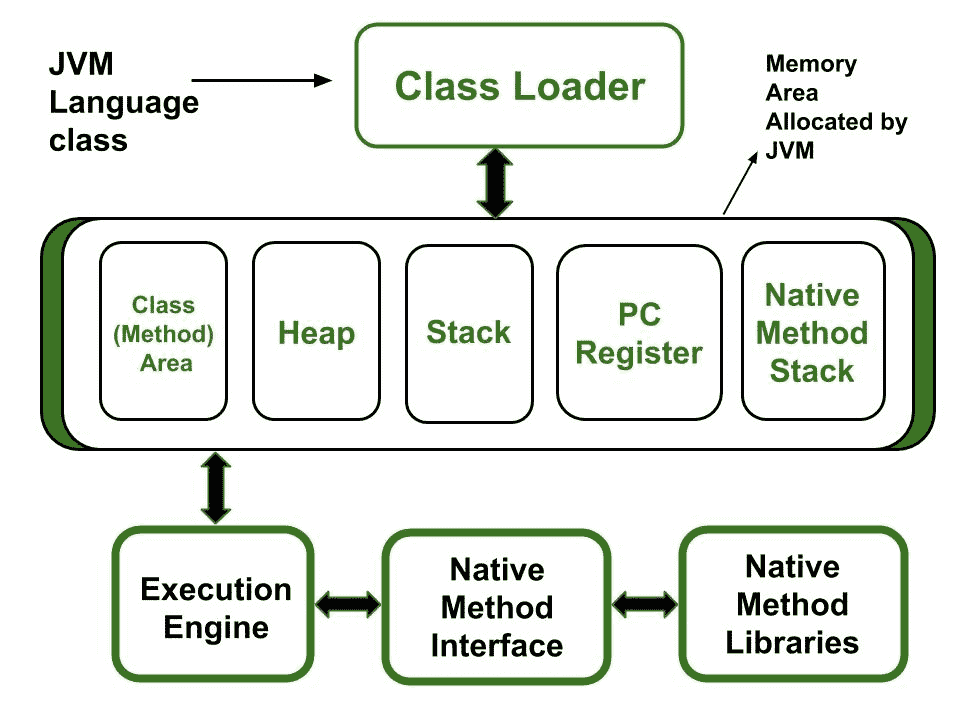

# JVM 分配了多少类型的内存区域？

> 原文:[https://www . geeksforgeeks . org/JVM 分配了多少类型的内存区域/](https://www.geeksforgeeks.org/how-many-types-of-memory-areas-are-allocated-by-jvm/)

[JVM (Java Virtual Machine)](https://www.geeksforgeeks.org/jvm-works-jvm-architecture/) 是一个抽象的机器，换句话说，它是一个取 Java 字节码，把字节码(一行一行)转换成机器可理解代码的程序/软件。

[JVM(Java 虚拟机)](https://www.geeksforgeeks.org/jvm-works-jvm-architecture/)充当运行 Java 应用的运行时引擎。JVM 实际上调用的是 Java 代码中的[主方法](https://www.geeksforgeeks.org/understanding-static-in-public-static-void-main-in-java/)。JVM 是 [JRE(Java 运行时环境)](https://www.geeksforgeeks.org/differences-jdk-jre-jvm/)的一部分。

JVM 执行一些特定类型的操作:

1.  代码加载
2.  代码验证
3.  执行代码
4.  它为用户提供运行时环境

**JVM 分配的内存区域类型**:

所有这些功能都采用不同形式的记忆结构。JVM 中的**内存分为 5 个不同的部分**:

1.  类(方法)区域
2.  许多
3.  堆
4.  程序计数器寄存器
5.  本机方法堆栈

让我们简单了解一下它们:

1.  **类加载器:**是 JVM 的一个子系统，用来加载类文件。它主要负责三项活动。
    *   装货
    *   连接
    *   初始化
2.  **类(方法)区:**存储每个类的类级数据，比如运行时常量池、字段和方法数据、方法的代码。
3.  **堆:**用于在运行时为对象分配内存
4.  **堆叠:**
    *   每个线程都有一个私有的 JVM 堆栈，与线程同时创建。它用于存储方法返回值和执行动态链接时所需的数据和部分结果。
    *   Java Stack 存储框架，每次调用该方法时都会创建一个新框架。
        当一个框架的方法调用完成时，它就会被销毁
5.  **程序计数器寄存器:**执行特定方法任务的每个 JVM 线程都有一个与之关联的程序计数器寄存器。非本机方法有一个存储可用 JVM 指令地址的 PC，而在本机方法中，程序计数器的值是未定义的。PC 寄存器能够存储返回地址或某个特定平台上的本机指针。
6.  **原生方法栈:**也称为 C 栈，原生方法栈不是用 Java 语言编写的。该内存在创建时分配给每个线程，可以是固定的，也可以是动态的。