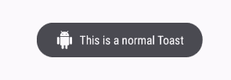
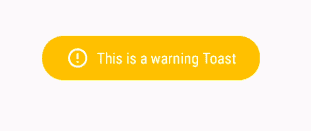

# 如何在安卓中添加自定义风格的吐司

> 原文:[https://www . geesforgeks . org/如何添加定制风格的安卓吐司/](https://www.geeksforgeeks.org/how-to-add-a-custom-styled-toast-in-android/)

一 [**吐司**](https://www.geeksforgeeks.org/toasts-android-studio/) 是反馈信息。它占用很少的显示空间，并且显示在活动的主要内容之上，并且仅在短时间内保持可见。本文解释如何创建**自定义吐司消息**，它有自定义背景、图像、图标等，这些都不是原吐司库提供的。

    

在本文中， **JitPack gradle** 的**吐司库**用于为用户创建自定义吐司，因为它是一个非常常见的库，已经被许多应用程序使用。

### **分步实施**

**第一步:创建新项目**

要在安卓工作室创建新项目，请参考[如何在安卓工作室创建/启动新项目](https://www.geeksforgeeks.org/android-how-to-create-start-a-new-project-in-android-studio/)。注意选择 **Java** 作为编程语言。

**第二步:添加依赖和 JitPack 存储库**

将支持库添加到您的根 [**build.gradle**](https://www.geeksforgeeks.org/android-build-gradle/) 文件中(不在模块 build.gradle 文件中)。这个库 **jitpack** 是一个新颖的包库。它是为 JVM 而做的，这样任何存在于 [github](https://www.geeksforgeeks.org/ultimate-guide-git-github/) 和 [bigbucket](https://www.geeksforgeeks.org/bitbucket-vs-github-vs-gitlab/) 中的库都可以直接在应用中使用。

> 所有项目{
> 
> 存储库{
> 
> maven {
> 
> URL " https://jitpack . io "
> 
> }
> 
> }
> 
> }

在模块的 [**build.gradle**](https://www.geeksforgeeks.org/android-build-gradle/) 文件中添加支持库，并在依赖项部分添加依赖项。添加这种依赖关系是为了在应用程序中直接使用不同风格的吐司。

> 依赖项{
> 
> 实现' com . github . grenderg:Toasty:1 . 4 . 2 '
> 
> }

**步骤 3:使用 activity_main.xml 文件**

导航到**应用程序> res >布局> activity_main.xml** 并将下面的代码添加到该文件中。下面是 **activity_main.xml** 文件的代码。

## 可扩展标记语言

```
<?xml version="1.0" encoding="utf-8"?>
<RelativeLayout
    xmlns:android="http://schemas.android.com/apk/res/android"
    xmlns:tools="http://schemas.android.com/tools"
    android:layout_width="match_parent"
    android:layout_height="match_parent"
    tools:context=".MainActivity">

    <LinearLayout
        android:layout_width="wrap_content"
        android:layout_height="wrap_content"
        android:layout_centerInParent="true"
        android:layout_gravity="center"
        android:orientation="vertical">

        <Button
            android:layout_margin="10dp"
            android:id="@+id/button_warning"
            android:layout_width="wrap_content"
            android:layout_height="wrap_content"
            android:onClick="showToast"
            android:text="show warning toast" />

        <Button
            android:layout_margin="10dp"
            android:id="@+id/button_info"
            android:layout_width="wrap_content"
            android:layout_height="wrap_content"
            android:onClick="showToast"
            android:text="show info toast" />

        <Button
            android:layout_margin="10dp"
            android:id="@+id/button_success"
            android:layout_width="wrap_content"
            android:layout_height="wrap_content"
            android:onClick="showToast"
            android:text="show success toast" />

        <Button
            android:layout_margin="10dp"
            android:id="@+id/button_error"
            android:layout_width="wrap_content"
            android:layout_height="wrap_content"
            android:onClick="showToast"
            android:text="show error toast" />

        <Button
            android:layout_margin="10dp"
            android:id="@+id/button_normal"
            android:layout_width="wrap_content"
            android:layout_height="wrap_content"
            android:onClick="showToast"
            android:text="show normal toast with an icon" />

    </LinearLayout>

</RelativeLayout>
```

**第四步:使用****MainActivity.java 文件**

转到**MainActivity.java**文件，参考以下代码。以下是**MainActivity.java**文件的代码。代码中添加了注释，以更详细地理解代码。

## Java 语言(一种计算机语言，尤用于创建网站)

```
import androidx.appcompat.app.AppCompatActivity;
import androidx.core.content.ContextCompat;

import android.os.Bundle;
import android.view.View;
import android.widget.Toast;

import es.dmoral.toasty.Toasty;

public class MainActivity
    extends AppCompatActivity {

    @Override
    protected void onCreate(Bundle savedInstanceState){
        super.onCreate(savedInstanceState);
        setContentView(R.layout.activity_main);
    }

    // We assign this method
    // on OnClick() method
    // in activity_main.xml file.
    public void showToast(View v)
    {
        switch (v.getId()) {

        // For Error type Toast
        case R.id.button_error:
            Toasty.error(this, "This is an error Toast", Toast.LENGTH_SHORT).show();
            break;

        // For Success type Toast
        case R.id.button_success:
            Toasty.success(this, "This is a success Toast", Toast.LENGTH_SHORT).show();
            break;

        // For Info type Toast
        case R.id.button_info:
            Toasty.info(this, "This is an info Toast", Toast.LENGTH_SHORT).show();
            break;

        // For Warning type Toast
        case R.id.button_warning:
            Toasty.warning(this, "This is a warning Toast", Toast.LENGTH_SHORT).show();
            break;

        // For Norma type Toast
        // with an icon
        case R.id.button_normal:
            Toasty.normal(this, "This is a normal Toast", Toast.LENGTH_SHORT, ContextCompat.getDrawable(this, R.drawable.ic_android_black_24dp)).show();
            break;
        }
    }
}
```

**输出:**

<video class="wp-video-shortcode" id="video-409418-1" width="640" height="360" preload="metadata" controls=""><source type="video/mp4" src="https://media.geeksforgeeks.org/wp-content/uploads/20200505140258/Record_2020-05-05-14-01-05_fa9fcb205c599544bea03d44a7b4b38d1.mp4?_=1">[https://media.geeksforgeeks.org/wp-content/uploads/20200505140258/Record_2020-05-05-14-01-05_fa9fcb205c599544bea03d44a7b4b38d1.mp4](https://media.geeksforgeeks.org/wp-content/uploads/20200505140258/Record_2020-05-05-14-01-05_fa9fcb205c599544bea03d44a7b4b38d1.mp4)</video>

> **注意:**不再推荐自定义吐司视图。在前台时，应用程序可以使用 **makeText()** 功能生成普通的文本吐司，或者创建一个 Snackbar。自定义吐司视图不会在拥有应用程序时显示，目标是应用编程接口级别的构建。版本代码#R 或以上在后台。目前，在以应用编程接口级构建为目标的应用程序中，使用 **makeText()** 或其变体构建的祝酒词同样会返回空值。版本代码。除非他们用非空视图调用了 setView。