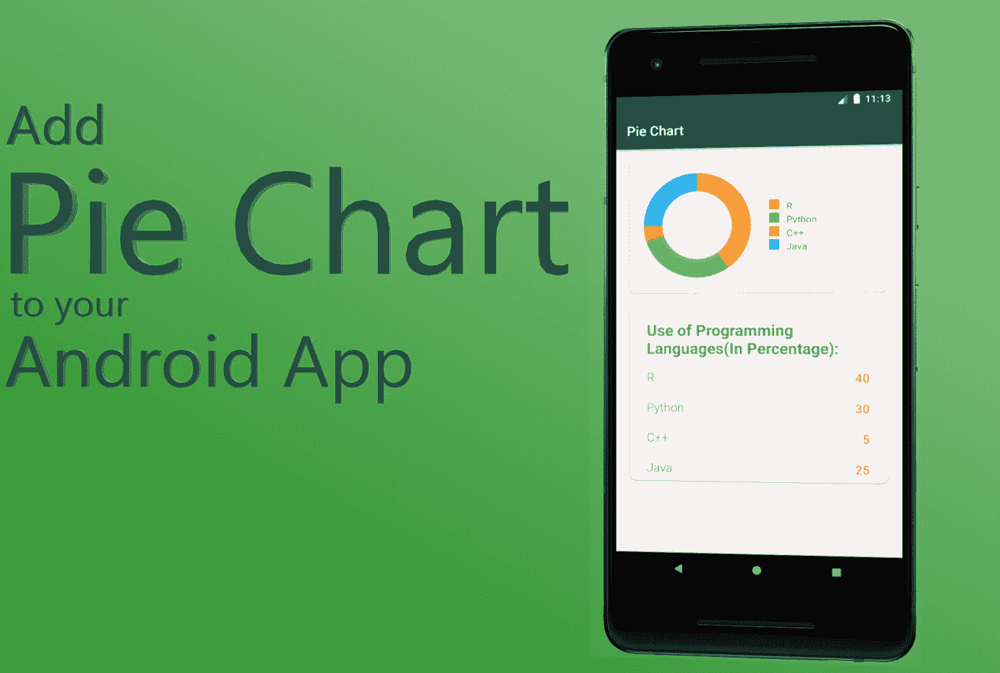
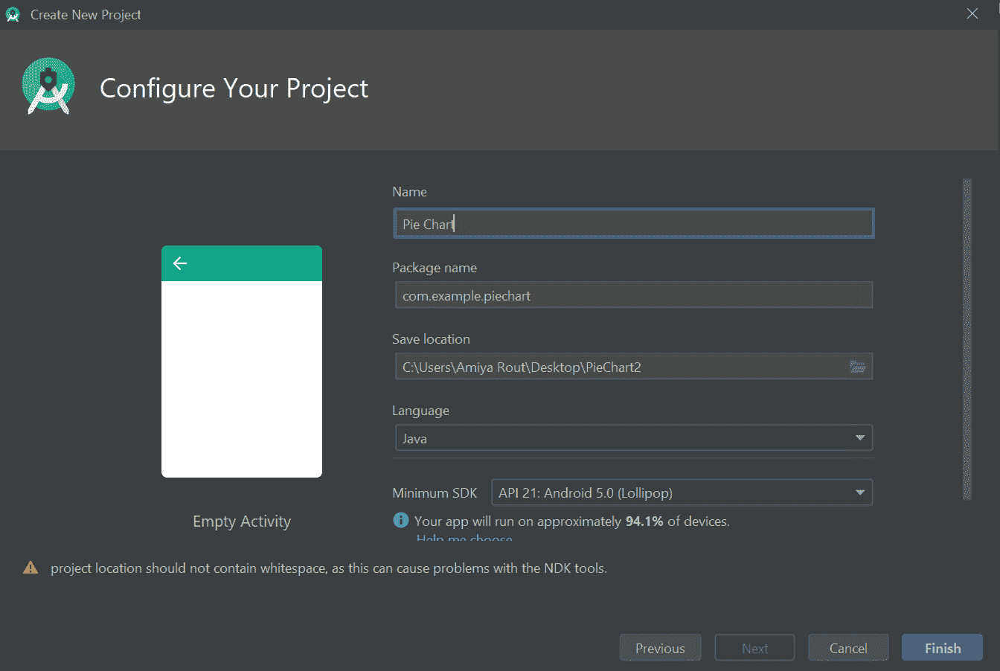
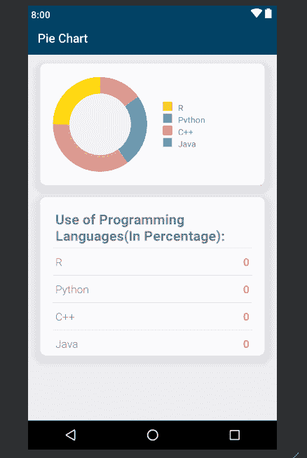
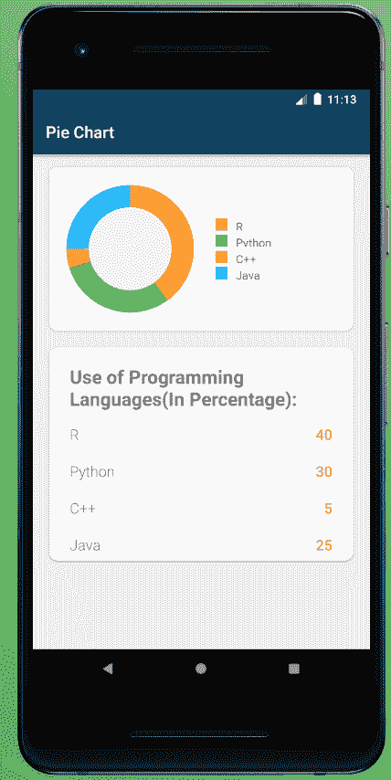

# 如何在安卓应用中添加饼图

> 原文:[https://www . geesforgeks . org/如何将饼图添加到安卓应用程序中/](https://www.geeksforgeeks.org/how-to-add-a-pie-chart-into-an-android-application/)

**先决条件:**

*   [新手安卓应用开发基础](https://www.geeksforgeeks.org/android-app-development-fundamentals-for-beginners/)
*   [安卓工作室安装设置指南](https://www.geeksforgeeks.org/guide-to-install-and-set-up-android-studio/?ref=rp)
*   [安卓|如何在安卓工作室创建/启动新项目？](https://www.geeksforgeeks.org/android-how-to-create-start-a-new-project-in-android-studio/?ref=rp)
*   [安卓|运行你的第一个安卓应用](https://www.geeksforgeeks.org/android-running-your-first-android-app/?ref=rp)

A **饼状图**是一个圆形的统计图形，它被分成若干个切片来说明数字比例。它描绘了一个使用“饼图切片”的特殊图表，其中每个扇区显示数据的相对大小。圆形图以半径的形式切割成描述相对频率或幅度的线段，也称为圆形图。饼图以百分比表示数字，所有分段的总和必须等于 100%。

让我们看看将**饼图**添加到安卓应用的步骤。

[](https://media.geeksforgeeks.org/wp-content/uploads/20200507112359/f41.jpg)

1.  **第一步:开启新项目**
    *   打开一个新项目，只需点击左上角的文件选项。
    *   然后点击新建，用你想要的名字打开一个新项目。
    *   现在我们将使用 Java 语言来处理空活动。保持所有其他选项不变。
    *   您可以根据自己的选择更改项目名称。
        [](https://media.geeksforgeeks.org/wp-content/uploads/20200507014407/f121.png)
    *   默认情况下会有两个文件 **activity_main.xml** 和**MainActivity.java**。
2.  **第二步:**在进入编码部分之前，你首先要做一些前置任务。
    *   转到**应用->RES->values->colors . XML**部分，为您的应用设置颜色。

        ## 

        ```java
        <?xml version="1.0" encoding="utf-8"?>
        <resources>
            <color name="colorPrimary">#024265</color>
            <color name="colorPrimaryDark">#024265</color>
            <color name="colorAccent">#05af9b</color>

            <color name="color_one">#fb7268</color>
            <color name="color_white">#ededf2</color>
            <color name="color_two">#E3E0E0</color>

            <color name="R">#FFA726</color>
            <color name="Python">#66BB6A</color>
            <color name="CPP">#EF5350</color>
            <color name="Java">#29B6F6</color>

        </resources>
        ```

    *   转到**梯度脚本- >构建.梯度(模块:应用)**部分，导入以下依赖项，然后单击上面弹出的“立即同步”。

        ## build . gradle(:app)

        ```java
        // For Card view
        implementation 'androidx.cardview:cardview:1.0.0'

        // Chart and graph library
        implementation 'com.github.blackfizz:eazegraph:1.2.5l@aar'
        implementation 'com.nineoldandroids:library:2.4.0'
        ```

3.  **第三步:设计用户界面**
    *   下面是 xml 文件的代码。

        ## activity _ main . XML

        ```java
        <?xml version="1.0" encoding="utf-8"?>
        <RelativeLayout

            xmlns:android="http://schemas.android.com/apk/res/android"
            xmlns:app="http://schemas.android.com/apk/res-auto"
            xmlns:tools="http://schemas.android.com/tools"
            android:layout_width="match_parent"
            android:layout_height="match_parent"
            android:background="@color/color_white"
            tools:context=".MainActivity">

            <!-- Card view for displaying the --->
            <!-- Pie chart and details of pie chart -->
            <androidx.cardview.widget.CardView
                android:id="@+id/cardViewGraph"
                android:layout_width="match_parent"
                android:layout_height="200dp"
                android:layout_marginLeft="20dp"
                android:layout_marginRight="20dp"
                android:layout_marginTop="15dp"
                android:elevation="10dp"
                app:cardCornerRadius="10dp">

                <!--Linear layout to display pie chart --->
                <!-- and details of pie chart-->

                <LinearLayout
                    android:layout_width="match_parent"
                    android:layout_height="match_parent"
                    android:orientation="horizontal"
                    android:weightSum="2">

                    <!--Pie chart to display the data-->

                    <org.eazegraph.lib.charts.PieChart
                        xmlns:app="http://schemas.android.com/apk/res-auto"
                        android:id="@+id/piechart"
                        android:layout_width="0dp"
                        android:layout_height="match_parent"
                        android:padding="6dp"
                        android:layout_weight="1"
                        android:layout_marginTop="15dp"
                        android:layout_marginLeft="15dp"
                        android:layout_marginBottom="15dp"

                        />

                    <!--Creating another linear layout --->
                    <!-- to display pie chart details -->
                    <LinearLayout
                        android:layout_width="0dp"
                        android:layout_height="match_parent"
                        android:layout_weight="1"
                        android:layout_marginLeft="20dp"
                        android:orientation="vertical"
                        android:gravity="center_vertical"
                        >

                        <LinearLayout
                            android:layout_width="match_parent"
                            android:layout_height="15dp"
                            android:layout_gravity="center_vertical">

                            <!--View to display the yellow color icon-->
                            <View
                                android:layout_width="15dp"
                                android:layout_height="match_parent"
                                android:background="@color/R"/>

                            <!--Text view to display R -->
                            <TextView
                                android:layout_width="wrap_content"
                                android:layout_height="wrap_content"
                                android:text="R"
                                android:paddingLeft="10dp"/>

                        </LinearLayout>

                        <!--Linear layout to display Python-->
                        <LinearLayout
                            android:layout_width="match_parent"
                            android:layout_height="15dp"
                            android:layout_gravity="center_vertical"
                            android:layout_marginTop="5dp">

                            <!--View to display the green color icon-->
                            <View
                                android:layout_width="15dp"
                                android:layout_height="match_parent"
                                android:background="@color/Python"/>

                            <!--Text view to display python text -->
                            <TextView
                                android:layout_width="wrap_content"
                                android:layout_height="wrap_content"
                                android:text="Python"
                                android:paddingLeft="10dp"/>

                        </LinearLayout>

                        <!--Linear layout to display C++-->
                        <LinearLayout
                            android:layout_width="match_parent"
                            android:layout_height="15dp"
                            android:layout_gravity="center_vertical"
                            android:layout_marginTop="5dp">

                            <!--View to display the red color icon-->
                            <View
                                android:layout_width="15dp"
                                android:layout_height="match_parent"
                                android:background="@color/CPP"/>

                            <!--Text view to display C++ text -->
                            <TextView
                                android:layout_width="wrap_content"
                                android:layout_height="wrap_content"
                                android:text="C++"
                                android:paddingLeft="10dp"/>

                        </LinearLayout>

                        <!--Linear layout to display Java-->
                        <LinearLayout
                            android:layout_width="match_parent"
                            android:layout_height="15dp"
                            android:layout_gravity="center_vertical"
                            android:layout_marginTop="5dp">

                            <!--View to display the blue color icon-->
                            <View
                                android:layout_width="15dp"
                                android:layout_height="match_parent"
                                android:background="@color/Java"/>

                            <!--Text view to display Java text -->
                            <TextView
                                android:layout_width="wrap_content"
                                android:layout_height="wrap_content"
                                android:text="Java"
                                android:paddingLeft="10dp"/>

                        </LinearLayout>

                    </LinearLayout>

                </LinearLayout>

            </androidx.cardview.widget.CardView>

            <!-- Another Card view for displaying --->
            <!-- Use of programming languages -->
            <androidx.cardview.widget.CardView
                android:layout_width="match_parent"
                android:layout_height="260dp"
                android:layout_below="@+id/cardViewGraph"
                android:layout_marginLeft="20dp"
                android:layout_marginRight="20dp"
                android:layout_marginTop="20dp"
                android:layout_marginBottom="20dp"
                android:elevation="10dp"
                app:cardCornerRadius="10dp"
                android:id="@+id/details">

                <!--Relative layout to display --->
                <!-- use of programming languages -->
                        <LinearLayout
                            android:layout_width="match_parent"
                            android:layout_height="wrap_content"
                            android:orientation="vertical">

                            <!--Text view to use of --->
                            <!-- programming languages text-->
                            <TextView
                                android:layout_width="match_parent"
                                android:layout_height="wrap_content"
                                android:text="Use of Programming Languages(In Percentage):"
                                android:textSize="23sp"
                                android:textStyle="bold"
                                android:layout_marginLeft="25dp"
                                android:layout_marginTop="20dp"/>

                            <!--View to display the line-->
                            <View
                                android:layout_width="match_parent"
                                android:layout_height="1dp"
                                android:background="@color/color_two"
                                android:layout_marginLeft="20dp"
                                android:layout_marginRight="20dp"
                                android:layout_marginTop="5dp"/>

                            <RelativeLayout
                                android:layout_width="match_parent"
                                android:layout_height="wrap_content"
                                android:layout_marginRight="25dp"
                                android:layout_marginLeft="25dp"
                                android:layout_marginTop="10dp"
                                android:layout_marginBottom="10dp">

                                <!--Text view to display R -->
                                <TextView
                                    android:layout_width="wrap_content"
                                    android:layout_height="wrap_content"
                                    android:fontFamily="sans-serif-light"
                                    android:text="R"
                                    android:textSize="18sp"/>

                                <!--Text view to display the --->
                                <!-- percentage of programming language --->
                                <!-- used. For now default set to 0-->
                                <TextView
                                    android:layout_width="fill_parent"
                                    android:layout_height="wrap_content"
                                    android:text="0"
                                    android:id="@+id/tvR"
                                    android:textAlignment="textEnd"
                                    android:textSize="18sp"
                                    android:textColor="@color/color_one"
                                    android:textStyle="bold"
                                    android:fontFamily="sans-serif-light"
                                    android:layout_alignParentRight="true"/>
                            </RelativeLayout>

                            <!--View to display the line-->
                            <View
                                android:layout_width="match_parent"
                                android:layout_height="1dp"
                                android:background="@color/color_two"
                                android:layout_marginLeft="20dp"
                                android:layout_marginRight="20dp" />

                            <RelativeLayout
                                android:layout_width="match_parent"
                                android:layout_height="wrap_content"
                                android:layout_marginRight="25dp"
                                android:layout_marginLeft="25dp"
                                android:layout_marginTop="10dp"
                                android:layout_marginBottom="10dp">

                                <TextView
                                    android:layout_width="wrap_content"
                                    android:layout_height="wrap_content"
                                    android:fontFamily="sans-serif-light"
                                    android:text="Python"
                                    android:textSize="18sp"/>

                                <!--Text view to display the percentage --->
                                <!-- of programming language used. --->
                                <!-- For now default set to 0-->

                                <TextView
                                    android:layout_width="fill_parent"
                                    android:layout_height="wrap_content"
                                    android:text="0"
                                    android:id="@+id/tvPython"
                                    android:textAlignment="textEnd"
                                    android:textSize="18sp"
                                    android:textColor="@color/color_one"
                                    android:textStyle="bold"
                                    android:fontFamily="sans-serif-light"
                                    android:layout_alignParentRight="true"/>

                            </RelativeLayout>
                            <View
                                android:layout_width="match_parent"
                                android:layout_height="1dp"
                                android:background="@color/color_two"
                                android:layout_marginLeft="20dp"
                                android:layout_marginRight="20dp" />

                            <RelativeLayout
                                android:layout_width="match_parent"
                                android:layout_height="wrap_content"
                                android:layout_marginRight="25dp"
                                android:layout_marginLeft="25dp"
                                android:layout_marginTop="10dp"
                                android:layout_marginBottom="10dp">

                                <TextView
                                    android:layout_width="wrap_content"
                                    android:layout_height="wrap_content"
                                    android:fontFamily="sans-serif-light"
                                    android:text="C++"
                                    android:textSize="18sp"/>

                                <!--Text view to display the percentage --->
                                <!-- of programming language used. --->
                                <!-- For now default set to 0-->
                                <TextView
                                    android:layout_width="fill_parent"
                                    android:layout_height="wrap_content"
                                    android:text="0"
                                    android:id="@+id/tvCPP"
                                    android:textAlignment="textEnd"
                                    android:textSize="18sp"
                                    android:textColor="@color/color_one"
                                    android:textStyle="bold"
                                    android:fontFamily="sans-serif-light"
                                    android:layout_alignParentRight="true"/>

                            </RelativeLayout>
                            <View
                                android:layout_width="match_parent"
                                android:layout_height="1dp"
                                android:background="@color/color_two"
                                android:layout_marginLeft="20dp"
                                android:layout_marginRight="20dp" />

                            <RelativeLayout
                                android:layout_width="match_parent"
                                android:layout_height="wrap_content"
                                android:layout_marginRight="25dp"
                                android:layout_marginLeft="25dp"
                                android:layout_marginTop="10dp"
                                android:layout_marginBottom="10dp">

                                <TextView
                                    android:layout_width="wrap_content"
                                    android:layout_height="wrap_content"
                                    android:fontFamily="sans-serif-light"
                                    android:text="Java"
                                    android:textSize="18sp"/>

                                <!--Text view to display the percentage --->
                                <!-- of programming language used. --->
                                <!-- For now default set to 0-->
                                <TextView
                                    android:layout_width="fill_parent"
                                    android:layout_height="wrap_content"
                                    android:text="0"
                                    android:id="@+id/tvJava"
                                    android:textAlignment="textEnd"
                                    android:textSize="18sp"
                                    android:textColor="@color/color_one"
                                    android:textStyle="bold"
                                    android:fontFamily="sans-serif-light"
                                    android:layout_alignParentRight="true"/>

                            </RelativeLayout>

                        </LinearLayout>

            </androidx.cardview.widget.CardView>

        </RelativeLayout>
        ```

    *   **After using this code in **.xml file**, the UI will be like:**

        [](https://media.geeksforgeeks.org/wp-content/uploads/20200507015421/f212.png)

4.  **Step4: Working with Java file**
    *   打开类内的**MainActivity.java**文件，首先创建对象的[文本视图类](https://www.geeksforgeeks.org/textview-widget-in-android-using-java-with-examples/)和饼图类。

        ```java
        // Create the object of TextView and PieChart class
        TextView tvR, tvPython, tvCPP, tvJava;
        PieChart pieChart;
        ```

    *   其次，在`onCreate()`方法中，我们必须将这些对象与我们已经给出的它们各自的 id 联系起来。XML 文件。

        ```java
        // Link those objects with their respective
        // id's that we have given in .XML file
        tvR = findViewById(R.id.tvR);
        tvPython = findViewById(R.id.tvPython);
        tvCPP = findViewById(R.id.tvCPP);
        tvJava = findViewById(R.id.tvJava);
        pieChart = findViewById(R.id.piechart);
        ```

    *   在`onCreate()`方法之外创建一个`private void setData()`方法并定义。
    *   在`setData()`方法中，最重要的任务是如何在文本文件和饼图中设置数据。
    *   首先在`setData()`方法里面设置在各自的文本视图中使用的语言的百分比。

        ```java
        // Set the percentage of language used
        tvR.setText(Integer.toString(40));
        tvPython.setText(Integer.toString(30));
        tvCPP.setText(Integer.toString(5));
        tvJava.setText(Integer.toString(25));
        ```

    *   然后将这些数据设置到饼图中，并使用`addPieSlice()`方法设置它们各自的颜色。

        ```java
        // Set the data and color to the pie chart
        pieChart.addPieSlice(
            new PieModel(
                "R",
                Integer.parseInt(tvR.getText().toString()),
                Color.parseColor("#FFA726")));
        pieChart.addPieSlice(
            new PieModel(
                "Python",
                Integer.parseInt(tvPython.getText().toString()),
                Color.parseColor("#66BB6A")));
        pieChart.addPieSlice(
            new PieModel(
                "C++",
                Integer.parseInt(tvCPP.getText().toString()),
                Color.parseColor("#EF5350")));
        pieChart.addPieSlice(
            new PieModel(
                "Java",
                Integer.parseInt(tvJava.getText().toString()),
                Color.parseColor("#29B6F6")));
        ```

    *   为了看起来更好，使用`startAnimation()`激活饼图。

        ```java
        // To animate the pie chart
        pieChart.startAnimation();
        ```

    *   最后调用`onCreate()`方法里面的`setData()`方法。

    以下是 MainActivity.java 文件的完整代码:

    ## MainActivity.java

    ```java
    package com.example.piechart;

    // Import the required libraries
    import androidx.appcompat.app.AppCompatActivity;
    import android.graphics.Color;
    import android.os.Bundle;
    import android.widget.TextView;
    import org.eazegraph.lib.charts.PieChart;
    import org.eazegraph.lib.models.PieModel;

    public class MainActivity
        extends AppCompatActivity {

        // Create the object of TextView
        // and PieChart class
        TextView tvR, tvPython, tvCPP, tvJava;
        PieChart pieChart;

        @Override
        protected void onCreate(Bundle savedInstanceState)
        {
            super.onCreate(savedInstanceState);
            setContentView(R.layout.activity_main);

            // Link those objects with their
            // respective id's that
            // we have given in .XML file
            tvR = findViewById(R.id.tvR);
            tvPython = findViewById(R.id.tvPython);
            tvCPP = findViewById(R.id.tvCPP);
            tvJava = findViewById(R.id.tvJava);
            pieChart = findViewById(R.id.piechart);

            // Creating a method setData()
            // to set the text in text view and pie chart
            setData();
        }

        private void setData()
        {

            // Set the percentage of language used
            tvR.setText(Integer.toString(40));
            tvPython.setText(Integer.toString(30));
            tvCPP.setText(Integer.toString(5));
            tvJava.setText(Integer.toString(25));

            // Set the data and color to the pie chart
            pieChart.addPieSlice(
                new PieModel(
                    "R",
                    Integer.parseInt(tvR.getText().toString()),
                    Color.parseColor("#FFA726")));
            pieChart.addPieSlice(
                new PieModel(
                    "Python",
                    Integer.parseInt(tvPython.getText().toString()),
                    Color.parseColor("#66BB6A")));
            pieChart.addPieSlice(
                new PieModel(
                    "C++",
                    Integer.parseInt(tvCPP.getText().toString()),
                    Color.parseColor("#EF5350")));
            pieChart.addPieSlice(
                new PieModel(
                    "Java",
                    Integer.parseInt(tvJava.getText().toString()),
                    Color.parseColor("#29B6F6")));

            // To animate the pie chart
            pieChart.startAnimation();
        }
    }
    ```

**输出:**
[](https://media.geeksforgeeks.org/wp-content/uploads/20200507111408/f36.png)