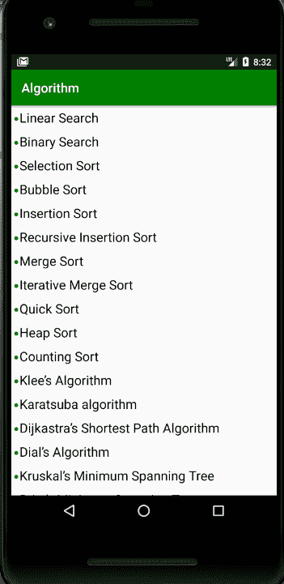
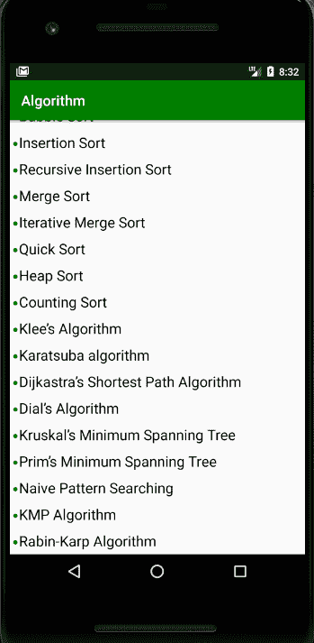

# 如何在安卓的 RecyclerView 中添加子弹列表？

> 原文:[https://www . geeksforgeeks . org/如何添加项目符号列表在安卓中循环查看/](https://www.geeksforgeeks.org/how-to-add-bullet-list-in-a-recyclerview-in-android/)

[回收器视图](https://www.geeksforgeeks.org/android-recyclerview/)允许我们显示一个项目列表，但是要将我们的列表转换成项目符号列表，我们必须做一些额外的工作。您可以按照下面给出的简单步骤来完成这项任务

1.  在依赖项部分的回收视图中，在 **[build.gradle](https://www.geeksforgeeks.org/android-build-gradle/)** 文件中添加支持库。

    ```
    <dependency>
        implementation 'androidx.recyclerview:recyclerview:1.1.0'
    </dependency>
    ```

2.  在[可绘制文件夹](https://www.geeksforgeeks.org/android-project-folder-structure/)中创建 **bullet.xml** 文件。

    ```
    <?xml version="1.0" encoding="utf-8"?>
    <shape
        xmlns:android="http://schemas.android.com/apk/res/android"
        android:shape="oval">
        <padding
            android:left="8dp"
            android:right="8dp"/>
        <size
            android:width="6dp"
            android:height="6dp"/>
        <solid
            android:color="#219806"/>
    </shape>
    ```

3.  在 **activity_main.xml** 中，添加以下代码。

    ```
    <?xml version="1.0" encoding="utf-8"?>

    <androidx.constraintlayout.widget.ConstraintLayout 
        xmlns:android="http://schemas.android.com/apk/res/android"
        xmlns:app="http://schemas.android.com/apk/res-auto"
        xmlns:tools="http://schemas.android.com/tools"
        android:layout_width="match_parent"
        android:layout_height="match_parent"
        tools:context=".MainActivity">

        <androidx.recyclerview.widget.RecyclerView
            android:layout_width="match_parent"
            android:layout_height="match_parent"
            android:id="@+id/recycler_view"
            />

    </androidx.constraintlayout.widget.ConstraintLayout>
    ```

4.  使用以下代码创建一个新的 **custom_layout.xml** 文件。

    ```
    <?xml version="1.0" encoding="utf-8"?>
    <LinearLayout
        xmlns:android="http://schemas.android.com/apk/res/android"
        android:layout_width="match_parent"
        android:id="@+id/show_name_layout"
        android:layout_height="wrap_content"
        android:orientation="horizontal"
        android:layout_margin="5dp"
        >
        <TextView
            android:drawableLeft="@drawable/bullet"
            android:layout_width="wrap_content"
            android:layout_height="wrap_content"
            />
        <TextView
            android:layout_marginStart="2dp"
            android:layout_width="match_parent"
            android:layout_height="wrap_content"
            android:id="@+id/textView"
            android:textSize="20sp"
            />
    </LinearLayout>
    ```

5.  创建一个**MyAdapter.java**类，并添加以下代码。

    ```
    public class MyAdapter
        extends RecyclerView.Adapter<MyAdapter.MyViewHolder> {

        String text[];
        Activity activity;

        public MyAdapter(Activity activity,
                         String text[])
        {
            this.activity = activity;
            this.text = text;
        }

        // This method is used to attach
        // custom layout to the recycler view
        @NonNull
        @Override
        public MyViewHolder onCreateViewHolder(
            @NonNull ViewGroup parent,
            int viewType)
        {

            View view
                = activity.getLayoutInflater()
                      .inflate(
                          R.layout.custom_layout,
                          parent, false);
            return new MyViewHolder(view);
        }

        // This method is used to set the action
        // to the widgets of our custom layout.
        @Override
        public void onBindViewHolder(
            @NonNull MyViewHolder holder,
            int position)
        {
            holder.textView.setText(text[position]);
        }

        @Override
        public int getItemCount()
        {
            return text.length;
        }

        class MyViewHolder extends RecyclerView.ViewHolder {
            TextView textView;
            public MyViewHolder(@NonNull View itemView)
            {
                super(itemView);
                textView = itemView.findViewById(R.id.textView);
            }
        }
    }
    ```

6.  最后，在**MainActivity.java**中添加以下代码。

    ```
    public class MainActivity
        extends AppCompatActivity {

        RecyclerView recyclerView;
        String text[]
            = { "Linear Search", "Binary Search", "Selection Sort",
                "Bubble Sort", "Insertion Sort",
                "Recursive Insertion Sort", "Merge Sort",
                "Iterative Merge Sort", "Quick Sort",
                "Heap Sort", "Counting Sort",
                "Klee’s Algorithm", "Karatsuba algorithm",
                "Dijkastra’s Shortest Path Algorithm",
                "Dial’s Algorithm",
                "Kruskal’s Minimum Spanning Tree",
                "Prim’s Minimum Spanning Tree",
                "Naive Pattern Searching",
                "KMP Algorithm", "Rabin-Karp Algorithm" };

        @Override
        protected void onCreate(Bundle savedInstanceState)
        {
            super.onCreate(savedInstanceState);
            setContentView(R.layout.activity_main);
            recyclerView = findViewById(R.id.recycler_view);

            MyAdapter adapter = new MyAdapter(this, text);
            recyclerView.setLayoutManager(
                new LinearLayoutManager(this));
            recyclerView.setAdapter(adapter);
        }
    }
    ```

**输出:**

[](https://media.geeksforgeeks.org/wp-content/uploads/20200407203633/Screenshot-2441.png)

[](https://media.geeksforgeeks.org/wp-content/uploads/20200407203657/Screenshot-2451.png)