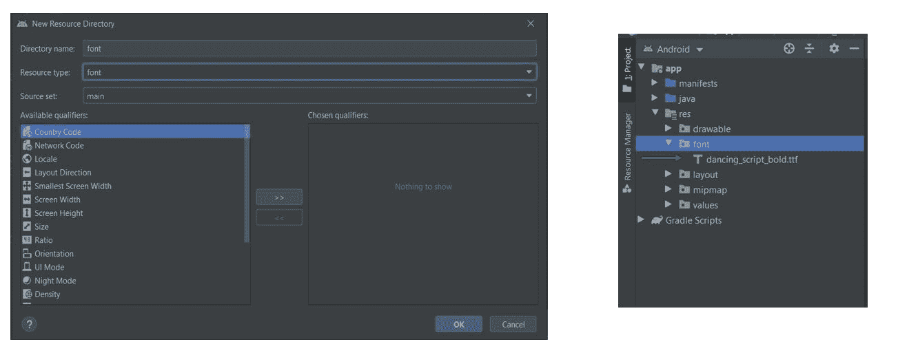
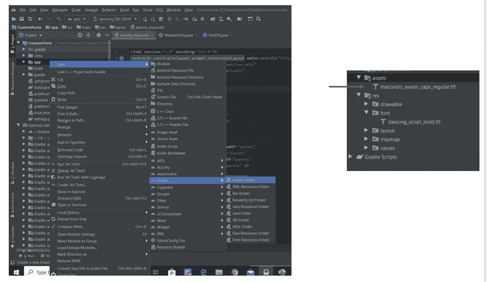
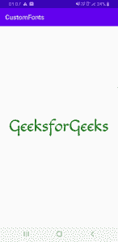
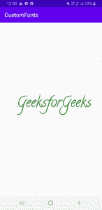
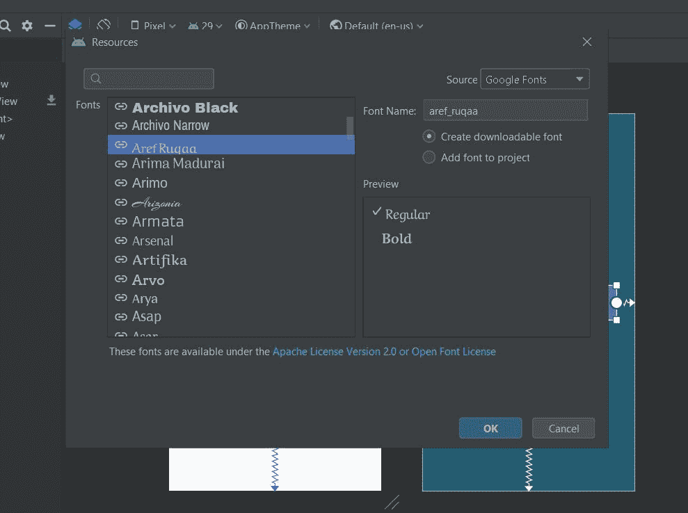
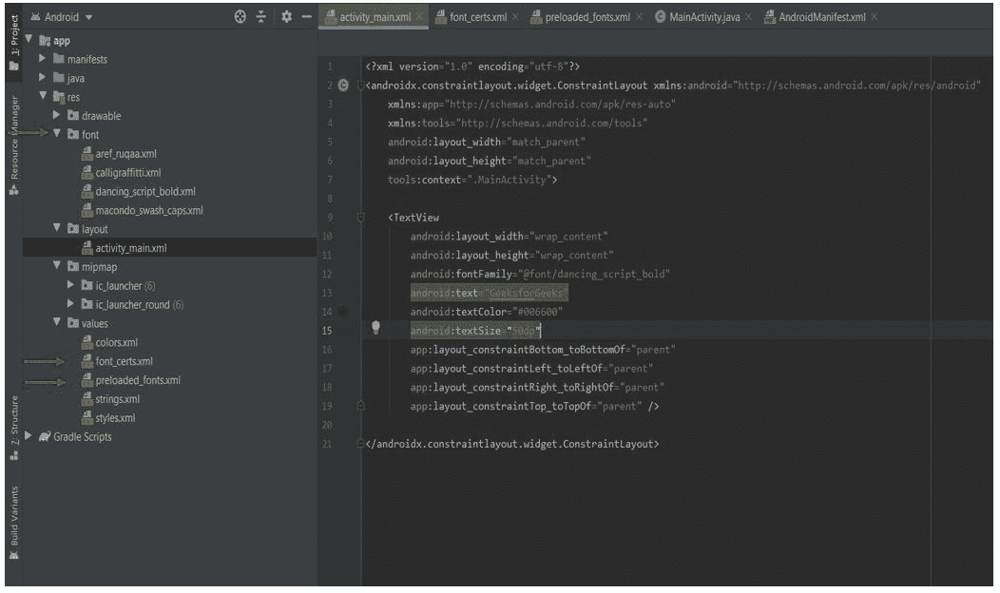

# 如何在安卓中添加自定义字体

> 原文:[https://www . geeksforgeeks . org/如何在安卓中添加自定义字体/](https://www.geeksforgeeks.org/how-to-add-custom-fonts-in-android/)

谷歌字体提供了各种各样的字体，可用于在[安卓工作室](https://www.geeksforgeeks.org/android-how-to-create-start-a-new-project-in-android-studio/?ref=rp)中设置文本样式。合适的字体不仅能增强用户界面，还能表明和强调文本的目的。在安卓工作室中，有三种方法可以给文本添加自定义字体。前两种方法涉及使用**字体**类，而最后一种方法相当直接和容易。跟随整篇文章探索所有的方法。

### 方法 1

在这种方法中，我们将首先从互联网上下载字体的 **ttf** 文件，然后将它们用作设置字体的资产或资源。你可以在这里找到可下载的字体[。](https://fonts.google.com/)此处使用**舞剧**字体。一旦你下载了你选择的字体，解压文件夹并复制字体文件。

**通过创建新的安卓资源目录:**

*   **第一步:**在项目的资源文件夹中，新建**的**安卓资源目录**资源类型:字体**将这个‘TTF’文件粘贴到这里。请注意，粘贴时，请记住资源文件的名称只能由小写字母和下划线组成，因此请相应地重构文件。
    

*   **步骤 2:** 在 XML 文件中创建布局。*   **步骤 3:** 现在在主活动中(必须是与要定制的文本视图所在的布局文件相对应的活动)，为该文本视图设置字体。

    ## activity _ main . XML

    ```java
    <?xml version="1.0" encoding="utf-8"?>
    <androidx.constraintlayout.widget.ConstraintLayout 
        xmlns:android="http://schemas.android.com/apk/res/android"
        xmlns:app="http://schemas.android.com/apk/res-auto"
        xmlns:tools="http://schemas.android.com/tools"
        android:layout_width="match_parent"
        android:layout_height="match_parent">

        <TextView
            android:id="@+id/textview"
            android:layout_width="wrap_content"
            android:layout_height="wrap_content"
            android:text="GeeksforGeeks"
            android:textColor="#006600"
            android:textSize="50dp"
            app:layout_constraintBottom_toBottomOf="parent"
            app:layout_constraintLeft_toLeftOf="parent"
            app:layout_constraintRight_toRightOf="parent"
            app:layout_constraintTop_toTopOf="parent"/>

    </androidx.constraintlayout.widget.ConstraintLayout>
    ```

    ## MainActivity.java

    ```java
    package com.example.android.customfonts;

    import androidx.appcompat.app.AppCompatActivity;
    import androidx.core.content.res.ResourcesCompat;
    import android.graphics.Typeface;
    import android.os.Bundle;
    import android.widget.TextView;

    public class MainActivity extends AppCompatActivity {

        @Override
        protected void onCreate(Bundle savedInstanceState)
        {
            super.onCreate(savedInstanceState);
            setContentView(R.layout.activity_main);

            TextView textView = findViewById(R.id.textview);

            Typeface typeface = ResourcesCompat.getFont(
                this,
                R.font.dancing_script_bold);
            textView.setTypeface(typeface);
        }
    }
    ```

    *   **Output:**
    

    **通过创建新的资产文件夹:**

    *   **第一步:**在 Android Studio 中创建新的资产文件夹**(app/New/Folder/Asset Folder)**，在此粘贴字体的‘TTF’文件。左边的图片显示了如何将 assets 文件夹添加到项目中，而右边的图片显示了添加的“ttf”文件。
        
    *   **第 2 步:**虽然我们保持了与前面相同的 XML 布局，但是 MainActivity 的 Java 代码是这样修改的。

        ## MainActivity.java

        ```java
        package com.example.android.customfonts;

        import androidx.appcompat.app.AppCompatActivity;
        import androidx.core.content.res.ResourcesCompat;
        import android.graphics.Typeface;
        import android.os.Bundle;
        import android.widget.TextView;
        import com.example.android.customfonts.R;

        public class MainActivity extends AppCompatActivity {

            @Override
            protected void onCreate(Bundle savedInstanceState)
            {
                super.onCreate(savedInstanceState);
                setContentView(R.layout.activity_main);

                TextView textView = findViewById(R.id.textview);

                Typeface typeface = Typeface.createFromAsset(
                    getAssets(),
                    "macondo_swash_caps_regular.ttf");
                textView.setTypeface(typeface);
            }
        }
        ```

    *   **输出:**
        

    ### 方法 2

    在这种方法中，我们将创建一个单独的 java 类来指定一种特定的字体，并使用这个类来代替 XML 文件中传统的 TextView 标签。

    *   **第一步:**下载自己选择的字体，使用以上两种方法中的任意一种，将其存储在项目中。我已将文件粘贴到资产文件夹中。
    *   **步骤 2:** 在包中创建新的 Java 文件。最好根据你想要实现的字体来命名。这里我们创建了一个名为**的文件。**
    *   **第三步:**在这个 Java 文件中扩展以下类:

        > androidx。app compat。小部件。app compaxtview

    *   **第 4 步:**通过添加所需的构造函数完成 Java 代码。
    *   **步骤 5:** 在类中创建一个方法，在其中设置字体的字体。
    *   **第六步:**在每个构造函数中调用这个方法。为了更好地理解，请参考下面的代码。

        ## CalligraffittiRegular.java

        ```java
        package com.example.android.customfonts;

        import android.content.Context;
        import android.graphics.Typeface;
        import android.util.AttributeSet;

        public class CalligraffittiRegular extends
                 androidx.appcompat.widget.AppCompatTextView {

            public CalligraffittiRegular(Context context)
            {
                super(context);
                initTypeface(context);
            }

            public CalligraffittiRegular(Context context,
                                         AttributeSet attrs)
            {
                super(context, attrs);
                initTypeface(context);
            }

            public CalligraffittiRegular(Context context,
                                         AttributeSet attrs,
                                         int defStyleAttr)
            {
                super(context, attrs, defStyleAttr);
                initTypeface(context);
            }

            private void initTypeface(Context context)
            {
                Typeface tf = Typeface.createFromAsset(
                    context.getAssets(),
                    "calligraffitti_regular.ttf");
                this.setTypeface(tf);
            }
        }
        ```

    *   **第 7 步:**现在在你的 XML 布局文件中，使用这个字体类代替传统的 TextView 标签。

        ## activity _ main . XML

        ```java
        <?xml version="1.0" encoding="utf-8"?>
        <androidx.constraintlayout.widget.ConstraintLayout 
            xmlns:android="http://schemas.android.com/apk/res/android"
            xmlns:app="http://schemas.android.com/apk/res-auto"
            xmlns:tools="http://schemas.android.com/tools"
            android:layout_width="match_parent"
            android:layout_height="match_parent">

            <com.example.android.customfonts.CalligraffittiRegular
                android:id="@+id/textview1"
                android:layout_width="wrap_content"
                android:layout_height="wrap_content"
                android:text="GeeksforGeeks"
                android:textColor="#006600"
                android:textSize="50dp"
                app:layout_constraintBottom_toBottomOf="parent"
                app:layout_constraintHorizontal_bias="0.616"
                app:layout_constraintLeft_toLeftOf="parent"
                app:layout_constraintRight_toRightOf="parent"
                app:layout_constraintTop_toTopOf="parent"
                app:layout_constraintVertical_bias="0.462"/>

        </androidx.constraintlayout.widget.ConstraintLayout>
        ```

    *   **输出:**
        

    ### 方法 3

    在安卓 8.0(应用编程接口级别 26)中，引入了一种更简单的方法，在安卓工作室中将字体用作资源。**文本视图类**的**安卓:字体家族**属性用于指定字体。

    *   **步骤 1:** 转到 XML 文件并转到设计视图。
    *   **第二步:**点击想要更改字体的文本视图。
    *   **第三步:**在搜索栏中，搜索 fontFamily。
        T3】
    *   **第四步:**在下拉菜单中，可以查看可用的字体。如果您想了解更多，请向下滚动并单击“**更多字体……**”。
    *   **第五步:**弹出对话框。选择自己喜欢的字体，在预览中选择自己喜欢的风格，点击**确定**。
    *   **Step 6:** This would create a downloadable font and add it automatically to your project.
        

        以下文件会自动添加到您的项目中:
        

    *   **第 7 步:**现在的 XML 文件会是这样的:

        ## activity _ main . XML

        ```java
        <?xml version="1.0" encoding="utf-8"?>
        <androidx.constraintlayout.widget.ConstraintLayout 
            xmlns:android="http://schemas.android.com/apk/res/android"
            xmlns:app="http://schemas.android.com/apk/res-auto"
            xmlns:tools="http://schemas.android.com/tools"
            android:layout_width="match_parent"
            android:layout_height="match_parent"
            tools:context=".MainActivity">

            <TextView
                android:layout_width="wrap_content"
                android:layout_height="wrap_content"
                android:fontFamily="@font/aref_ruqaa"
                android:text="GeeksforGeeks"
                android:textColor="#006600"
                android:textSize="50dp"
                app:layout_constraintBottom_toBottomOf="parent"
                app:layout_constraintLeft_toLeftOf="parent"
                app:layout_constraintRight_toRightOf="parent"
                app:layout_constraintTop_toTopOf="parent" />

        </androidx.constraintlayout.widget.ConstraintLayout>
        ```

    *   **Output:**
        

        **结论**
        虽然最后一种方法看起来简单省时，但是它将额外的文件与应用的 APK 捆绑在一起，这可能会增加其大小。虽然这也确保了字体存在，即使当应用程序离线工作。第一种方法会产生一个较小的 APK，但是如果其他已经存在的应用程序的缓存中没有存储相同的字体，用户可能需要在处理该应用程序时访问互联网。