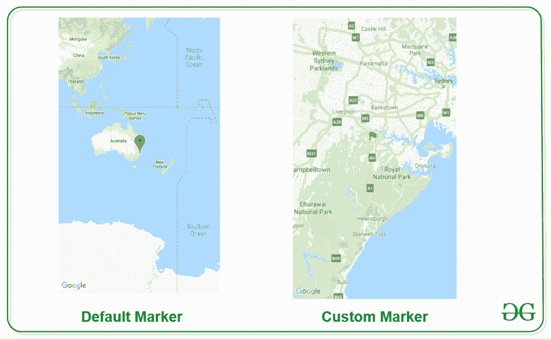
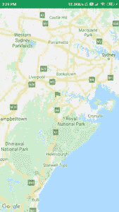

# 如何在安卓系统中给谷歌地图添加自定义标记？

> 原文:[https://www . geesforgeks . org/如何将自定义标记添加到安卓谷歌地图/](https://www.geeksforgeeks.org/how-to-add-custom-marker-to-google-maps-in-android/)

谷歌地图在许多应用程序中用于显示位置和在地图上指示特定位置。我们已经看到地图在许多应用程序中的使用，这些应用程序提供诸如 Ola、优步等服务。在这些应用程序中，您将看到**我们如何在安卓系统中向谷歌地图添加自定义标记。**

### 我们将在本文中构建什么？

我们将构建一个简单的应用程序，其中我们将显示一张地图，在这张地图上，我们将在我们的应用程序上显示一个自定义标记。下面是截图，我们将在其中看到我们将在这个项目中做什么。注意，我们将使用 **Java** 语言来实现这个项目。



### **分步实施**

**第一步:创建新项目**

要在安卓工作室创建新项目，请参考[如何在安卓工作室创建/启动新项目](https://www.geeksforgeeks.org/android-how-to-create-start-a-new-project-in-android-studio/)。注意选择 **Java** 作为编程语言。创建新项目时，确保选择**地图活动**。

**第二步:生成使用谷歌地图的应用编程接口密钥**

要为地图生成应用编程接口密钥，您可以参考[如何为在安卓系统中使用谷歌地图生成应用编程接口密钥](https://www.geeksforgeeks.org/how-to-generate-api-key-for-using-google-maps-in-android/)。在为谷歌地图生成你的应用编程接口密钥后。我们必须将这个密钥添加到我们的项目中。要在我们的应用程序中添加此密钥，请导航至**值文件夹> google_maps_api.xml** 文件，在第 23 行，您必须添加您的 api 密钥来代替 **YOUR_API_KEY** 。在添加了这个之后，我们现在可以将自定义标记添加到我们的应用程序中了。添加应用编程接口密钥后，您可以运行您的应用程序，您将看到悉尼位置上带有默认标记的默认标记。

**第三步:在谷歌地图中添加自定义标记**

要为谷歌地图添加自定义标记，请导航至**应用程序> res >可绘制>右键单击它>新建>矢量资源**并选择我们必须在您的地图上显示的图标。你可以根据我们的要求改变颜色。在创建了这个图标之后，现在我们将把这个标记添加到我们的地图中。

**步骤 4:使用 MapsActivity.java 文件**

转到**文件，参考以下代码。以下是**MapsActivity.java**文件的代码。代码中添加了注释，以更详细地理解代码。**

## **Java 语言(一种计算机语言，尤用于创建网站)**

```java
import android.content.Context;
import android.graphics.Bitmap;
import android.graphics.Canvas;
import android.graphics.drawable.Drawable;
import android.os.Bundle;

import androidx.core.content.ContextCompat;
import androidx.fragment.app.FragmentActivity;

import com.google.android.gms.maps.CameraUpdateFactory;
import com.google.android.gms.maps.GoogleMap;
import com.google.android.gms.maps.OnMapReadyCallback;
import com.google.android.gms.maps.SupportMapFragment;
import com.google.android.gms.maps.model.BitmapDescriptor;
import com.google.android.gms.maps.model.BitmapDescriptorFactory;
import com.google.android.gms.maps.model.LatLng;
import com.google.android.gms.maps.model.MarkerOptions;

public class MapsActivity extends FragmentActivity implements OnMapReadyCallback {

    private GoogleMap mMap;

    @Override
    protected void onCreate(Bundle savedInstanceState) {
        super.onCreate(savedInstanceState);
        setContentView(R.layout.activity_maps);
        // Obtain the SupportMapFragment and get notified
        // when the map is ready to be used.
        SupportMapFragment mapFragment = (SupportMapFragment) getSupportFragmentManager().findFragmentById(R.id.map);
        mapFragment.getMapAsync(this);
    }

    /**
     * Manipulates the map once available.
     * This callback is triggered when the map is ready to be used.
     * This is where we can add markers or lines, add listeners or move the camera. In this case,
     * we just add a marker near Sydney, Australia.
     * If Google Play services is not installed on the device, the user will be prompted to install
     * it inside the SupportMapFragment. This method will only be triggered once the user has
     * installed Google Play services and returned to the app.
     */
    @Override
    public void onMapReady(GoogleMap googleMap) {
        mMap = googleMap;

        // Add a marker in Sydney and move the camera
        LatLng sydney = new LatLng(-34, 151);
        mMap.addMarker(new MarkerOptions().position(sydney).title("Marker in Sydney")
                // below line is use to add custom marker on our map.
                .icon(BitmapFromVector(getApplicationContext(), R.drawable.ic_flag)));
        mMap.moveCamera(CameraUpdateFactory.newLatLng(sydney));
    }

    private BitmapDescriptor BitmapFromVector(Context context, int vectorResId) {
        // below line is use to generate a drawable. 
        Drawable vectorDrawable = ContextCompat.getDrawable(context, vectorResId);

        // below line is use to set bounds to our vector drawable. 
        vectorDrawable.setBounds(0, 0, vectorDrawable.getIntrinsicWidth(), vectorDrawable.getIntrinsicHeight());

        // below line is use to create a bitmap for our
        // drawable which we have added.
        Bitmap bitmap = Bitmap.createBitmap(vectorDrawable.getIntrinsicWidth(), vectorDrawable.getIntrinsicHeight(), Bitmap.Config.ARGB_8888);

        // below line is use to add bitmap in our canvas. 
        Canvas canvas = new Canvas(bitmap);

        // below line is use to draw our 
        // vector drawable in canvas. 
        vectorDrawable.draw(canvas);

        // after generating our bitmap we are returning our bitmap. 
        return BitmapDescriptorFactory.fromBitmap(bitmap);
    }
}
```

**现在运行您的应用程序，并查看应用程序的输出。**

### ****输出:****

> ****注意:**在谷歌开发者控制台([https://console.developers.google.com](https://console.developers.google.com))中，确保启用了“**谷歌地图安卓 API v2** ”。并确保您的应用编程接口密钥存在。**

****