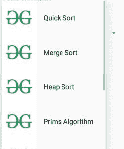

# 如何在安卓中添加自定义 Spinner？

> 原文:[https://www . geesforgeks . org/如何在安卓中添加自定义微调器/](https://www.geeksforgeeks.org/how-to-add-custom-spinner-in-android/)

[**微调器**](https://www.geeksforgeeks.org/spinner-in-android-using-java-with-example/)**是一个小部件，用于从项目列表中选择一个项目。当用户点击微调器时，用户可以看到一个下拉菜单。在本文中，我们将学习如何在应用程序中添加**自定义微调器**。如果您想详细了解 spinner，请点击此[链接](https://developer.android.com/guide/topics/ui/controls/spinner)。**

****

****进场:****

1.  **创建一个新文件 **algorithm_spinner.xml** 并添加以下代码。微调器中的每个项目都将有这样的布局，一个**图像视图**和一个**文本视图**。

    ## 算法 _spinner.xml** 

```java
<?xml version="1.0" encoding="utf-8"?>
<RelativeLayout
    xmlns:android="http://schemas.android.com/apk/res/android"
    android:layout_width="match_parent"
    android:layout_height="match_parent">

    <ImageView
        android:id="@+id/image_view"
        android:layout_width="100dp"
        android:layout_height="100dp"
        android:src="@drawable/gfg" />

    <TextView
        android:id="@+id/text_view"
        android:layout_width="wrap_content"
        android:layout_height="wrap_content"
        android:layout_alignBottom="@+id/image_view"
        android:layout_alignParentTop="true"
        android:layout_margin="20dp"
        android:layout_toEndOf="@+id/image_view"
        android:gravity="center"
        android:text="Quick Sort"
        android:textColor="@android:color/black"
        android:textSize="20sp" />

</RelativeLayout>
```