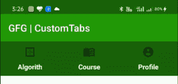

# 如何在安卓中添加自定义标签？

> 原文:[https://www . geeksforgeeks . org/如何添加-定制-安卓标签/](https://www.geeksforgeeks.org/how-to-add-customize-tabs-in-android/)

本文在安卓中增加了**自定义标签**。 [**制表布局**](https://www.geeksforgeeks.org/how-to-implement-a-tablayout-in-android-using-viewpager-and-fragments/) 提供水平布局来显示选项卡。TabLayouts 也可以用 viewPager 添加，这里勾选，但是不能自定义。每当用户点击标签时，它将导致一个片段到另一个片段的事务。可以创建自定义选项卡来完成同样的任务。图标，动画，文本等根据我们的需要可以添加标签。下图显示了自定义选项卡的示例:



**进场:**

**步骤 1:** 通过右键单击 java 包创建一个**算法片段**，选择新建？**片段(空白)**。

**第二步:**按照上述步骤进行**课程片段**和**逻辑片段**。

**第三步**:现在在 **fragment_algorithm.xml** 文件中添加以下代码。这里，布局中添加了一个文本视图。

## 片段 _ 算法. xml

```java
<?xml version="1.0" encoding="utf-8"?>
<androidx.constraintlayout.widget.ConstraintLayout
    xmlns:android="http://schemas.android.com/apk/res/android"
    xmlns:app="http://schemas.android.com/apk/res-auto"
    xmlns:tools="http://schemas.android.com/tools"
    android:layout_width="match_parent"
    android:layout_height="match_parent"
    tools:context=".Fragments.AlgorithmFragment"
    android:orientation="vertical">

    <TextView
        android:layout_width="wrap_content"
        android:layout_height="wrap_content"
        android:text="Algorithm"
        android:textSize="30sp"
        android:textStyle="bold"
        app:layout_constraintBottom_toBottomOf="parent"
        app:layout_constraintEnd_toEndOf="parent"
        app:layout_constraintStart_toStartOf="parent"
        app:layout_constraintTop_toTopOf="parent" />
</androidx.constraintlayout.widget.ConstraintLayout>
```

**第 4 步:**现在在 **fragment_course.xml** 文件中添加以下代码。这里，布局中添加了一个文本视图。

## fragment_course.xml

```java
<?xml version="1.0" encoding="utf-8"?>
<androidx.constraintlayout.widget.ConstraintLayout
    xmlns:android="http://schemas.android.com/apk/res/android"
    xmlns:app="http://schemas.android.com/apk/res-auto"
    xmlns:tools="http://schemas.android.com/tools"
    android:layout_width="match_parent"
    android:layout_height="match_parent"
    tools:context=".Fragments.AlgorithmFragment"
    android:orientation="vertical">

    <TextView
        android:layout_width="wrap_content"
        android:layout_height="wrap_content"
        android:text="Course"
        android:textSize="30sp"
        android:textStyle="bold"
        app:layout_constraintBottom_toBottomOf="parent"
        app:layout_constraintEnd_toEndOf="parent"
        app:layout_constraintStart_toStartOf="parent"
        app:layout_constraintTop_toTopOf="parent" />
</androidx.constraintlayout.widget.ConstraintLayout>
```

**步骤 5:** 现在在 **fragment_profile.xml** 文件中添加以下代码。这里，布局中添加了一个文本视图。

## fragment_profile.xml

```java

<?xml version="1.0" encoding="utf-8"?>
<androidx.constraintlayout.widget.ConstraintLayout
    xmlns:android="http://schemas.android.com/apk/res/android"
    xmlns:app="http://schemas.android.com/apk/res-auto"
    xmlns:tools="http://schemas.android.com/tools"
    android:layout_width="match_parent"
    android:layout_height="match_parent"
    tools:context=".Fragments.AlgorithmFragment"
    android:orientation="vertical">

    <TextView
        android:layout_width="wrap_content"
        android:layout_height="wrap_content"
        android:text="Algorithm"
        android:textSize="30sp"
        android:textStyle="bold"
        app:layout_constraintBottom_toBottomOf="parent"
        app:layout_constraintEnd_toEndOf="parent"
        app:layout_constraintStart_toStartOf="parent"
        app:layout_constraintTop_toTopOf="parent" />
</androidx.constraintlayout.widget.ConstraintLayout>
```

**步骤 6:** 现在在 **tab_bar.xml** 文件中添加以下代码。在此文件中，设计自定义选项卡的布局。这里为每个片段添加了一个文本视图和一个图标(图像视图)。

## tab_bar.xml

```java
<?xml version="1.0" encoding="utf-8"?>
<LinearLayout
    android:background="@color/colorPrimaryDark"
    xmlns:android="http://schemas.android.com/apk/res/android"
    android:layout_width="match_parent"
    android:layout_height="70dp"
    android:orientation="horizontal">

    <LinearLayout
        android:onClick="onClick"
        android:id="@+id/algo_lay"
        android:layout_marginTop="4dp"
        android:layout_weight="1"
        android:layout_width="match_parent"
        android:layout_height="70dp"
        android:orientation="vertical">

        <ImageView
            android:layout_gravity="center"
            android:src="@drawable/ic_algorithm"
            android:layout_width="wrap_content"
            android:layout_height="35dp"
            android:id="@+id/first_icon"/>

        <TextView
            android:id="@+id/commerce_first_text"
            android:textColor="#FFFF"
            android:layout_marginTop="3dp"
            android:textStyle="bold"
            android:layout_width="match_parent"
            android:layout_height="wrap_content"
            android:textAlignment="center"
            android:text="Algorith"
            />
    </LinearLayout>

    <LinearLayout
        android:onClick="onClick"
        android:id="@+id/course_lay"
        android:layout_marginTop="4dp"
        android:layout_weight="1"
        android:layout_width="match_parent"
        android:layout_height="70dp"
        android:orientation="vertical">

        <ImageView
            android:layout_gravity="center"
            android:src="@drawable/ic_course"
            android:layout_width="wrap_content"
            android:layout_height="35dp"
            android:id="@+id/sec_icon"/>

        <TextView
            android:id="@+id/commerce_sec_text"
            android:textColor="#FFFF"
            android:layout_marginTop="3dp"
            android:textStyle="bold"
            android:layout_width="match_parent"
            android:layout_height="wrap_content"
            android:textAlignment="center"
            android:text="Course"
            />
    </LinearLayout>

    <LinearLayout
        android:onClick="onClick"
        android:id="@+id/profile_lay"
        android:layout_marginTop="4dp"
        android:layout_weight="1"
        android:layout_width="match_parent"
        android:layout_height="70dp"
        android:orientation="vertical">

        <ImageView
            android:layout_gravity="center"
            android:src="@drawable/ic_account"
            android:layout_width="wrap_content"
            android:layout_height="35dp"
            android:id="@+id/third_icon"/>

        <TextView
            android:id="@+id/commerce_third_text"
            android:textColor="#FFFF"
            android:layout_marginTop="3dp"
            android:textStyle="bold"
            android:layout_width="match_parent"
            android:layout_height="wrap_content"
            android:textAlignment="center"
            android:text="Profile"
            />
    </LinearLayout>

</LinearLayout>
```

**步骤 7:** 现在在 **activity_main.xml** 文件中添加以下代码。在这个文件中，添加自定义选项卡的布局和片段的容器。

## activity_main.xml

```java
<?xml version="1.0" encoding="utf-8"?>
<LinearLayout
    xmlns:android="http://schemas.android.com/apk/res/android"
    xmlns:app="http://schemas.android.com/apk/res-auto"
    xmlns:tools="http://schemas.android.com/tools"
    android:layout_width="match_parent"
    android:layout_height="match_parent"
    tools:context=".MainActivity"
    android:orientation="vertical">

    <include
        layout="@layout/tab_bar"/>

    <FrameLayout
        android:id="@+id/layout"
        android:layout_width="match_parent"
        android:layout_height="match_parent"
        />
</LinearLayout>
```

**第 8 步:**现在在**MainActivity.java**文件中添加以下代码。在这个文件中，在导航中添加**帮助在片段之间导航。当用户点击图标时，它将切换片段。** 

## MainActivity.java

```java
package org.geeksforgeeks.customtabs;

import androidx.appcompat.app.AppCompatActivity;
import android.os.Bundle;
import android.view.View;
import android.widget.FrameLayout;

public class MainActivity extends AppCompatActivity {

    @Override
    protected void onCreate(Bundle savedInstanceState) {
        super.onCreate(savedInstanceState);
        setContentView(R.layout.activity_main);

        getSupportFragmentManager().beginTransaction()
                .add(R.id.layout,new AlgorithmFragment()).commit();
    }

    public void onClick(View v){
        switch (v.getId()){
            case R.id.algo_lay:
                getSupportFragmentManager().beginTransaction()
                        .replace(R.id.layout,
                         new AlgorithmFragment()).commit();
                break;
            case R.id.course_lay:
                getSupportFragmentManager().beginTransaction()
                        .replace(R.id.layout,
                         new CourseFragment()).commit();
                break;
            case R.id.profile_lay:
                getSupportFragmentManager().beginTransaction()
                        .replace(R.id.layout,
                         new ProfileFragment()).commit();
                break;
        }
    }
}
```

**输出:**

<video class="wp-video-shortcode" id="video-454479-1" width="640" height="360" preload="metadata" controls=""><source type="video/mp4" src="https://media.geeksforgeeks.org/wp-content/uploads/20200715032738/Record_2020-07-15-03-26-38_e9921eb31ec9d8884b04449491df7a961.mp4?_=1">[https://media.geeksforgeeks.org/wp-content/uploads/20200715032738/Record_2020-07-15-03-26-38_e9921eb31ec9d8884b04449491df7a961.mp4](https://media.geeksforgeeks.org/wp-content/uploads/20200715032738/Record_2020-07-15-03-26-38_e9921eb31ec9d8884b04449491df7a961.mp4)</video>