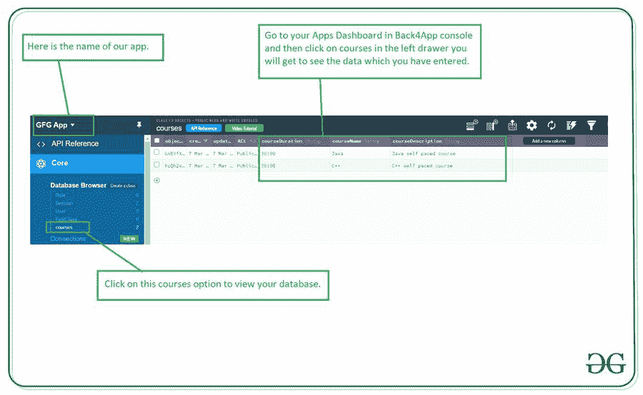
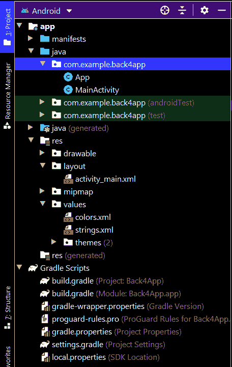

# 如何在安卓中向 Back4App 数据库添加数据？

> 原文:[https://www . geesforgeks . org/如何将数据添加到 back 4 app-数据库 in Android/](https://www.geeksforgeeks.org/how-to-add-data-to-back4app-database-in-android/)

**先决条件:** [如何连接安卓 App 和 Back4App？](https://www.geeksforgeeks.org/how-to-connect-android-app-with-back4app/)

Back4App 是一个在线数据库提供平台，为我们提供服务，让我们可以管理数据库中的应用数据。这是 **4 篇文章**的系列文章，我们将在安卓中用 Back4App 执行基本的 **CRUD(创建、读取、更新和删除)**操作。我们将在本系列中介绍以下 4 篇文章:

1.  **如何在安卓中向 Back4App 数据库添加数据？**
2.  [如何在安卓系统中从 Back4App 数据库读取数据？](https://www.geeksforgeeks.org/how-to-read-data-from-back4app-database-in-android/)
3.  [安卓如何更新 Back4App 数据库中的数据？](https://www.geeksforgeeks.org/how-to-update-data-in-back4app-database-in-android/)
4.  [安卓如何删除 Back4App 数据库中的数据？](https://www.geeksforgeeks.org/how-to-delete-data-in-back4app-database-in-android/)

### 我们将在本文中构建什么？

我们将构建一个简单的应用程序，其中我们将从我们的安卓应用程序向 Back4App 数据库添加数据。

### **分步实施**

**第一步:创建新项目**

要在安卓工作室创建新项目，请参考[如何在安卓工作室创建/启动新项目](https://www.geeksforgeeks.org/android-how-to-create-start-a-new-project-in-android-studio/)。注意选择 **Java** 作为编程语言。

**第二步:将你的应用连接到 Back4App**

我们已经在先决条件文章中看到将我们的安卓应用程序连接到 Back4App。所以你可以看看那篇文章。

**第三步:在 AndroidManifest.xml 文件**中添加互联网权限

导航到**应用程序> AndroidManifest.xml** ，并添加以下代码。

## 可扩展标记语言

```
<uses-permission android:name="android.permission.INTERNET" />
```

**第 4 步:使用 activity_main.xml 文件**

导航到**应用程序> res >布局> activity_main.xml** 并将下面的代码添加到该文件中。下面是 **activity_main.xml** 文件的代码。

## 可扩展标记语言

```
<?xml version="1.0" encoding="utf-8"?>
<LinearLayout
    xmlns:android="http://schemas.android.com/apk/res/android"
    xmlns:tools="http://schemas.android.com/tools"
    android:layout_width="match_parent"
    android:layout_height="match_parent"
    android:orientation="vertical"
    tools:context=".MainActivity">

    <!--Edit text for getting course Name-->
    <EditText
        android:id="@+id/idEdtCourseName"
        android:layout_width="match_parent"
        android:layout_height="wrap_content"
        android:layout_marginStart="10dp"
        android:layout_marginTop="20dp"
        android:layout_marginEnd="10dp"
        android:hint="Course Name"
        android:importantForAutofill="no"
        android:inputType="text" />

    <!--Edittext for getting course Duration-->
    <EditText
        android:id="@+id/idEdtCourseDuration"
        android:layout_width="match_parent"
        android:layout_height="wrap_content"
        android:layout_marginStart="10dp"
        android:layout_marginTop="20dp"
        android:layout_marginEnd="10dp"
        android:hint="Course Duration in min"
        android:importantForAutofill="no"
        android:inputType="time" />

    <!--Edittext for getting course Description-->
    <EditText
        android:id="@+id/idEdtCourseDescription"
        android:layout_width="match_parent"
        android:layout_height="wrap_content"
        android:layout_marginStart="10dp"
        android:layout_marginTop="20dp"
        android:layout_marginEnd="10dp"
        android:hint="Course Description"
        android:importantForAutofill="no"
        android:inputType="text" />

    <!--Button for adding your course to Firebase-->
    <Button
        android:id="@+id/idBtnSubmitCourse"
        android:layout_width="match_parent"
        android:layout_height="wrap_content"
        android:layout_margin="10dp"
        android:text="Submit Course Details"
        android:textAllCaps="false" />

</LinearLayout>
```

**第五步:使用****MainActivity.java 文件**

转到**MainActivity.java**文件，参考以下代码。以下是**MainActivity.java**文件的代码。代码中添加了注释，以更详细地理解代码。

## Java 语言(一种计算机语言，尤用于创建网站)

```
import android.os.Bundle;
import android.text.TextUtils;
import android.view.View;
import android.widget.Button;
import android.widget.EditText;
import android.widget.Toast;

import androidx.appcompat.app.AppCompatActivity;

import com.parse.ParseException;
import com.parse.ParseObject;
import com.parse.SaveCallback;

public class MainActivity extends AppCompatActivity {

    // creating variables for our edit text
    private EditText courseNameEdt, courseDurationEdt, courseDescriptionEdt;

    // creating variable for button
    private Button submitCourseBtn;

    // creating a strings for storing our values from edittext fields.
    private String courseName, courseDuration, courseDescription;

    @Override
    protected void onCreate(Bundle savedInstanceState) {
        super.onCreate(savedInstanceState);
        setContentView(R.layout.activity_main);

        // initializing our edittext and buttons
        courseNameEdt = findViewById(R.id.idEdtCourseName);
        courseDescriptionEdt = findViewById(R.id.idEdtCourseDescription);
        courseDurationEdt = findViewById(R.id.idEdtCourseDuration);
        submitCourseBtn = findViewById(R.id.idBtnSubmitCourse);
        submitCourseBtn.setOnClickListener(new View.OnClickListener() {
            @Override
            public void onClick(View v) {

                // getting data from edittext fields.
                courseName = courseNameEdt.getText().toString();
                courseDescription = courseDescriptionEdt.getText().toString();
                courseDuration = courseDurationEdt.getText().toString();

                // validating the text fields if empty or not.
                if (TextUtils.isEmpty(courseName)) {
                    courseNameEdt.setError("Please enter Course Name");
                } else if (TextUtils.isEmpty(courseDescription)) {
                    courseDescriptionEdt.setError("Please enter Course Description");
                } else if (TextUtils.isEmpty(courseDuration)) {
                    courseDurationEdt.setError("Please enter Course Duration");
                } else {
                    // calling method to add data to Firebase Firestore.
                    addDataToDatabase(courseName, courseDescription, courseDuration);
                }
            }
        });
    }

    private void addDataToDatabase(String courseName, String courseDescription, String courseDuration) {

        // Configure Query
        ParseObject courseList = new ParseObject("courses");

        // on below line we are adding our data with their key value in our object.
        courseList.put("courseName", courseName);
        courseList.put("courseDescription", courseDescription);
        courseList.put("courseDuration", courseDuration);

        // after adding all data we are calling a
        // method to save our data in background.
        courseList.saveInBackground(new SaveCallback() {
            @Override
            public void done(ParseException e) {
                // inside on done method we are checking
                // if the error is null or not.
                if (e == null) {

                    // if the error is null we are displaying a simple toast message.
                    Toast.makeText(MainActivity.this, "Data has been successfully added to Database", Toast.LENGTH_SHORT).show();

                    // on below line we are setting our edit text fields to empty value.
                    courseNameEdt.setText("");
                    courseDescriptionEdt.setText("");
                    courseDurationEdt.setText("");
                } else {
                    // if the error is not null we will be
                    // displaying an error message to our user.
                    Toast.makeText(getApplicationContext(), e.getMessage().toString(), Toast.LENGTH_LONG).show();
                }
            }
        });
    }
}
```

现在运行您的应用程序，并查看应用程序的输出。您可以在 Back4App 控制台中看到您添加的数据。导航到 Back4App 控制台，然后在左侧导航栏中。你会看到一个课程选项，点击那个选项你会看到你添加的数据。



### **输出:**

<video class="wp-video-shortcode" id="video-571921-1" width="640" height="360" preload="metadata" controls=""><source type="video/mp4" src="https://media.geeksforgeeks.org/wp-content/uploads/20210307191002/Screenrecorder-2021-03-07-19-08-51-682.mp4?_=1">[https://media.geeksforgeeks.org/wp-content/uploads/20210307191002/Screenrecorder-2021-03-07-19-08-51-682.mp4](https://media.geeksforgeeks.org/wp-content/uploads/20210307191002/Screenrecorder-2021-03-07-19-08-51-682.mp4)</video>

**下面是执行添加操作后 Android Studio 中的文件结构:**

