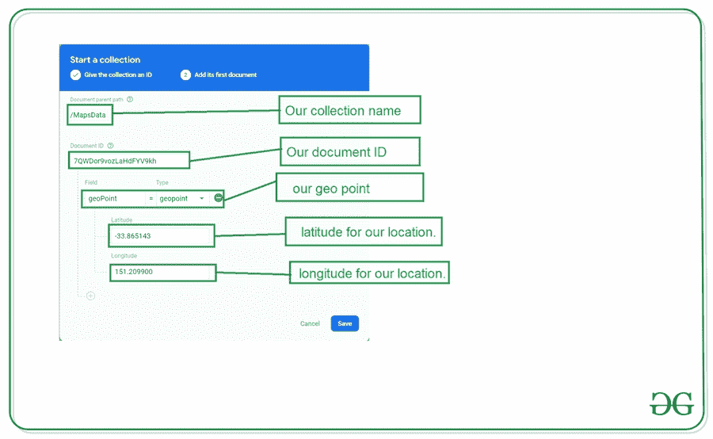

# 如何用 Firebase Firstore 在谷歌地图中添加动态标记？

> 原文:[https://www . geeksforgeeks . org/如何添加动态标记-谷歌地图-带 firebase-firstore/](https://www.geeksforgeeks.org/how-to-add-dynamic-markers-in-google-maps-with-firebase-firstore/)

我们已经看到[在安卓](https://www.geeksforgeeks.org/how-to-add-custom-marker-to-google-maps-in-android/)中给谷歌地图添加了标记。除此之外，我们还在安卓系统的谷歌地图上添加了[多个标记。许多应用程序使用动态功能在谷歌地图上添加标记，并根据要求更新它们。在本文中，我们将从安卓系统中的](https://www.geeksforgeeks.org/how-to-add-multiple-markers-on-google-maps-in-android/) [<u>【火基地】</u>](https://www.geeksforgeeks.org/firebase-introduction/) 看一下给谷歌地图添加标记。

### 我们将在本文中构建什么？

我们将构建一个简单的应用程序，其中我们将显示一个带有简单标记的地图，我们将从 Firebase 向其中添加一个标记。我们必须在地图上添加 Firebase Firestore 的标记。下面给出了一个示例视频，让我们了解一下在本文中要做什么。请注意，我们将使用 **Java** 语言来实现这个项目。

<video class="wp-video-shortcode" id="video-550661-1" width="640" height="360" preload="metadata" controls=""><source type="video/mp4" src="https://media.geeksforgeeks.org/wp-content/uploads/20210125125635/1611559183062.mp4?_=1">[https://media.geeksforgeeks.org/wp-content/uploads/20210125125635/1611559183062.mp4](https://media.geeksforgeeks.org/wp-content/uploads/20210125125635/1611559183062.mp4)</video>

### **分步实施**

**第一步:创建新项目**

在安卓工作室创建新项目请参考 [<u>【如何在安卓工作室创建/启动新项目】</u>](https://www.geeksforgeeks.org/android-how-to-create-start-a-new-project-in-android-studio/) 。注意选择 **Java** 作为编程语言。创建新项目时，确保选择**映射活动**。

**第二步:生成使用谷歌地图的应用编程接口密钥**

要为地图生成应用编程接口密钥，您可以参考[<u>如何为在安卓系统中使用谷歌地图生成应用编程接口密钥</u>](https://www.geeksforgeeks.org/how-to-generate-api-key-for-using-google-maps-in-android/) 。在为谷歌地图生成你的应用编程接口密钥后。我们必须将这个密钥添加到我们的项目中。要在我们的应用程序中添加此密钥，请导航至**值文件夹> google_maps_api.xml** 文件，在第 23 行，您必须添加您的 api 密钥来代替 **YOUR_API_KEY** 。

**第三步:连接你的应用和 Firebase**

创建新项目并为谷歌地图添加密钥后。导航到顶部栏上的工具选项。点击火焰基地。点击 Firebase 后，你可以看到截图中下面提到的右栏。


在那一栏中，导航到火基云火石。点击那个选项，你会看到两个选项:连接应用到 Firebase 和添加云 Firestore 到你的应用。单击立即连接选项，您的应用程序将连接到 Firebase。之后点击第二个选项，现在你的应用程序连接到 Firebase。将您的应用程序连接到 Firebase 后，您将看到下面的屏幕。


之后，验证 Firebase Firestore 数据库的依赖项是否已经添加到我们的 Gradle 文件中。导航到该文件中的应用程序>梯度脚本。检查是否添加了以下依赖项。如果下面的依赖项不在你的 [build.gradle](https://www.geeksforgeeks.org/android-build-gradle/) 文件中。在依赖项部分添加以下依赖项。

> 实现' com . Google . firebase:firebase-firestore:22 . 0 . 1 '

添加此依赖项后，同步您的项目，现在我们可以创建我们的应用程序了。如果你想了解更多关于连接你的应用到 Firebase。参考本文详细了解[如何给安卓 App](https://www.geeksforgeeks.org/adding-firebase-to-android-app/) 添加 Firebase。

**第 4 步:使用 AndroidManifest.xml 文件**

为了向 Firebase 添加数据，我们应该授予访问互联网的权限。要添加这些权限，请导航至**应用程序>和**。在该文件中添加以下权限。

## 可扩展标记语言

```java
<!--Permissions for internet-->
<uses-permission android:name="android.permission.INTERNET" /> 
<uses-permission android:name="android.permission.ACCESS_NETWORK_STATE" />
```

**步骤 5:使用 MapsActivity.java 文件**

转到**文件，参考以下代码。以下是**MapsActivity.java**文件的代码。代码中添加了注释，以更详细地理解代码。**

## **Java 语言(一种计算机语言，尤用于创建网站)**

```java
import android.os.Bundle;
import android.widget.Toast;

import androidx.annotation.Nullable;
import androidx.fragment.app.FragmentActivity;

import com.google.android.gms.maps.CameraUpdateFactory;
import com.google.android.gms.maps.GoogleMap;
import com.google.android.gms.maps.OnMapReadyCallback;
import com.google.android.gms.maps.SupportMapFragment;
import com.google.android.gms.maps.model.LatLng;
import com.google.android.gms.maps.model.MarkerOptions;
import com.google.firebase.firestore.DocumentReference;
import com.google.firebase.firestore.DocumentSnapshot;
import com.google.firebase.firestore.EventListener;
import com.google.firebase.firestore.FirebaseFirestore;
import com.google.firebase.firestore.FirebaseFirestoreException;
import com.google.firebase.firestore.GeoPoint;

public class MapsActivity extends FragmentActivity implements OnMapReadyCallback {

    private GoogleMap mMap;
    FirebaseFirestore db;

    @Override
    protected void onCreate(Bundle savedInstanceState) {
        super.onCreate(savedInstanceState);
        setContentView(R.layout.activity_maps);

        // initializing our firebase firestore.
        db = FirebaseFirestore.getInstance();

        // Obtain the SupportMapFragment and get 
        // notified when the map is ready to be used.
        SupportMapFragment mapFragment = (SupportMapFragment) getSupportFragmentManager().findFragmentById(R.id.map);
        mapFragment.getMapAsync(this);
    }

    @Override
    public void onMapReady(GoogleMap googleMap) {
        mMap = googleMap;

        // creating a variable for document reference.
        DocumentReference documentReference = db.collection("MapsData").document("7QWDor9vozLaHdFYV9kh");

        // calling document reference class with on snap shot listener.
        documentReference.addSnapshotListener(new EventListener<DocumentSnapshot>() {
            @Override
            public void onEvent(@Nullable DocumentSnapshot value, @Nullable FirebaseFirestoreException error) {
                if (value != null && value.exists()) {
                    // below line is to create a geo point and we are getting
                    // geo point from firebase and setting to it.
                    GeoPoint geoPoint = value.getGeoPoint("geoPoint");

                    // getting latitude and longitude from geo point 
                    // and setting it to our location.
                    LatLng location = new LatLng(geoPoint.getLatitude(), geoPoint.getLongitude());

                    // adding marker to each location on google maps
                    mMap.addMarker(new MarkerOptions().position(location).title("Marker"));

                    // below line is use to move camera.
                    mMap.moveCamera(CameraUpdateFactory.newLatLng(location));
                } else {
                    Toast.makeText(MapsActivity.this, "Error found is " + error, Toast.LENGTH_SHORT).show();
                }
            }
        });
    }
}
```

****第六步:在安卓**中向 Firebase Firestore 添加数据**

**转到浏览器，在浏览器中打开 Firebase。打开 Firebase 后，您将看到下面的页面，在此页面上单击右上角的转到控制台选项。**

****

**点击此屏幕后，您将看到下面的屏幕，其中包含您选择项目的所有项目。**

****

**在该屏幕中，单击左侧窗口中的 n Firebase Firestore 数据库。**

****

**点击创建数据库选项后，您将看到下面的屏幕。**

****

**在此屏幕中，我们必须选择“在测试模式下启动”选项。我们使用测试模式，因为我们没有在我们的应用程序中设置身份验证。所以我们在测试模式下选择开始。选择测试模式后，点击下一步选项，您将看到下面的屏幕。**

****

**在这个屏幕中，我们只需要点击启用按钮来启用我们的 Firebase Firestore 数据库。完成这个过程后，我们只需要运行我们的应用程序，在我们的应用程序中添加数据，然后点击提交按钮。要添加数据，只需点击开始收集按钮，并提供收集标识为**地图数据**。然后提供文件编号为 **7QWDor9vozLaHdFYV9kh** 并在字段内记下**地理点**，选择类型为**地理点**，输入所需位置的**纬度**和**经度**。最后点击保存按钮。**

****

**将数据添加到 Firebase 后。现在运行您的应用程序，并查看应用程序的输出。您可以使用您的纬度和经度字段更改**地理点**中的值，并且您可以通过添加的标记查看地图上的实时更新。**

### ****输出:****

**<video class="wp-video-shortcode" id="video-550661-2" width="640" height="360" preload="metadata" controls=""><source type="video/mp4" src="https://media.geeksforgeeks.org/wp-content/uploads/20210125125635/1611559183062.mp4?_=2">[https://media.geeksforgeeks.org/wp-content/uploads/20210125125635/1611559183062.mp4](https://media.geeksforgeeks.org/wp-content/uploads/20210125125635/1611559183062.mp4)</video>**