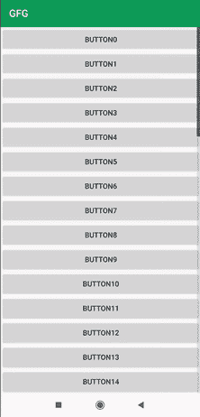

# 如何使用回收-快速-滚动在回收视图中添加快速滚动条？

> 原文:[https://www . geeksforgeeks . org/如何快速添加-scroller-in-recycle view-use-recycle-fast-scroll/](https://www.geeksforgeeks.org/how-to-add-fast-scroller-in-recyclerview-using-recycle-fast-scroll/)

在本文中，我们将使用循环快速滚动库来实现快速滚动。对于该项目，在 RecycleView 中，我们只是实现了一个按钮，按钮的总数将由我们在 MainActivity 中设置。按钮的名称将是按钮的位置。下面给出了一个 GIF 示例，来了解一下我们将在本文中做什么。注意，我们将使用 **Java** 语言来实现这个项目。



### **分步实施**

**第一步:创建新项目**

要在安卓工作室创建新项目，请参考[如何在安卓工作室创建/启动新项目](https://www.geeksforgeeks.org/android-how-to-create-start-a-new-project-in-android-studio/)。注意选择 **Java** 作为编程语言。

**第二步:将此添加到 build.gradle:(app)文件**

```java
implementation 'androidx.recyclerview:recyclerview:1.1.0'
implementation 'com.github.plusCubed:recycler-fast-scroll:0.3.2'
implementation 'com.google.android.material:material:1.0.0'
```

将它添加到 build.gradle:(项目)文件中

```java
allprojects {
    repositories {
        google()
        jcenter()
        maven { url 'https://jitpack.io' }
    }
}
```

**步骤 3:使用 items.xml 文件**

转到 **app > res >布局>新建>布局资源文件**并将文件命名为**项**。转到 **item.xml** 文件并参考以下代码。下面是 **item.xml** 文件的代码。

## 可扩展标记语言

```java
<?xml version="1.0" encoding="utf-8"?>
<LinearLayout
    xmlns:android="http://schemas.android.com/apk/res/android"
    android:layout_width="match_parent"
    android:layout_height="wrap_content"
    android:orientation="vertical">

    <Button
        android:id="@+id/itemclick"
        android:layout_width="match_parent"
        android:layout_height="wrap_content"
        android:text="Click Here" />

</LinearLayout>
```

**步骤 4:** **处理 RecyclerViewAdapter.java 文件**

[在 android studio](https://www.geeksforgeeks.org/how-to-create-classes-in-android-studio/) 中创建新的 java 类，并将该类命名为**recyclerviewaadapter。**转到**RecyclerViewAdapter.java**文件，参考以下代码。以下是**RecyclerViewAdapter.java**文件的代码。

## Java 语言(一种计算机语言，尤用于创建网站)

```java
import android.view.LayoutInflater;
import android.view.View;
import android.view.ViewGroup;
import android.widget.Button;

import androidx.annotation.NonNull;
import androidx.recyclerview.widget.RecyclerView;

public class RecyclerViewAdapter extends RecyclerView.Adapter<RecyclerViewAdapter.ViewHolder> {

    private int mcount;

    public RecyclerViewAdapter(int mcount) {
        this.mcount = mcount;
    }

    @NonNull
    @Override
    public RecyclerViewAdapter.ViewHolder onCreateViewHolder(@NonNull ViewGroup parent, int viewType) {
        View view = LayoutInflater.from(parent.getContext()).inflate(R.layout.items, parent, false);
        return new ViewHolder(view);
    }

    @Override
    public void onBindViewHolder(@NonNull RecyclerViewAdapter.ViewHolder holder, int position) {
        // Adding the items in recycler view with name "Button" + position
        holder.itemclick.setText("Button" + position);
    }

    @Override
    public int getItemCount() {
        return mcount;
    }

    public class ViewHolder extends RecyclerView.ViewHolder {
        Button itemclick;

        public ViewHolder(@NonNull View itemView) {
            super(itemView);
            itemclick = itemView.findViewById(R.id.itemclick);
        }
    }
}
```