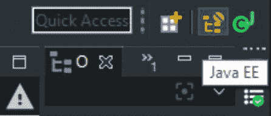
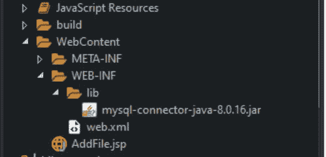
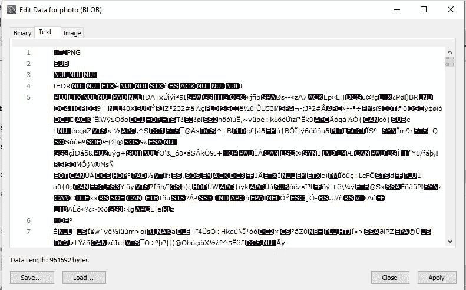

# 如何使用 Servlet 和 JDBC

给 MySql 数据库添加 Image

> 原文:[https://www . geesforgeks . org/如何使用 servlet 和 jdbc 将图像添加到 mysql 数据库/](https://www.geeksforgeeks.org/how-to-add-image-to-mysql-database-using-servlet-and-jdbc/)

[结构化查询语言或 SQL](https://www.geeksforgeeks.org/structured-query-language/) 是一种标准的数据库语言，用于创建、维护和检索关系数据库中的数据，如 MySQL、Oracle、SQL Server、PostGre 等。在本文中，我们将了解如何使用 servlet 向 **MYSQL** 数据库添加图像。

**MYSQL** 是一个关系型数据库。关系数据库意味着数据以关系(表)的形式存储和检索。[servlet](https://www.geeksforgeeks.org/introduction-java-servlets/)是运行在支持 Java 的网络服务器或应用服务器上的 Java 程序。它们用于处理从 web 服务器获得的请求，处理请求，生成响应，然后将响应发送回 web 服务器。servlets 的属性是它们在服务器端工作。它们能够处理从 web 服务器获得的复杂请求。在本文中， [Eclipse IDE](https://www.eclipse.org/downloads/) 用于执行 servlet，MYSQL 工作台用于运行 MYSQL 数据库。使用 servlet 和 [JDBC](https://www.geeksforgeeks.org/jdbc-drivers/) 可以按照以下步骤将图像添加到 MYSQL 数据库中:

1.  **Step 1:** Open Eclipse IDE and on the top right corner You’ll find 2 icons. Upon hovering, it will show JAVA EE and JAVA. As we will be working with a web project, so we will choose JAVA EE. After selecting it, go to **File -> New -> Dynamic Web Project**.

    [](https://media.geeksforgeeks.org/wp-content/uploads/20200529111338/JavaEESnip.JPG)

2.  **Step 2:** Now We need to copy and paste the JDBC Driver for MySQL (Connector – JAR_FILE) in lib folder of WEB-INF folder which is present in WebContent folder. (All the external libraries for the project needs to be here).

    [](https://media.geeksforgeeks.org/wp-content/uploads/20200529112502/rootdirectory.JPG)

3.  **步骤 3:** 现在，我们需要创建一个主页，该主页将呈现一个用户可以上传图像文件的表单。我们可以在*网络内容*文件夹中创建一个 JSP 和 HTML 文件。例如，我们将创建**AddFile.jsp**。我们还需要更新 web.xml 文件，以更新其欢迎文件列表。我们必须在欢迎文件列表中添加 AddFile.jsp。

    ```
    <welcome-file-list>
        <welcome-file>AddFile.jsp</welcome-file>
    </welcome-file-list>
    ```

4.  **第四步:**现在，我们需要添加上面创建的**AddFile.jsp**的代码。该文件的代码如下:

    ```
    <%@ page language="java" contentType="text/html; charset=ISO-8859-1"
        pageEncoding="ISO-8859-1"%>
    <!DOCTYPE html>
    <html>
    <head>
    <meta charset="ISO-8859-1">
    <title>Add File Here</title>
    </head>
    <body>

         <form method="post" action="serv" enctype="multipart/form-data">
         <div>
          <label>First Name:</label>
          <input type="text" name="firstName" size="50" />
         </div>
         <div>
          <label>Last Name:</label> 
          <input type="text" name="lastName" size="50" />
         </div>
         <div>
          <label>Profile Photo: </label> 
          <input type="file" name="photo" size="50" />
         </div>
         <input type="submit" value="Save">
        </form>

    </body>
    </html>
    ```

5.  **步骤 5:** 现在，我们将创建一个类，该类将用于使用 JDBC 建立与 MySql 数据库的连接，并且可以在将来的任何时候使用该连接来反映数据库上的任何内容。例如，我们将创建“MyConnection.java”类和“getConnection()”静态方法来获得如下连接:

    ```
    import java.sql.*;

    public class MyConnection {

        public static Connection getConnection()
        {

            // As java.sql package classes
            // contains Checked Exceptions,
            // we have to surround it with
            // Try/Catch Block.
            try {

                // We have to register the
                // Driver class present in
                // com.mysql.jdbc package.
                DriverManager.registerDriver(
                    new com.mysql.jdbc.Driver());

                // To get the connection,
                // 3 params need to be passed in
                // DriverManager.getConnection() method.

                Connection con
                    = DriverManager.getConnection(
                        "jdbc:mysql:// localhost:3306/"
                            + "FileUploadDatabase",
                        "root", "root");

                /* 1\. URL: "jdbc:mysql://", is the address 
                      "localhost: " is the local machine 
                      and "3306" is the port number 
                      and "FileUploadDatabase" is the name 
                      of the database.

                   2\. UserName: "root", which is set 
                      while creating a database server in
                      MySql Workbench.
                   3\. Password: "root"   
                */

                return con;
            }
            catch (SQLException e) {

                System.out.println(e.getMessage());
            }
            return null;
        }
    }
    ```

6.  **步骤 6:** 现在，我们将创建一个数据库和表“用户”，它将存储从 HTML 表单传递的内容。相同的查询如下:

    > 创建数据库文件上传数据库
    > 创建表格用户(
    > id int(11)NOT NULL AUTO _ INCREMENT，
    > first _ name varchar(45)DEFAULT NULL，
    > last _ name varchar(45)DEFAULT NULL，
    > photo mediumblob，
    > PRIMARY KEY(` id `)
    > )

7.  **Step 7:** Now, we will create a Servlet which will take the request from the webpage and perform all the business logic and store the contents in MySql Database. For Instance, we will name it as “serv.java”. The following is the code in this servlet:

    ```
    // Java program to implement
    // the servlet
    package controllers;

    import java.io.IOException;
    import java.io.InputStream;
    import java.sql.Connection;
    import java.sql.PreparedStatement;
    import java.sql.SQLException;

    import javax.servlet
        .ServletConfig;
    import javax.servlet
        .ServletException;
    import javax.servlet
        .annotation.MultipartConfig;
    import javax.servlet
        .annotation.WebServlet;
    import javax.servlet
        .http.HttpServlet;
    import javax.servlet
        .http.HttpServletRequest;
    import javax.servlet
        .http.HttpServletResponse;
    import javax.servlet.http.Part;

    import Dao.UploadFileDao;
    import connection.copy.MyConnection;

    // This is the annotation-based
    // mapping URL to Servlet.
    @WebServlet("/serv")

    // This annotation defines the maximum
    // file size which can be taken.
    @MultipartConfig(maxFileSize = 16177215)

    public class serv extends HttpServlet {

        // auto generated
        private static final long serialVersionUID = 1L;

        public serv()
        {
            super();
        }

        // This Method takes in All the information
        // required and is used to store in the
        // MySql Database.
        public int uploadFile(String firstName,
                              String lastName,
                              InputStream file)
        {
            String SQL
                = "INSERT INTO users "
                  + "(first_name, last_name, "
                  + "photo) values (?, ?, ?)";
            int row = 0;

            Connection connection
                = MyConnection.getConnection();

            PreparedStatement preparedStatement;
            try {
                preparedStatement
                    = connection.prepareStatement(sql);

                preparedStatement
                    .setString(1, firstName);

                preparedStatement
                    .setString(2, lastName);

                if (file != null) {

                    // Fetches the input stream
                    // of the upload file for
                    // the blob column
                    preparedStatement.setBlob(3, file);
                }

                // Sends the statement to
                // the database server
                row = preparedStatement
                          .executeUpdate();
            }
            catch (SQLException e) {
                System.out.println(e.getMessage());
            }

            return row;
        }

        // As Submit button is hit from
        // the Web Page, request is made
        // to this Servlet and
        // doPost method is invoked.
        protected void doPost(
            HttpServletRequest request,
            HttpServletResponse response)
            throws ServletException, IOException
        {

            // Getting the parametes from web page
            String firstName
                = request.getParameter("firstName");

            String lastName
                = request.getParameter("lastName");

            // Input stream of the upload file
            InputStream inputStream = null;

            String message = null;

            // Obtains the upload file
            // part in this multipart request
            Part filePart
                = request.getPart("photo");

            if (filePart != null) {

                // Prints out some information
                // for debugging
                System.out.println(
                    filePart.getName());
                System.out.println(
                    filePart.getSize());
                System.out.println(
                    filePart.getContentType());

                // Obtains input stream of the upload file
                inputStream
                    = filePart.getInputStream();
            }

            // Sends the statement to the
            // database server
            int row
                = UploadFileDao
                      .uploadFile(firstName,
                                  lastName,
                                  inputStream);
            if (row > 0) {
                message
                    = "File uploaded and "
                      + "saved into database";
            }
            System.out.println(message);
        }
    }
    ```

    **注意:**上述代码无法在联机 IDE 上运行。

**输出:**

*   We can view the database after running the code to check the images uploaded in the database by clicking on “Open Value In Editor” as follows:

    [](https://media.geeksforgeeks.org/wp-content/uploads/20200529123128/OpenValueEditor.JPG)

*   After we click on “Open Value in Editor”, a window will pop up showing the image which is stored in the database in three formats: Binary Format, Text Format and Image format.

    [](https://media.geeksforgeeks.org/wp-content/uploads/20200610115947/OpenValueEditor2.JPG)

*   Now, if we click on the image option, we will be able to see the image which is uploaded.

    [](https://media.geeksforgeeks.org/wp-content/uploads/20200610120108/OpenValueEditor3.JPG)