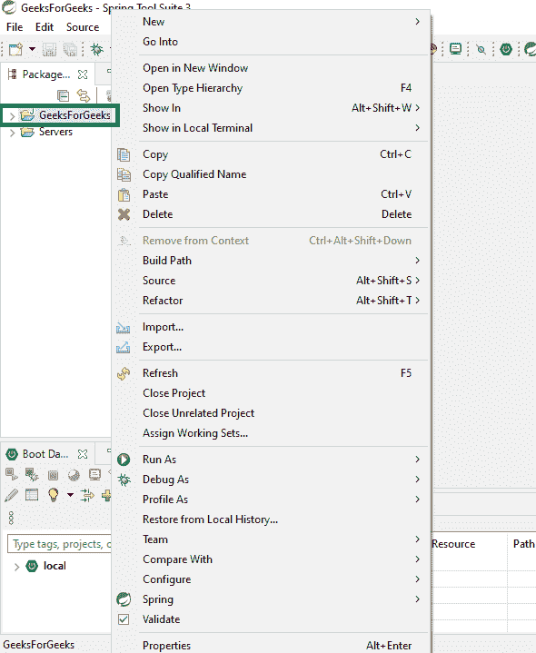
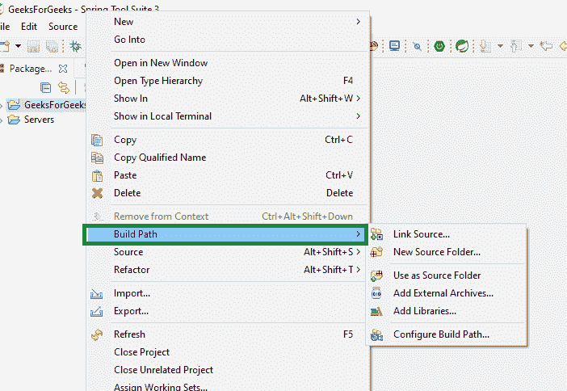
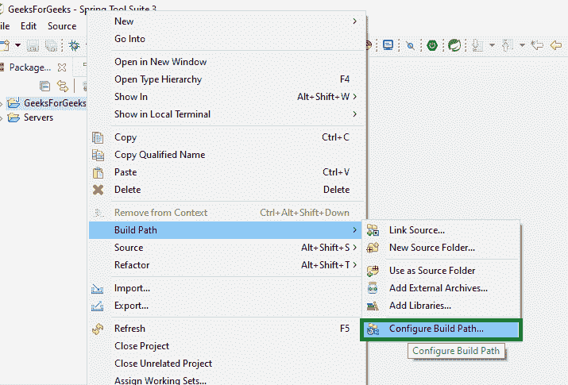
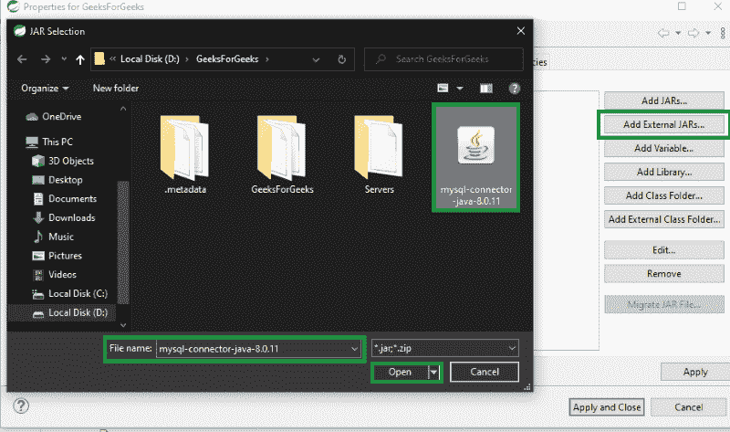
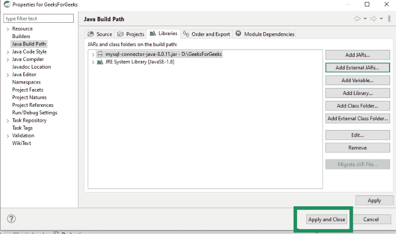

# 如何在 Java 中将 JAR 文件添加到类路径中？

> 原文:[https://www . geesforgeks . org/如何将 jar 文件添加到 java 类路径/](https://www.geeksforgeeks.org/how-to-add-jar-file-to-classpath-in-java/)

JAR 是 JAVA Archive 的缩写。它用于将多个文件聚合成一个文件，并以 ZIP 格式呈现。它也可以用作归档工具，但是使用这个文件进行开发的主要目的是 Java 小程序及其组件(。类文件)只需一个 HTTP 请求就可以轻松下载到客户端浏览器，而不是只为一件事建立新的连接。这将提高小程序加载到网页上并开始工作的速度。它还支持压缩，这减少了文件大小，下载时间将得到改善。

**方法:** JAR 文件可以通过两种不同的方式添加到类路径中

1.  使用 eclipse 或任何集成开发环境
2.  使用命令行

### 方法 1–使用 Eclipse 集成开发环境

**步骤 1:** 右键单击您的项目名称



**步骤 2:** 点击构建路径



**步骤 3:** 点击配置构建路径



**第 4 步:**点击库，点击“添加外部 jar”


**步骤 5:** 从保存 jar 文件的文件夹中选择 jar 文件



**第 6 步:**点击应用并确定。



### 方法 2–使用命令行

**命令 1:** 通过在类路径环境变量中包含 JAR 名称

类路径环境变量不区分大小写。它可以是*类路径*或者*类路径*，类似于我们可以用来定位 java 二进制文件的路径环境变量，比如 javaw 和 Java 命令。

**命令 2:** 通过在类路径命令行选项中包含 JAR 文件的名称

当我们像运行 java–*类路径* $( *类路径* ) Main 一样运行我们的 Java 程序时，这个选项是可行的。在这种情况下，类路径外壳变量包含应用程序所需的 Jar 文件列表。使用*类路径*命令行选项的最佳优势之一是，它允许我们使用每个应用程序拥有自己的一组 JAR 类路径。在其他情况下，并不是所有运行在同一台主机上的 Java 程序都可以使用它。

**命令 3:** 通过在清单的类路径选项中包含 jar 名称

当我们运行一个可执行的 JAR 文件时，我们总是注意到文件中的类路径属性在 META-INF 文件夹中。因此，我们可以说类路径被赋予了最高的优先级，它覆盖了类路径环境变量以及–*类路径*命令行选项。从此以后，我们可以推断这是一个包含 Java 应用程序所需的所有 JAR 文件的好地方。

**命令 4:** 通过使用 Java 6 通配符选项来包含多个 JAR

从 Java 1.6+开始，我们可以使用通配符来包含目录中的所有 jar，以设置类路径，或者使用类路径命令行选项来提供 Java 程序。我们可以举例说明使用 Java 6 通配符方法将多个 JAR 添加到类路径中的 Java 命令示例，如下所示，

```
java.exe -classpath D:\lib\*Main
```

在这个方法*、*中，我们将所有的 JAR 文件 *s* 里面的“*D:\ lib”*目录包含到类路径中。我们必须确保语法正确。关于使用 Java 6 通配符在类路径中包含多个 JAR 的一些更重要的要点如下:

用*代替*。冲突

每当 JAR 和类文件出现在同一个目录中时，我们就需要分别包含它们

```
 Java -*classpath* /classes: /lib/*
```

在包含所有 JAR 的 Java 6 通配符中，它不会在子目录中搜索 JAR。

通配符包含在所有 JAR 中在我们运行带有 JAR 文件的 Java 程序并且在清单文件中有类路径属性的情况下是不被认可的。当我们使用–*CP*或–*类路径*选项时，会使用 JAR 通配符

**命令 5:** *在 ext 目录中添加 JAR 示例是' C:\ Program Files \ Java \ JDK 1 . 6 . 0 \ JRE \ lib \ ext '*

通过使用上面的*方法，我们可以在类路径中添加多个 JAR。扩展类加载器可以从扩展目录加载 JAR。它被赋予了比应用程序类加载器更高的优先级，后者从类路径环境变量或–*类路径*或–*CP*中指定的目录加载 JAR*