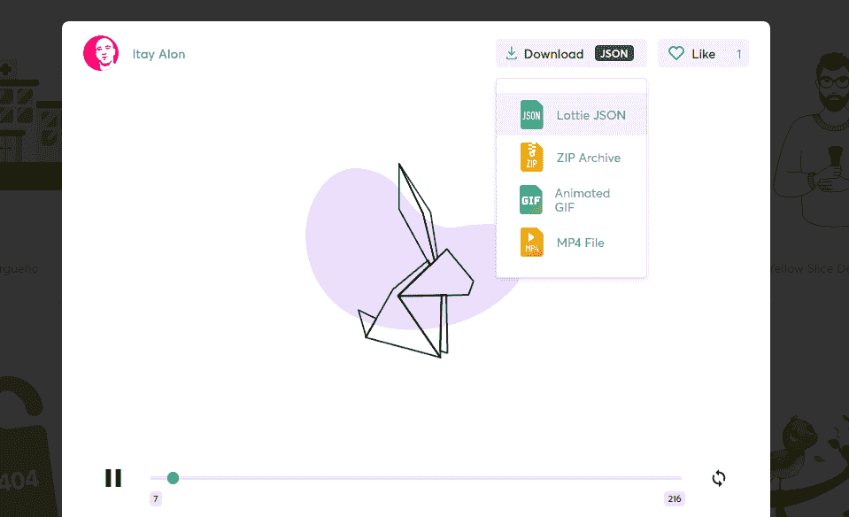

# 如何在安卓应用中添加洛蒂动画

> 原文:[https://www . geeksforgeeks . org/how-add-Lottie-animation in a-an-Android-app/](https://www.geeksforgeeks.org/how-to-add-lottie-animation-in-an-android-app/)

这篇文章是关于通过在我们的移动应用中添加**洛蒂动画**文件来增强移动应用的[用户界面](https://www.geeksforgeeks.org/user-interface-ui/)。洛蒂动画可以自由使用矢量动画文件。这些动画文件可以在官方网站[这里](https://lottiefiles.com/)找到。许多著名的应用程序都使用这个，如优步、网飞、谷歌、Airbnb、Shopify 等。
下面是洛蒂动画的一个例子:

<video class="wp-video-shortcode" id="video-422856-1" width="640" height="360" preload="metadata" controls=""><source type="video/mp4" src="https://media.geeksforgeeks.org/wp-content/uploads/20200519010652/8358-checklist-remixed.mp4?_=1">[https://media.geeksforgeeks.org/wp-content/uploads/20200519010652/8358-checklist-remixed.mp4](https://media.geeksforgeeks.org/wp-content/uploads/20200519010652/8358-checklist-remixed.mp4)</video>

**洛蒂动画的动态属性**

*   这些可以用来给应用一个主题。
*   这些可以添加以响应任何事件，如错误、成功等。
*   这些可以被动画化为动画的单个部分，以响应任何用户。
*   响应设计时未知的视图大小或其他值。

**洛蒂的优势**

*   它支持一组更大的特效功能。
*   开发人员可以设置进度，将动画添加到手势、事件等。
*   面具是抗锯齿的。
*   开发人员可以自由地动态改变动画特定部分的速度和颜色。

**方法:**
**第一步:**将此依赖项添加到项目的 **App 级渐变模块**中，然后**将**渐变与项目同步。这个库使我们能够使用洛蒂的动画:

## Java 语言(一种计算机语言，尤用于创建网站)

```java
// Lottie dependency
def lottieVersion = "3.4.0" implementation "com.airbnb.android:lottie:$lottieVersion"
```

**第二步:**从[这里](https://lottiefiles.com/featured)选择任意动画，下载动画
的 JSON 文件



下载 JSON 动画文件

**第 3 步:**现在将 XML 代码包含到布局文件中，您希望在其中显示动画。这里 JSON 文件的文件名假定为动画。洛蒂获取 JSON 文件的不同方法

*   一个 JSON 动画: **src/main/res/raw**

*   一份 JSON 文件: **src/main/assets**

*   压缩文件: **src/main/assets**

下面是 XML 代码:

## 可扩展标记语言

```java
<com.airbnb.lottie.LottieAnimationView
            android:layout_width="match_parent"
            android:layout_height="wrap_content"
            android:id="@+id/animation_view"
            app:lottie_rawRes="@raw/animation"
            app:lottie_autoPlay="true"
            app:lottie_loop="true"/>
```

**第 4 步:**(可选)向动画添加控件:

*   添加自定义进度:这里进度的初始值和最终值是自定义的。

## Java 语言(一种计算机语言，尤用于创建网站)

```java
// Custom animation speed or duration.
ValueAnimator animator
    = ValueAnimator.ofFloat(0f, 1f);
animator
    .addUpdateListener(animation -> {
        animationView
            .setProgress(
                animation
                    .getAnimatedValue());
    });
animator.start();
```

*   添加动画监听器:不同的监听器可以添加洛蒂动画。

## Java 语言(一种计算机语言，尤用于创建网站)

```java
// Declaring the animation view
LottieAnimationView animationView
    = findViewById(R.id.animationView);
animationView
    .addAnimatorUpdateListener(
        (animation) -> {
            // Do something.
        });
animationView
    .playAnimation();

if (animationView.isAnimating()) {
    // Do something.
}
```

**输出:**

<video class="wp-video-shortcode" id="video-422856-2" width="640" height="360" preload="metadata" controls=""><source type="video/mp4" src="https://media.geeksforgeeks.org/wp-content/uploads/20200602024408/done.mp4?_=2">[https://media.geeksforgeeks.org/wp-content/uploads/20200602024408/done.mp4](https://media.geeksforgeeks.org/wp-content/uploads/20200602024408/done.mp4)</video>

**参考**:[https://github . com/Airbnb/lotte-Android](https://github.com/airbnb/lottie-android)