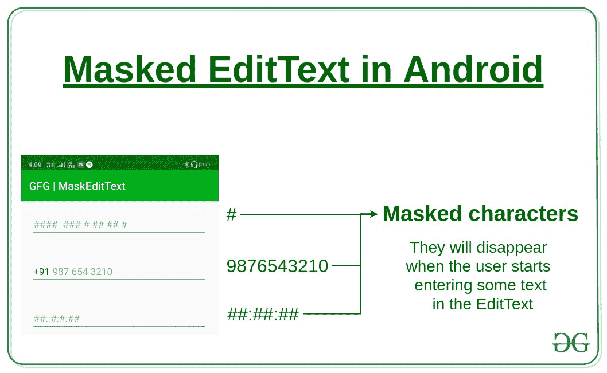

# 如何在安卓中给编辑文本添加蒙版

> 原文:[https://www . geeksforgeeks . org/如何在 android 中向编辑文本添加掩码/](https://www.geeksforgeeks.org/how-to-add-mask-to-an-edittext-in-android/)

**[EditText](https://www.geeksforgeeks.org/edittext-widget-in-android-using-java-with-examples/)** 是一个安卓小部件。这是一个用于输入和修改数据的[用户界面](https://www.geeksforgeeks.org/user-interface-ui/)元素。它以字符串格式返回数据。

掩蔽指的是将某物放在另一物位置的过程。因此，通过屏蔽编辑文本，空白空间被一些默认文本所取代，称为屏蔽。一旦用户输入任何字符作为输入，该掩码就会被移除，并且当文本从编辑文本中移除时，该掩码会重新出现。

[](https://media.geeksforgeeks.org/wp-content/cdn-uploads/20200508193510/Mask-to-an-EditText-in-Android.jpg)

在本文中，屏蔽是借助 [JitPack 库](https://jitpack.io/)完成的，因为它可以根据实现电话号码、日期等各种字段的需要轻松定制。

**进场:**

1.  将支持库添加到您的根 **[build.gradle](https://www.geeksforgeeks.org/android-build-gradle/)** 文件中(不是您的模块 build.gradle 文件)。这个库 **jitpack** 是一个新颖的包库。它是为 JVM 而做的，因此 [github](https://www.geeksforgeeks.org/ultimate-guide-git-github/) 和 [bigbucket](https://www.geeksforgeeks.org/bitbucket-vs-github-vs-gitlab/) 中存在的任何库都可以直接在应用程序中使用。

    ```
    allprojects {
        repositories {
            maven {
                url "https://jitpack.io"
            }
        }
    }
    ```

2.  在依赖项部分添加以下依赖项。这是一个简单的安卓编辑文本，支持自定义掩码。Mask edittext 直接导入，并根据用途进行自定义。

    ```
    dependencies {
        implementation 'ru.egslava:MaskedEditText:1.0.5'
    }
    ```

3.  现在在 **activity_main.xml** 文件中添加以下代码。它将在 activity _ main . XML .

    ## 【activity _ main . XML】

    ```
    <?xml version="1.0" encoding="utf-8"?>
    <LinearLayout
        xmlns:android="http://schemas.android.com/apk/res/android"
        xmlns:tools="http://schemas.android.com/tools"
        android:layout_width="match_parent"
        android:layout_height="match_parent"
        xmlns:app="http://schemas.android.com/apk/res-auto"
        android:orientation="vertical"
        tools:context=".MainActivity">

        <br.com.sapereaude.maskedEditText.MaskedEditText
            android:hint="#### #### #### ####"
            android:layout_width="match_parent"
            android:inputType="number"

            <!-- Set the masked characters -->
            app:mask="#### #### #### ####"
            android:layout_height="wrap_content"
            android:layout_margin="20dp"
            android:id="@+id/card"/>

        <br.com.sapereaude.maskedEditText.MaskedEditText
            android:layout_width="match_parent"
            android:layout_height="wrap_content"
            android:layout_margin="20dp"
            android:id="@+id/phone"
            android:hint="9876543210"
            android:inputType="phone"
            app:keep_hint="true"

            <!-- Set the masked characters -->
            app:mask="+91 ### ### ####"/>

        <br.com.sapereaude.maskedEditText.MaskedEditText
            android:hint="##:##:####"
            android:layout_width="match_parent"
            android:layout_height="wrap_content"
            android:layout_margin="20dp"
            android:id="@+id/Date"
            android:inputType="date"

            <!-- Set the masked characters -->
            app:mask="##:##:####"/>

        <Button
            android:id="@+id/showButton"
            android:layout_marginTop="40dp"
            android:layout_gravity="center"
            android:layout_width="wrap_content"
            android:layout_height="wrap_content"
            android:textAllCaps="false"
            android:textSize="18sp"
            android:text="Show"
            />
    </LinearLayout>
    ```

    中创建**三个**掩码编辑文本和**一个**按钮
4.  现在在**MainActivity.java**文件中添加以下代码。定义了所有三个掩码编辑文本和一个按钮。一个 **onClickListener()** 被添加到按钮上，该按钮创建一个吐司并显示在掩码编辑文本中输入的所有数据。

    ## MainActivity.java

    ```
    package org.geeksforgeeks.gfgMaskEditText;

    import androidx.appcompat.app.AppCompatActivity;
    import android.os.Bundle;
    import android.view.View;
    import android.widget.Button;
    import android.widget.Toast;
    import br.com.sapereaude
        .maskedEditText
        .MaskedEditText;

    public class MainActivity
        extends AppCompatActivity {

        MaskedEditText creditCardText,
            phoneNumText,
            dateText;
        Button show;

        @Override
        protected void onCreate(
            Bundle savedInstanceState)
        {
            super.onCreate(savedInstanceState);
            setContentView(R.layout.activity_main);

            creditCardText = findViewById(R.id.card);
            phoneNumText = findViewById(R.id.phone);
            dateText = findViewById(R.id.Date);
            show = findViewById(R.id.showButton);

            show.setOnClickListener(
                new View.OnClickListener() {

                    @Override
                    public void onClick(View v)
                    {

                        // Display the information
                        // from the EditText
                        // with help of Taosts
                        Toast.makeText(
                                 MainActivity.this,
                                 "Credit Card Number "
                                     + creditCardText.getText()
                                     + "\n Phone Number "
                                     + phoneNumText.getText()
                                     + "\n Date "
                                     + dateText.getText(),
                                 Toast.LENGTH_LONG)
                            .show();
                    }
                });
        }
    }
    ```

**输出:**

<video class="wp-video-shortcode" id="video-408625-1" width="665" height="1330" preload="metadata" controls=""><source type="video/mp4" src="https://media.geeksforgeeks.org/wp-content/uploads/20200505162724/Record_2020-05-05-16-09-23_b64b62a768fef9e79b7cc5e52be67d20.mp4?_=1">[https://media.geeksforgeeks.org/wp-content/uploads/20200505162724/Record_2020-05-05-16-09-23_b64b62a768fef9e79b7cc5e52be67d20.mp4](https://media.geeksforgeeks.org/wp-content/uploads/20200505162724/Record_2020-05-05-16-09-23_b64b62a768fef9e79b7cc5e52be67d20.mp4)</video>