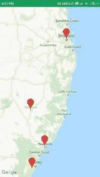

# 如何在安卓系统的谷歌地图上添加多个标记？

> 原文:[https://www . geeksforgeeks . org/如何在安卓系统中添加多个谷歌地图标记/](https://www.geeksforgeeks.org/how-to-add-multiple-markers-on-google-maps-in-android/)

谷歌地图用于大多数应用程序，这些应用程序用于表示谷歌地图上的许多位置和标记。我们在谷歌地图上看到了多个位置的标记。在本文中，我们将看一下**多标记在 Android** 中谷歌地图上的实现。

### 我们将在本文中构建什么？

我们将构建一个简单的应用程序，在其中我们将在不同位置的地图上显示多个标记。下面给出了一个示例图像，以了解本文中要做什么。请注意，我们将使用 **Java** 语言来实现这个项目。



### **分步实施**

**第一步:创建新项目**

要在安卓工作室创建新项目，请参考[如何在安卓工作室创建/启动新项目](https://www.geeksforgeeks.org/android-how-to-create-start-a-new-project-in-android-studio/)。注意选择 **Java** 作为编程语言。创建新项目时，确保选择**地图活动**。

**第二步:生成使用谷歌地图的应用编程接口密钥**

要为地图生成应用编程接口密钥，您可以参考[如何为在安卓系统中使用谷歌地图生成应用编程接口密钥](https://www.geeksforgeeks.org/how-to-generate-api-key-for-using-google-maps-in-android/)。在为谷歌地图生成你的应用编程接口密钥后。我们必须将这个密钥添加到我们的项目中。要在我们的应用程序中添加此密钥，请导航至**值文件夹> google_maps_api.xml** 文件，在第 23 行，您必须添加您的 api 密钥来代替 **YOUR_API_KEY** 。

**第三步:给我们的地图添加多个标记**

转到**文件，参考以下代码。以下是**MapsActivity.java**文件的代码。代码中添加了注释，以更详细地理解代码。**

## **Java 语言(一种计算机语言，尤用于创建网站)**

```
import android.os.Bundle;

import androidx.fragment.app.FragmentActivity;

import com.google.android.gms.maps.CameraUpdateFactory;
import com.google.android.gms.maps.GoogleMap;
import com.google.android.gms.maps.OnMapReadyCallback;
import com.google.android.gms.maps.SupportMapFragment;
import com.google.android.gms.maps.model.LatLng;
import com.google.android.gms.maps.model.MarkerOptions;

import java.util.ArrayList;

public class MapsActivity extends FragmentActivity implements OnMapReadyCallback {

    private GoogleMap mMap;

    // below are the latitude and longitude
    // of 4 different locations.
    LatLng sydney = new LatLng(-34, 151);
    LatLng TamWorth = new LatLng(-31.083332, 150.916672);
    LatLng NewCastle = new LatLng(-32.916668, 151.750000);
    LatLng Brisbane = new LatLng(-27.470125, 153.021072);

    // creating array list for adding all our locations.
    private ArrayList<LatLng> locationArrayList;

    @Override
    protected void onCreate(Bundle savedInstanceState) {
        super.onCreate(savedInstanceState);
        setContentView(R.layout.activity_maps);

        // Obtain the SupportMapFragment and get notified when the map is ready to be used.
        SupportMapFragment mapFragment = (SupportMapFragment) getSupportFragmentManager().findFragmentById(R.id.map);
        mapFragment.getMapAsync(this);

        // in below line we are initializing our array list.
        locationArrayList = new ArrayList<>();

        // on below line we are adding our
        // locations in our array list.
        locationArrayList.add(sydney);
        locationArrayList.add(TamWorth);
        locationArrayList.add(NewCastle);
        locationArrayList.add(Brisbane);
    }

    /**
     * Manipulates the map once available.
     * This callback is triggered when the map is ready to be used.
     * This is where we can add markers or lines, add listeners or move the camera. In this case,
     * we just add a marker near Sydney, Australia.
     * If Google Play services is not installed on the device, the user will be prompted to install
     * it inside the SupportMapFragment. This method will only be triggered once the user has
     * installed Google Play services and returned to the app.
     */
    @Override
    public void onMapReady(GoogleMap googleMap) {
        mMap = googleMap;
        // inside on map ready method
        // we will be displaying all our markers.
        // for adding markers we are running for loop and 
        // inside that we are drawing marker on our map.
        for (int i = 0; i < locationArrayList.size(); i++) {

            // below line is use to add marker to each location of our array list.
            mMap.addMarker(new MarkerOptions().position(locationArrayList.get(i)).title("Marker"));

            // below lin is use to zoom our camera on map.
            mMap.animateCamera(CameraUpdateFactory.zoomTo(18.0f));

            // below line is use to move our camera to the specific location.
            mMap.moveCamera(CameraUpdateFactory.newLatLng(locationArrayList.get(i)));
        }
    }
}
```

**添加此代码后。现在运行您的应用程序，并查看应用程序的输出。**

### ****输出:****

> *****注意:**在谷歌开发者控制台(*[](https://console.developers.google.com/)**)中，确保启用了“**谷歌地图安卓 API v2** ”。并确保您的应用编程接口密钥存在。****

******