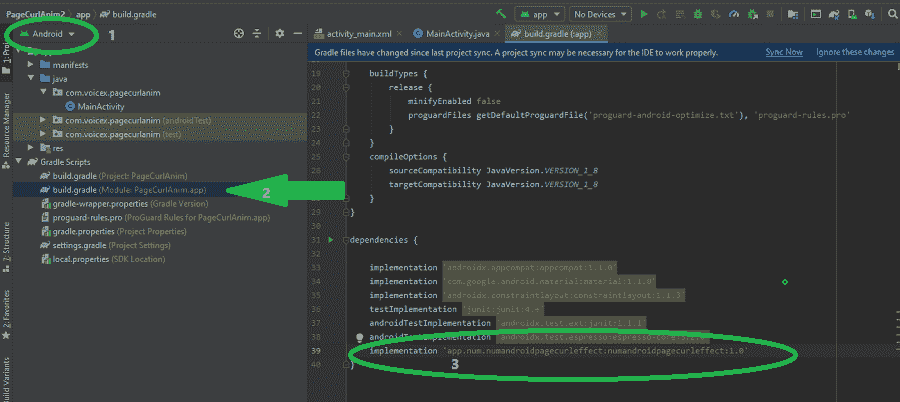

# 安卓中如何在图像之间添加页面卷曲动画？

> 原文:[https://www . geesforgeks . org/how-add-page-curl-animation-in-Android/](https://www.geeksforgeeks.org/how-to-add-page-curl-animation-between-images-in-android/)

动画是创建好看的用户界面的最好方法。用户喜欢在安卓应用中看到动画。当我们必须制作某种特殊的应用程序时，这变得更加必要，例如，如果我们为一本书创建应用程序，那么我们应该创建一个动画，当用户从一个页面移动到另一个页面时，给用户一种真实世界的感觉。他应该有一些经验，这样他才能在现实世界中从一页到另一页。在今天的文章中，我们将学习安卓的另一个动画，叫做页面卷曲动画。当用户从一个图像移动到另一个图像时，它会给人一种卷曲页面的感觉。


**方法:**我们将在本文中使用一个库，在 XML 中，我们将使用该库的一个对象**app . num . numandropdagecolleffect . pagecurlview**并给出宽度和高度属性 **match_parent** 。之后，我们将在 java 或 Kotlin 类中创建一个图像数组列表，并在这个库的帮助下将该列表设置为 CurlView。作为参考和资源，我们将在 GitHub 上传本文中的项目，并将向您提供存储库链接，以便您可以探索更多内容。下面给出了一个 GIF 示例，来了解一下 我们在本文中要做什么 。注意，我们将使用 **Java** 语言来实现这个项目。


### **分步实施**

**第一步:创建新项目**

要在安卓工作室创建新项目，请参考[如何在安卓工作室创建/启动新项目](https://www.geeksforgeeks.org/android-how-to-create-start-a-new-project-in-android-studio/)。注意选择 **Java** 作为编程语言。

**步骤 2:添加库的依赖关系**

确保在项目结构的左上角选择了 Android。然后，导航到**Gradle Scripts/build . Gradle(Module:app)**并将此代码**实现‘app . num . numandropdegacoleffect:numandropdegacoleffect:1.0’**粘贴到依赖项中。



之后点击屏幕右上角的立即同步。

**步骤 3:使用 activity_main.xml 文件**

导航到**应用程序> res >布局> activity_main.xml** 并将下面的代码添加到该文件中。下面是 **activity_main.xml** 文件的代码。

## 可扩展标记语言

```
<?xml version="1.0" encoding="utf-8"?>
<LinearLayout 
    xmlns:android="http://schemas.android.com/apk/res/android"
    xmlns:app="http://schemas.android.com/apk/res-auto"
    xmlns:tools="http://schemas.android.com/tools"
    android:layout_width="match_parent"
    android:layout_height="match_parent"
    tools:context=".MainActivity">

    <app.num.numandroidpagecurleffect.PageCurlView
        android:id="@+id/pagecurlView"
        android:layout_width="match_parent"
        android:layout_height="500dp"
        android:layout_gravity="center">
    </app.num.numandroidpagecurleffect.PageCurlView>

</LinearLayout>
```

**第四步:使用****MainActivity.java 文件**

现在，转到 MainActivity 类，在 onCreate 方法之前粘贴代码。

## Java 语言(一种计算机语言，尤用于创建网站)

```
PageCurlView pageCurlView;
List<Integer> images;
```

**创建图像的数组列表，并为页面卷曲动画设置它们**

在 MainActivity 类中，将下面的代码粘贴到我们的 onCreate 方法中。

## Java 语言(一种计算机语言，尤用于创建网站)

```
pageCurlView = findViewById(R.id.pagecurlView);
images= new ArrayList<>();

images.add(R.drawable.img1); // First Image
images.add(R.drawable.img2); // Second Image
images.add(R.drawable.img3); // Third Image

pageCurlView.setCurlView(images);
pageCurlView.setCurlSpeed(600); // Set the speed in ms
```

以下是**文件的完整代码。**

## **Java 语言(一种计算机语言，尤用于创建网站)**

```
import androidx.appcompat.app.AppCompatActivity;

import android.os.Bundle;

import java.util.ArrayList;
import java.util.List;

import app.num.numandroidpagecurleffect.PageCurlView;

public class MainActivity extends AppCompatActivity {

    PageCurlView pageCurlView;
    List<Integer> images;

    @Override
    protected void onCreate(Bundle savedInstanceState) {
        super.onCreate(savedInstanceState);
        setContentView(R.layout.activity_main);
        pageCurlView = findViewById(R.id.pagecurlView);
        images = new ArrayList<>();

        images.add(R.drawable.img1); // First Image
        images.add(R.drawable.img2); // Second Image
        images.add(R.drawable.img3); // Third Image

        pageCurlView.setCurlView(images);
        pageCurlView.setCurlSpeed(600); // Set the speed in ms
    }
}
```

**现在，我们已经完成了代码，您可以在 android 模拟器或物理设备上运行您的应用程序。**

****输出:****

**<video class="wp-video-shortcode" id="video-569185-1" width="640" height="360" preload="metadata" controls=""><source type="video/mp4" src="https://media.geeksforgeeks.org/wp-content/uploads/20210308120940/Page-Curl-Animation-Between-Images-in-Android.mp4?_=1">[https://media.geeksforgeeks.org/wp-content/uploads/20210308120940/Page-Curl-Animation-Between-Images-in-Android.mp4](https://media.geeksforgeeks.org/wp-content/uploads/20210308120940/Page-Curl-Animation-Between-Images-in-Android.mp4)</video>**

****资源:**你也可以在 GitHub 上找到[这个项目](https://github.com/shivamparashar165/PageCurlAnim)，用它的代码探索更多。**