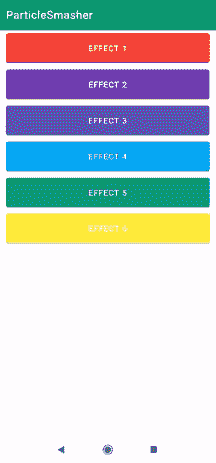

# 如何在安卓 App 中添加粒子击碎器？

> 原文:[https://www . geesforgeks . org/how-add-pieces smasher-in-Android-app/](https://www.geeksforgeeks.org/how-to-add-particlesmasher-in-android-app/)

粒子加速器是一个安卓库，允许我们在安卓应用程序中轻松地将粒子效果应用到视图中。我们可以在很多应用中使用这个功能，比如我们在完成任务后或删除特定文件时破坏特定 UI 的应用。下面给出了一个示例 GIF，以了解我们将在本文中做什么。注意，我们将使用 **Java** 语言来实现这个项目。



### **分步实施**

**第一步:创建新项目**

要在安卓工作室创建新项目，请参考[如何在安卓工作室创建/启动新项目](https://www.geeksforgeeks.org/android-how-to-create-start-a-new-project-in-android-studio/)。注意选择 **Java** 作为编程语言。

**第二步:去编码区之前先做一些前置任务**

转到**应用程序->RES->values->colors . XML**文件，为应用程序设置颜色。

## 可扩展标记语言

```
<?xml version="1.0" encoding="utf-8"?>
<resources>

    <color name="colorPrimary">#0F9D58</color>
    <color name="colorPrimaryDark">#0F9D58</color>
    <color name="colorAccent">#05af9b</color>

</resources>
```

转到 Gradle **脚本- > build.gradle(模块:app)** 部分，导入以下依赖项，点击上面弹出的“**立即同步**”。

> 实现“com.ifadai:粒子粉碎器:1.0.1”

**第三步:设计 UI**

在 **activity_main.xml** 中，删除默认的文本视图，并将布局更改为相对布局，并在其中添加一个垂直的线性布局，在线性布局中添加 6 个具有不同 id、文本和颜色的按钮。下面是 **activity_main.xml** 文件的代码。

## 可扩展标记语言

```
<?xml version="1.0" encoding="utf-8"?>
<RelativeLayout
    xmlns:android="http://schemas.android.com/apk/res/android"
    xmlns:tools="http://schemas.android.com/tools"
    android:layout_width="match_parent"
    android:layout_height="match_parent"
    tools:context=".MainActivity">

    <!-- simple vertical linear layout -->
    <LinearLayout
        android:layout_width="match_parent"
        android:layout_height="wrap_content"
        android:orientation="vertical">

        <!-- simple buttons with different text ,color and id's -->
        <Button
            android:id="@+id/button1"
            android:layout_width="match_parent"
            android:layout_height="64dp"
            android:layout_marginLeft="16dp"
            android:layout_marginRight="16dp"
            android:backgroundTint="#F44336"
            android:text="Effect 1"
            android:textColor="#ffff" />

        <Button
            android:id="@+id/button2"
            android:layout_width="match_parent"
            android:layout_height="64dp"
            android:layout_marginLeft="16dp"
            android:layout_marginRight="16dp"
            android:backgroundTint="#9C27B0"
            android:text="Effect 2"
            android:textColor="#ffff" />

        <Button
            android:id="@+id/button3"
            android:layout_width="match_parent"
            android:layout_height="64dp"
            android:layout_marginLeft="16dp"
            android:layout_marginRight="16dp"
            android:backgroundTint="#3F51B5"
            android:text="Effect 3"
            android:textColor="#ffff" />

        <Button
            android:id="@+id/button4"
            android:layout_width="match_parent"
            android:layout_height="64dp"
            android:layout_marginLeft="16dp"
            android:layout_marginRight="16dp"
            android:backgroundTint="#03A9F4"
            android:text="Effect 4"
            android:textColor="#ffff" />

        <Button
            android:id="@+id/button5"
            android:layout_width="match_parent"
            android:layout_height="64dp"
            android:layout_marginLeft="16dp"
            android:layout_marginRight="16dp"
            android:backgroundTint="#009688"
            android:text="Effect 5"
            android:textColor="#ffff" />

        <Button
            android:id="@+id/button6"
            android:layout_width="match_parent"
            android:layout_height="64dp"
            android:layout_marginLeft="16dp"
            android:layout_marginRight="16dp"
            android:backgroundTint="#FFEB3B"
            android:text="Effect 6"
            android:textColor="#ffff" />

    </LinearLayout>

</RelativeLayout>
```