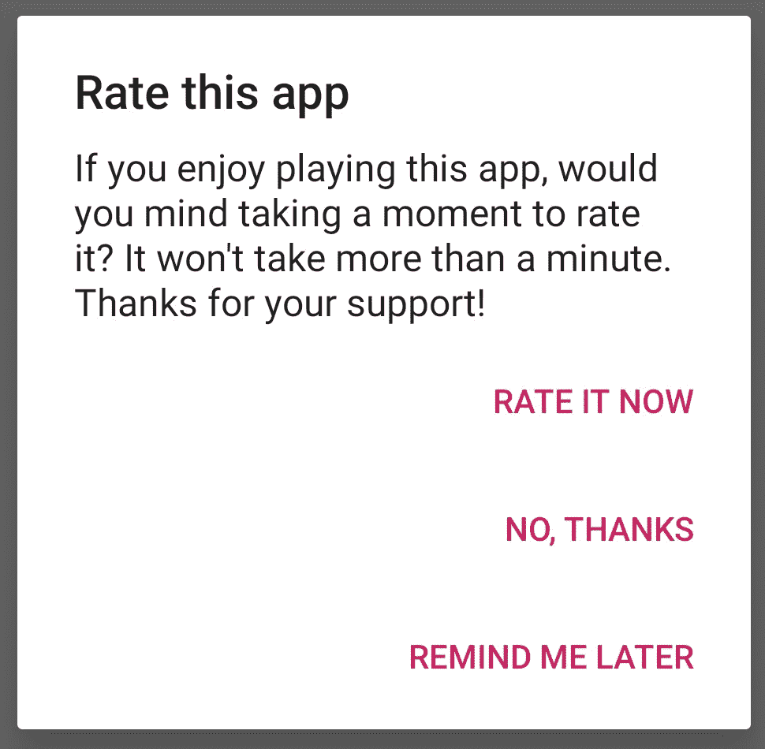
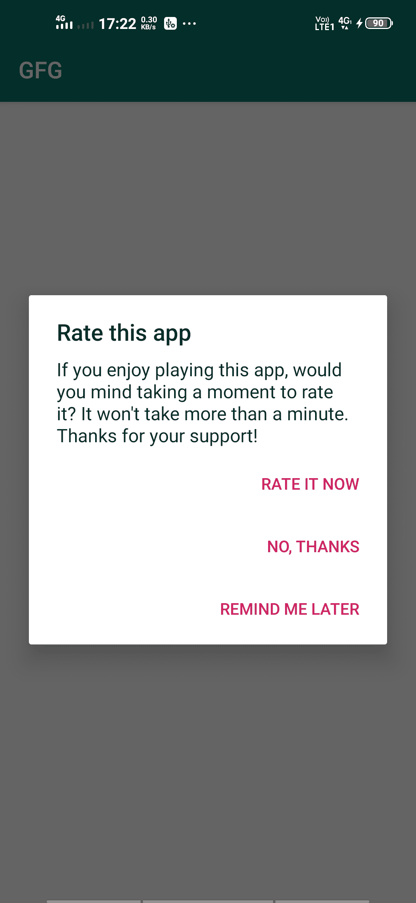

# 如何在安卓

中添加 Rate App 功能

> 原文:[https://www . geeksforgeeks . org/如何在安卓中添加费率应用功能/](https://www.geeksforgeeks.org/how-to-add-rate-the-app-feature-in-android/)

当你在 google play 商店发布你的应用时，从用户那里获得反馈是很重要的。除非用户不爱或不恨你的应用，否则他们不太可能特意给你的应用打分。因为高评级表明你的应用程序成功，甚至需要批评才能使应用程序变得更好。所以，最好在你的应用中增加一个**评价我**的功能，帮助你获得反馈。

**评价 me 特性的重要性:-**

*   它提高了您的应用在 play store 中的评级。
*   它通过获得反馈来帮助你改进你的应用程序(找到 bug)。
*   它有助于您对应用程序的未来更新做出决定。

[](https://media.geeksforgeeks.org/wp-content/uploads/20200514172922/copy.jpg)

**进场:**

**第一步:**

在 [**build.gradle**](https://www.geeksforgeeks.org/android-build-gradle/) 文件中添加支持库，并在依赖项部分添加安卓-Rate 依赖项。这个库有一个功能，可以将用户重定向到 google play 商店，并允许他们对应用程序进行评级。这有助于获得反馈。

## 可扩展标记语言

```java
dependencies {
    implementation 'com.github.hotchemi:android-rate:1.0.1'
}
```

**第二步:**

在 MainActivity.java 文件中添加以下代码。该代码将在应用程序中添加**评价我**功能。**设置安装天数**等默认功能允许从应用安装之日起一定天数后出现对话框，**设置启动次数**是用户应该启动应用的最小次数，**设置提醒服务器**是用户选择中立选项(稍后提醒我)后出现对话框的天数。

## Java 语言(一种计算机语言，尤用于创建网站)

```java
package org.geeksforgeeks.gfgapprate;

import androidx.appcompat.app.AppCompatActivity;
import android.os.Bundle;
import hotchemi.android.rate.AppRate;

public class MainActivity
    extends AppCompatActivity {

    @Override
    protected void onCreate(
        Bundle savedInstanceState)
    {
        super.onCreate(savedInstanceState);
        setContentView(R.layout.activity_main);

        // Here 0 means
        // the installation date.
        AppRate.with(this)

            // default 10
            .setInstallDays(1)

            // default 10
            .setLaunchTimes(3)

            // default 1
            .setRemindInterval(1)
            .monitor();

        // Show a dialogue
        // if meets conditions
        AppRate
            .showRateDialogIfMeetsConditions(
                this);
    }
}
```

**输出:**

[](https://media.geeksforgeeks.org/wp-content/uploads/20200514172606/Screenshot_20200514_172215.jpg)