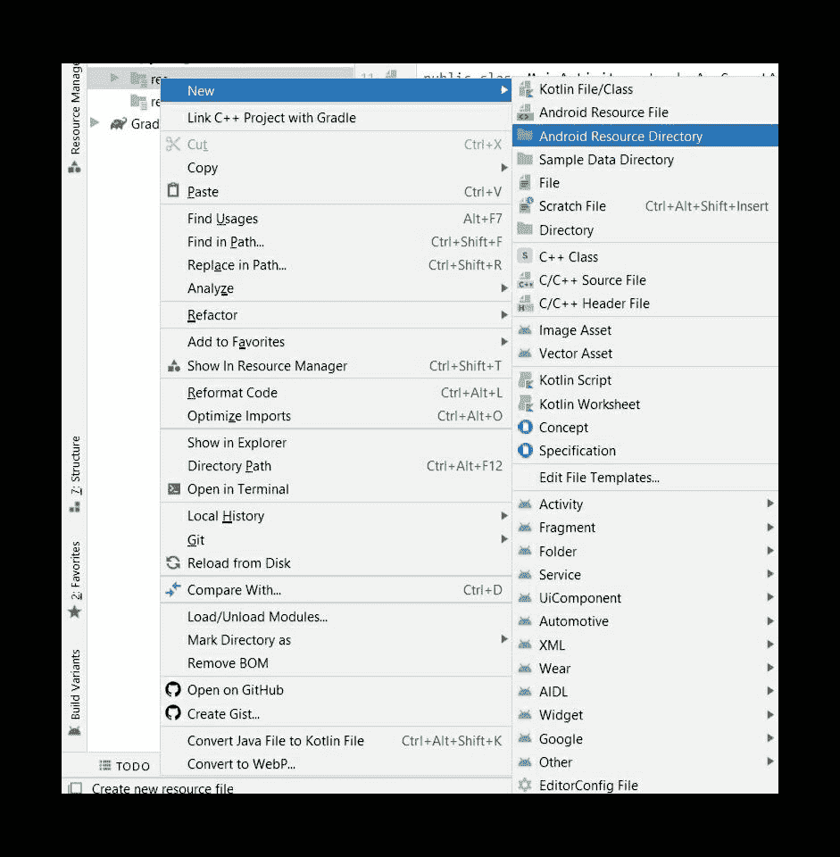
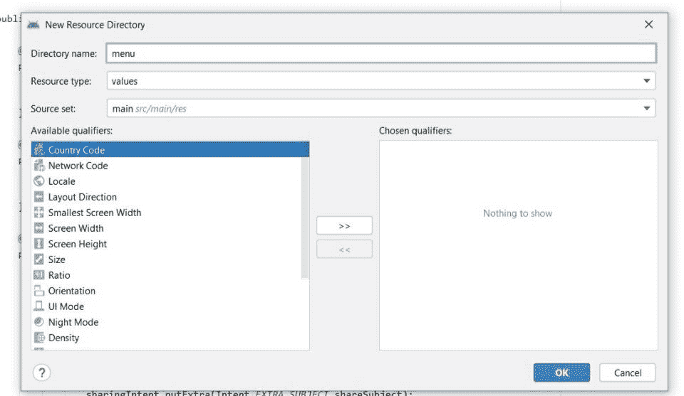
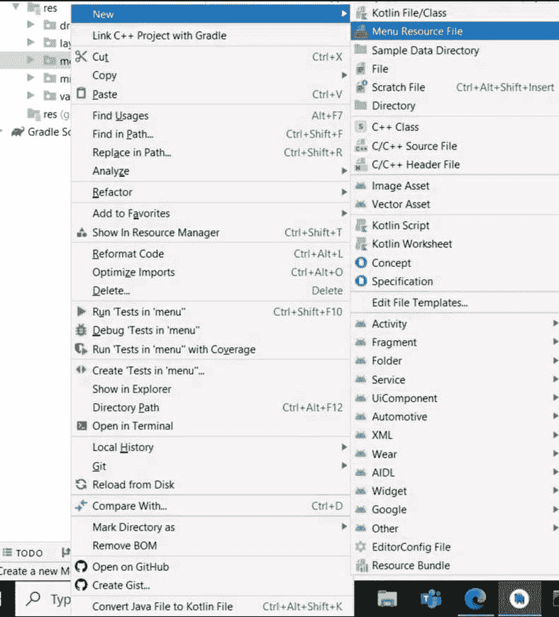
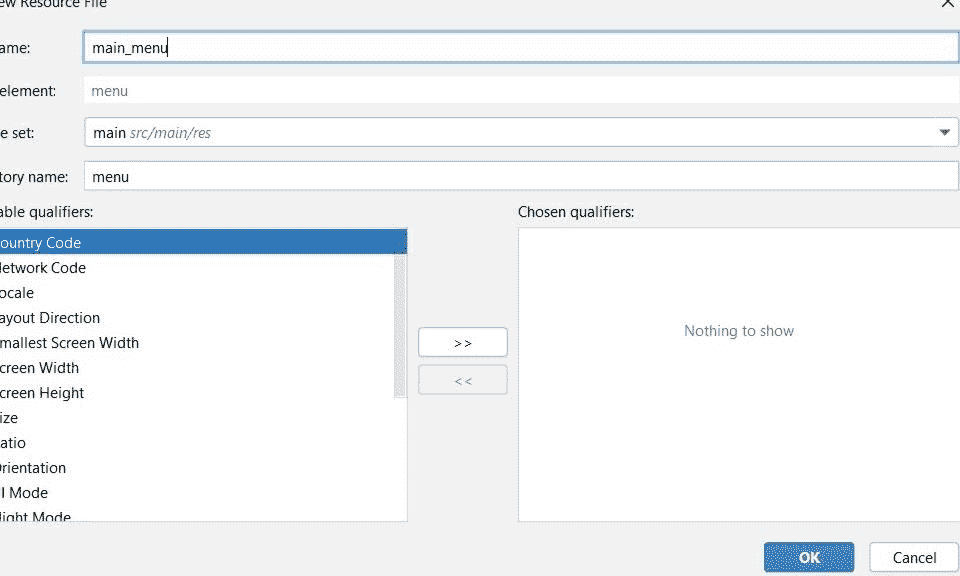
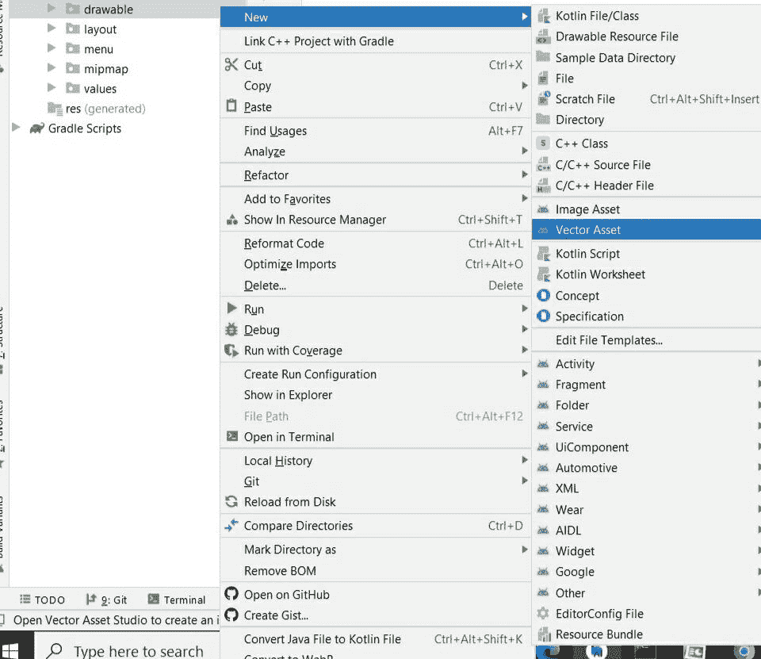
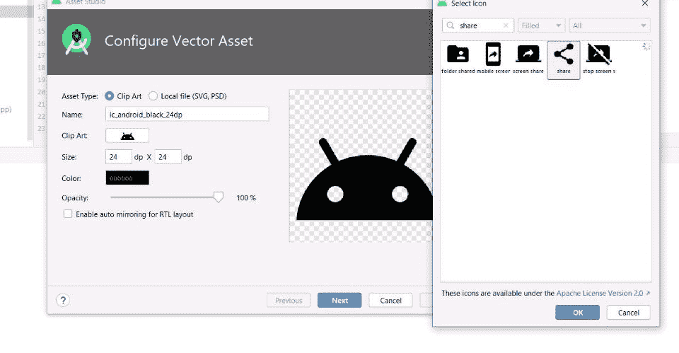
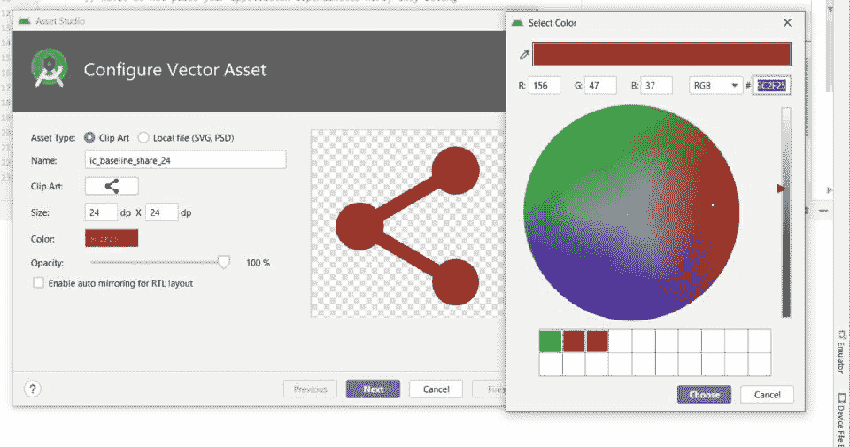

# 安卓如何在工具栏中添加分享按钮？

> 原文:[https://www . geesforgeks . org/如何添加-共享-安卓工具栏中的按钮/](https://www.geeksforgeeks.org/how-to-add-share-button-in-toolbar-in-android/)

在本文中，我们将在安卓的[工具栏](https://www.geeksforgeeks.org/toolbar-in-android-with-example/)中创建一个简单的**共享按钮**。共享按钮用于在任何社交媒体上向个人或团体共享邮件、蓝牙、脸书、推特、WhatsApp 等信息。我们可以分享任何类型的信息，如文本、图像、视频、链接等。注意，我们使用的是 **Java** 作为编程语言。下面给出了一个示例视频，以了解我们将在这个项目中做什么。

<video class="wp-video-shortcode" id="video-585402-1" width="640" height="360" preload="metadata" controls=""><source type="video/mp4" src="https://media.geeksforgeeks.org/wp-content/uploads/20210330101809/share_button.mp4?_=1">[https://media.geeksforgeeks.org/wp-content/uploads/20210330101809/share_button.mp4](https://media.geeksforgeeks.org/wp-content/uploads/20210330101809/share_button.mp4)</video>

### **分步实施**

**第一步:创建新项目**

要在安卓工作室创建新项目，请参考[如何在安卓工作室创建/启动新项目](https://www.geeksforgeeks.org/android-how-to-create-start-a-new-project-in-android-studio/)。注意选择 **Java** 作为编程语言。

**第二步:新建安卓资源目录**

进入 **res** 文件夹**，**右键点击，按照下图所示步骤创建新的安卓资源目录。



现在右键点击安卓资源目录，一个新的标签被打开。请按照以下所示操作:



为您的目录命名，然后单击“确定”。一个新的安卓资源目录被创建。

**第三步:创建菜单资源文件**

进入**菜单**目录，右键点击，如下图所示:



现在右键单击菜单资源目录，如下图所示:



为您的文件命名，然后单击“确定”。新的菜单资源文件已经创建。

**第四步:创建图标**

导航至 **res > drawable。**现在，右键单击可绘制文件夹，并按照下面给出的图像操作:



现在右键点击矢量资产，如下图所示:

**i)** 点击剪贴画选择图标，然后搜索图标**分享。**



如果你想给你的图标一些，那么把它写在名字里，否则，默认的名字就产生了。

**ii)** 点击颜色选项，为图标选择一种颜色



点击选择下一步并完成，你的图标已经创建。这里**默认给出 ic_baseline_share_24** 。

**第五步:使用 main_menu.xml**

导航到 **res >菜单> main_menu.xml** 并将下面的代码添加到该文件中。

## 可扩展标记语言

```java
<?xml version="1.0" encoding="utf-8"?>
<menu xmlns:android="http://schemas.android.com/apk/res/android"
      xmlns:app="http://schemas.android.com/apk/res-auto">

    <!--we are using  app:showAsAction="ifRoom" so that share
        button is added in toolbar. -->
    <item
        android:id="@+id/shareButton"
        android:icon="@drawable/ic_baseline_share_24"
        android:title="SHARE"
        app:showAsAction="ifRoom" />

</menu>
```

**第 6 步:使用 activity_main.xml 文件**

导航到**应用程序> res >布局> activity_main.xml** 并将下面的代码添加到该文件中。下面是 **activity_main.xml** 文件的代码。

## 可扩展标记语言

```java
<?xml version="1.0" encoding="utf-8"?>
<androidx.constraintlayout.widget.ConstraintLayout 
    xmlns:android="http://schemas.android.com/apk/res/android"
    xmlns:app="http://schemas.android.com/apk/res-auto"
    xmlns:tools="http://schemas.android.com/tools"
    android:layout_width="match_parent"
    android:layout_height="match_parent"
    tools:context=".MainActivity">

    <TextView
        android:layout_width="wrap_content"
        android:layout_height="wrap_content"
        android:text="Hello GFG !!"
        app:layout_constraintBottom_toBottomOf="parent"
        app:layout_constraintLeft_toLeftOf="parent"
        app:layout_constraintRight_toRightOf="parent"
        app:layout_constraintTop_toTopOf="parent" />

</androidx.constraintlayout.widget.ConstraintLayout>
```

**第七步:使用****MainActivity.java 文件**

转到**MainActivity.java**文件，添加下面给出的代码。我们在这里实现了两种方法**公共布尔 onCreateOptionsMenu()** 和**公共布尔 onoptions sitemselected()**。以下是**MainActivity.java**文件的代码。代码中添加了注释，以更详细地理解代码。

## Java 语言(一种计算机语言，尤用于创建网站)

```java
import android.content.Intent;
import android.os.Bundle;
import android.view.Menu;
import android.view.MenuItem;

import androidx.annotation.NonNull;
import androidx.appcompat.app.AppCompatActivity;

public class MainActivity extends AppCompatActivity {

    @Override
    protected void onCreate(Bundle savedInstanceState) {
        super.onCreate(savedInstanceState);
        setContentView(R.layout.activity_main);
    }

    @Override
    public boolean onCreateOptionsMenu(Menu menu) {

        getMenuInflater().inflate(R.menu.main_menu, menu);

        // first parameter is the file for icon and second one is menu   
        return super.onCreateOptionsMenu(menu);
    }

    @Override
    public boolean onOptionsItemSelected(@NonNull MenuItem item) {
        // We are using switch case because multiple icons can be kept
        switch (item.getItemId()) {
            case R.id.shareButton:

                Intent sharingIntent = new Intent(Intent.ACTION_SEND);

                // type of the content to be shared
                sharingIntent.setType("text/plain");

                // Body of the content
                String shareBody = "Your Body Here";

                // subject of the content. you can share anything
                String shareSubject = "Your Subject Here";

                // passing body of the content 
                sharingIntent.putExtra(Intent.EXTRA_TEXT, shareBody);

                // passing subject of the content
                sharingIntent.putExtra(Intent.EXTRA_SUBJECT, shareSubject);
                startActivity(Intent.createChooser(sharingIntent, "Share using"));
                break;
        }
        return super.onOptionsItemSelected(item);
    }
}
```

**输出:**

<video class="wp-video-shortcode" id="video-585402-2" width="640" height="360" preload="metadata" controls=""><source type="video/mp4" src="https://media.geeksforgeeks.org/wp-content/uploads/20210330101809/share_button.mp4?_=2">[https://media.geeksforgeeks.org/wp-content/uploads/20210330101809/share_button.mp4](https://media.geeksforgeeks.org/wp-content/uploads/20210330101809/share_button.mp4)</video>

你可以使用任何媒介，如脸书、WhatsApp、电子邮件、消息传递、蓝牙等。分享你的信息。