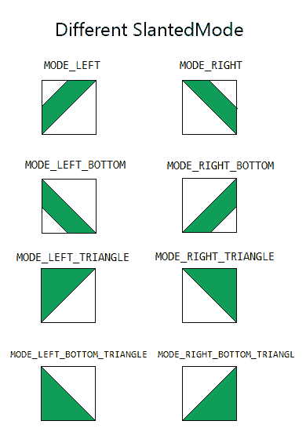

# 如何在安卓 App 中添加倾斜的 extView？

> 原文:[https://www . geesforgeks . org/how-add-slated extview-in-Android-app/](https://www.geeksforgeeks.org/how-to-add-slantedtextview-in-android-app/)

倾斜文本视图 [](https://github.com/HeZaiJin/SlantedTextView/blob/master/README-cn.md) 是一个安卓库，允许我们在安卓应用中轻松创建倾斜文本。我们可以在许多应用程序中使用此功能，例如教育课程应用程序或基于订阅的应用程序，以及许多其他应用程序，其中一些功能是免费提供的，一些是付费功能。请注意，我们将使用 **Java** 语言来实现这个项目。

### **属性**偏[](https://github.com/HeZaiJin/SlantedTextView/blob/master/README-cn.md)


### **不同的倾斜模式**



### **分步实施**

**第一步:创建新项目**

要在安卓工作室创建新项目，请参考[如何在安卓工作室创建/启动新项目](https://www.geeksforgeeks.org/android-how-to-create-start-a-new-project-in-android-studio/)。注意选择 **Java** 作为编程语言。

**第二步:去编码区之前先做一些前置任务**

转到**应用程序->RES->values->colors . XML**文件，为应用程序设置颜色。

## 可扩展标记语言

```java
<?xml version="1.0" encoding="utf-8"?>
<resources>

    <color name="colorPrimary">#0F9D58</color>
    <color name="colorPrimaryDark">#0F9D58</color>
    <color name="colorAccent">#05af9b</color>
    <color name="white">#ffffff</color>

</resources>
```

转到**Gradle Scripts->build . Gradle**(模块:app)部分，导入以下依赖项，然后点击上面弹出的“**立即同步**”。

> 实现' com . Hao Zhang . library:Android-tilted-text view:1.2 '

**第三步:设计 UI**

在 **activity_main.xml** 中，删除默认的文本视图，将布局更改为[相对布局](https://www.geeksforgeeks.org/android-relativelayout-in-kotlin/)，并添加**倾斜文本视图**和普通的[文本视图](https://www.geeksforgeeks.org/textview-widget-in-android-using-java-with-examples/)，如下所示。导航到**应用程序> res >布局> activity_main.xml** 并将下面的代码添加到该文件中。下面是 **activity_main.xml** 文件的代码。

## 可扩展标记语言

```java
<?xml version="1.0" encoding="utf-8"?>
<RelativeLayout
    xmlns:android="http://schemas.android.com/apk/res/android"
    xmlns:app="http://schemas.android.com/apk/res-auto"
    xmlns:tools="http://schemas.android.com/tools"
    android:layout_width="match_parent"
    android:layout_height="match_parent"
    tools:context=".MainActivity">

    <!-- adding slant text view -->
    <com.haozhang.lib.SlantedTextView
        android:id="@+id/slantTextView"
        android:layout_width="80dp"
        android:layout_height="80dp"
        app:slantedBackgroundColor="@color/colorPrimary"
        app:slantedLength="40dp"
        app:slantedMode="left"
        app:slantedText="Pro"
        app:slantedTextColor="@color/white"
        app:slantedTextSize="16sp" />

    <!-- normal text view -->
    <TextView
        android:layout_width="match_parent"
        android:layout_height="wrap_content"
        android:layout_centerInParent="true"
        android:layout_centerHorizontal="true"
        android:gravity="center"
        android:text="Advance Programming in Python"
        android:textSize="24dp" />

</RelativeLayout>
```

### **倾斜视图的属性**

<figure class="table">

| 财产 | 可扩展标记语言 | Java 语言（一种计算机语言，尤用于创建网站） | 描述 |
| one | app:slantbackground color | setslanedbackground color(int color) | 用于设置文本背景颜色 |
| Two | app:slantlength | set lanterldth(int length) | 用于设置文本倾斜长度 |
| three | app:slant mode | setMode（int mode） | 用于设置倾斜模式 |
| four | app:slant text | settext(str 字串) | 用于设置文本 |
| five | app:slanttextcolor | setTextColor（int color） | 用于设置文本颜色 |
| six | app:slatedtext size | setTextSize（int size） | 用于设置文本大小 |

</figure>

**第四步:编码部分**

与**MainActivity.java**无关，但是我们可以使用 java 代码对**倾斜文本视图**进行更改，为此，我们创建了一个**倾斜文本()**方法，在该方法中，我们创建并初始化**倾斜文本视图**并更改其值，如下所示。

## Java 语言(一种计算机语言，尤用于创建网站)

```java
void slantText()
 {
        // getting slant text view reference
        SlantedTextView slantedTextView =(SlantedTextView)findViewById(R.id.slantTextView);

        // changing the values of slant text view
        slantedTextView.setText("Pro") // change the text
                .setTextColor(Color.WHITE) // change the text color
                .setSlantedBackgroundColor(Color.RED) // change the text background color
                .setTextSize(16) // change the text size
                .setSlantedLength(40) // change the slanted length
                .setMode(SlantedTextView.MODE_LEFT); // change the Mode
  }
```

以下是**MainActivity.java**文件的完整代码。代码中添加了注释，以更详细地理解代码。

## Java 语言(一种计算机语言，尤用于创建网站)

```java
import android.graphics.Color;
import android.os.Bundle;

import androidx.appcompat.app.AppCompatActivity;

import com.haozhang.lib.SlantedTextView;

public class MainActivity extends AppCompatActivity {
    @Override
    protected void onCreate(Bundle savedInstanceState) {
        super.onCreate(savedInstanceState);
        setContentView(R.layout.activity_main);

        // call if we need
        // slantText();

    }

    void slantText() {

        // getting slant text view reference
        SlantedTextView slantedTextView = (SlantedTextView) findViewById(R.id.slantTextView);

        // changing the values of slant text view
        slantedTextView.setText("Pro") // change the text
                .setTextColor(Color.WHITE) // change the text color
                .setSlantedBackgroundColor(Color.RED) // change the text background color
                .setTextSize(16) // change the text size
                .setSlantedLength(40) // change the slanted length
                .setMode(SlantedTextView.MODE_LEFT); // change the Mode
    }
}
```

**输出:**

<video class="wp-video-shortcode" id="video-591320-1" width="640" height="360" preload="metadata" controls=""><source type="video/mp4" src="https://media.geeksforgeeks.org/wp-content/uploads/20210407153211/slanted-text-view-android-onlyklohan.mp4?_=1">[https://media.geeksforgeeks.org/wp-content/uploads/20210407153211/slanted-text-view-android-onlyklohan.mp4](https://media.geeksforgeeks.org/wp-content/uploads/20210407153211/slanted-text-view-android-onlyklohan.mp4)</video>